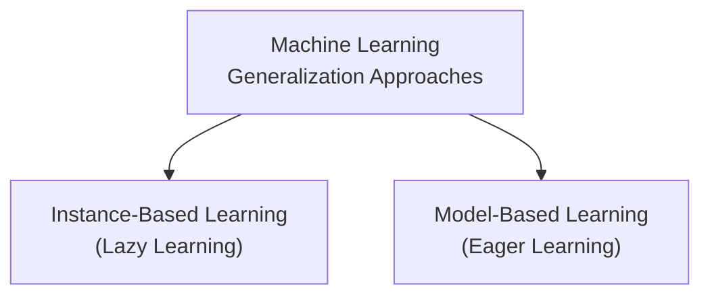
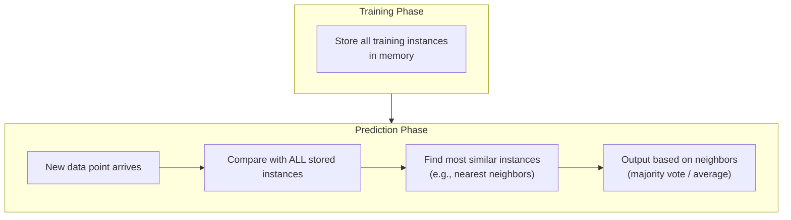
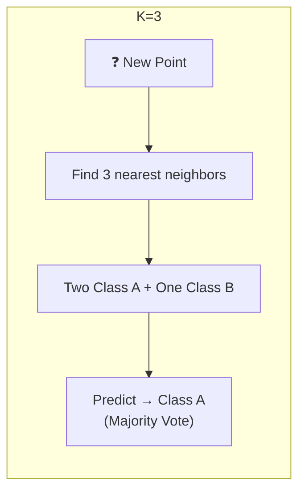
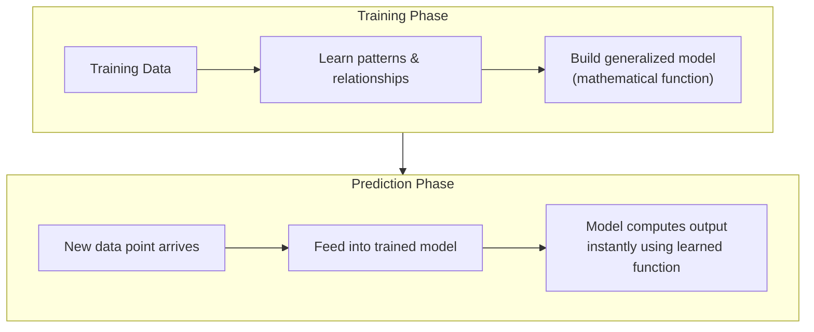
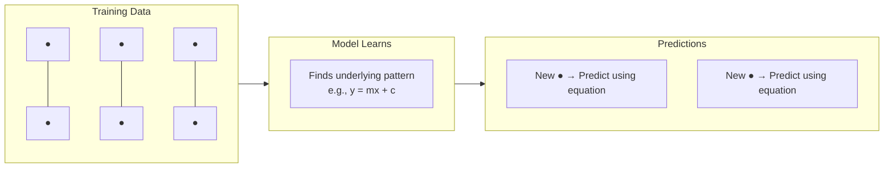
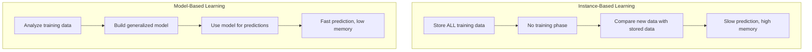
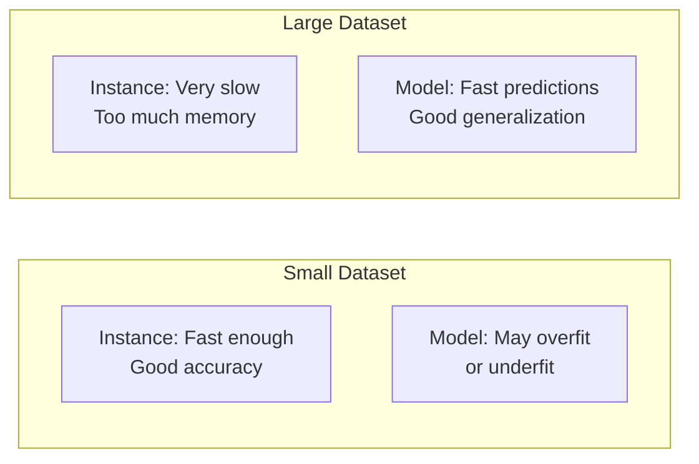
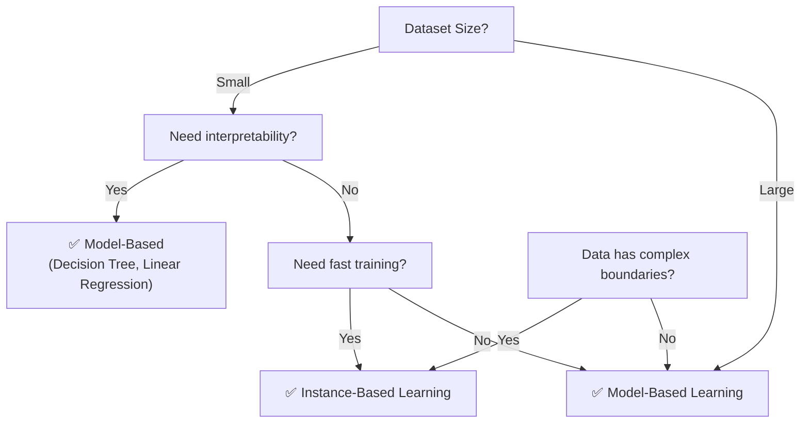
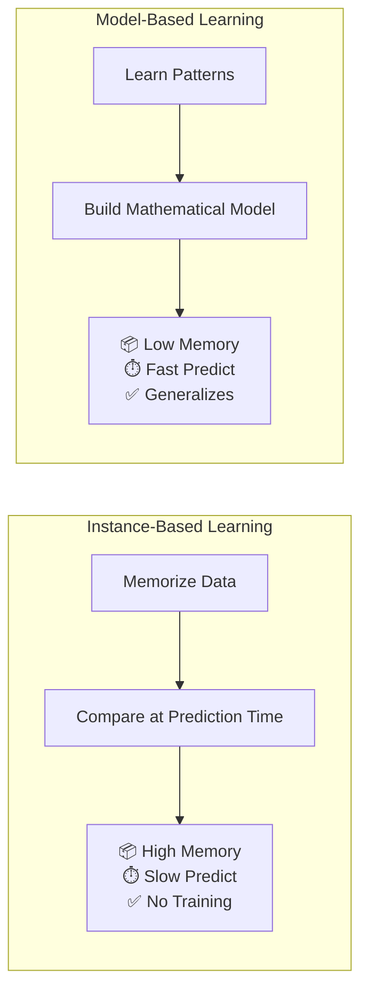

# Instance-Based Vs Model-Based Learning

---

## Overview

Machine Learning algorithms can be categorized based on **how they generalize** from training data:



---

## 1. Instance-Based Learning (Lazy Learning)

**Instance-Based Learning** = The algorithm **memorizes the training data** and makes predictions by **comparing new data points** to the stored instances. No explicit model is built.

### How It Works



1. **Training Phase** — Simply **store** all training data (no actual learning)
2. **Prediction Phase** — When new data arrives:
   - Compare it with **every stored instance**
   - Find the **most similar** instances
   - Predict based on those neighbors

### Also Called "Lazy Learning"

- The model does **no work during training** — just memorizes
- All the **work happens at prediction time**
- Training is fast, but **prediction is slow**

### Key Algorithm: K-Nearest Neighbors (K-NN)



- **K** = number of neighbors to consider
- For **classification**: majority vote among K neighbors
- For **regression**: average of K neighbors
- Distance metric: Euclidean, Manhattan, etc.

### Characteristics

| Aspect | Description |
|--------|-------------|
| **Training Time** | Almost zero (just store data) |
| **Prediction Time** | Slow (compares with all data) |
| **Memory Usage** | High (stores entire dataset) |
| **Model Size** | Grows with data |
| **Generalization** | Local (based on nearby points) |

### Advantages
- **Simple to understand** and implement
- **No training phase** — instant "learning"
- **Adapts naturally** — new data just gets added to memory
- **Works well** with complex decision boundaries
- **No assumptions** about data distribution

### Disadvantages
- **Slow predictions** — must compare with all stored data
- **High memory** — stores entire dataset
- **Sensitive to irrelevant features** — distance calculation affected by noise
- **Curse of dimensionality** — performance degrades in high dimensions
- **No interpretable model** — just raw data

### Real-World Examples
- **Recommendation Systems** — "Find users similar to you"
- **Anomaly Detection** — "Is this point unusual compared to known data?"
- **Image Recognition** (simple) — compare new image to stored images

---

## 2. Model-Based Learning (Eager Learning)

**Model-Based Learning** = The algorithm uses training data to **build a generalized model** (mathematical function) that captures patterns. This model is then used for predictions.

### How It Works



1. **Training Phase** — Analyze data, find patterns, build a **model**
2. **Prediction Phase** — Feed new data into the model → instant output

### Also Called "Eager Learning"

- The model does **hard work during training**
- Once trained, **predictions are extremely fast**
- Training is slow, but **prediction is instant**

### How Model Generalizes



### Characteristics

| Aspect | Description |
|--------|-------------|
| **Training Time** | Slow (learns patterns from data) |
| **Prediction Time** | Instant (just use the model) |
| **Memory Usage** | Low (only stores model parameters) |
| **Model Size** | Fixed (doesn't grow with data) |
| **Generalization** | Global (one function for all data) |

### Advantages
- **Fast predictions** — just compute using learned function
- **Compact** — stores only model parameters, not all data
- **Good generalization** — can handle unseen data well
- **Interpretable** (some models) — can understand what was learned
- **Handles large datasets** — doesn't need to store everything

### Disadvantages
- **Training is expensive** — takes time and compute
- **Risk of overfitting** — model learns noise instead of signal
- **Risk of underfitting** — model too simple to capture patterns
- **Needs retraining** — to incorporate new data
- **Assumptions** — makes assumptions about data distribution

### Common Algorithms

| Algorithm | Type | Use Case |
|-----------|------|----------|
| **Linear Regression** | Regression | Predict continuous values |
| **Logistic Regression** | Classification | Binary classification |
| **Decision Trees** | Both | Interpretable rules |
| **Random Forest** | Both | High accuracy, ensemble |
| **SVM** | Both | Complex boundaries |
| **Neural Networks** | Both | Very complex patterns |

---

## 3. Comparison: Instance-Based vs Model-Based



| Aspect | Instance-Based | Model-Based |
|--------|---------------|-------------|
| **Training** | None (just store) | Slow/Expensive |
| **Prediction** | Slow | Instant |
| **Memory** | High (stores all data) | Low (stores model only) |
| **Model Size** | Grows with data | Fixed |
| **Generalization** | Local (neighbor-based) | Global (function-based) |
| **Adapt to New Data** | Trivial (just add) | Needs retraining |
| **Interpretability** | Low | Medium-High |
| **Noise Sensitivity** | High | Medium (regularization helps) |
| **Curse of Dim.** | Severe | Manageable |
| **Best For** | Small datasets, complex boundaries | Large datasets, patterns |

### Memory & Speed Trade-off



---

## 4. When to Use Which?



| Scenario | Recommended | Reason |
|----------|------------|--------|
| Small dataset, fast training needed | Instance-Based | K-NN works well with small data |
| Large dataset, fast predictions | Model-Based | Once trained, predictions are instant |
| Need interpretable model | Model-Based | Decision trees, linear regression |
| Complex decision boundaries | Instance-Based | K-NN can model any shape |
| Limited memory | Model-Based | Only stores parameters |
| Data changes frequently | Instance-Based | Just add new data (no retraining) |
| Production deployment | Model-Based | Fast, predictable, compact |

---

## 5. Quick Comparison Table

| Algorithm | Type | Training Speed | Prediction Speed | Memory |
|-----------|------|---------------|-----------------|--------|
| **K-Nearest Neighbors** | Instance-Based | 🟢 Instant | 🔴 Slow | 🔴 High |
| **Linear Regression** | Model-Based | 🟡 Moderate | 🟢 Instant | 🟢 Low |
| **Decision Tree** | Model-Based | 🟡 Moderate | 🟢 Instant | 🟢 Low |
| **SVM** | Model-Based | 🔴 Slow | 🟢 Instant | 🟢 Low |
| **Neural Network** | Model-Based | 🔴 Very Slow | 🟢 Instant | 🟢 Low |
| **Case-Based Reasoning** | Instance-Based | 🟢 Instant | 🔴 Slow | 🔴 High |

---

## Summary



```
INSTANCE-BASED  → Memorize all data → Compare at predict time → Slow predict, high memory
MODEL-BASED     → Learn from data   → Build a model          → Fast predict, low memory
```

> Simple Analogy:
> - **Instance-Based** = Looking through a photo album to identify a person (compare with all photos)
> - **Model-Based** = Learning what a person looks like, then recognizing them instantly

---

*Based on CampusX video: "Instance-Based Vs Model-Based Learning | Types of Machine Learning"*
