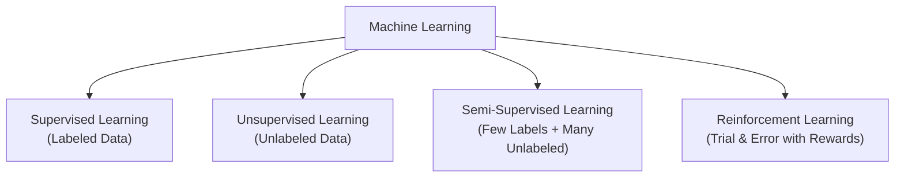
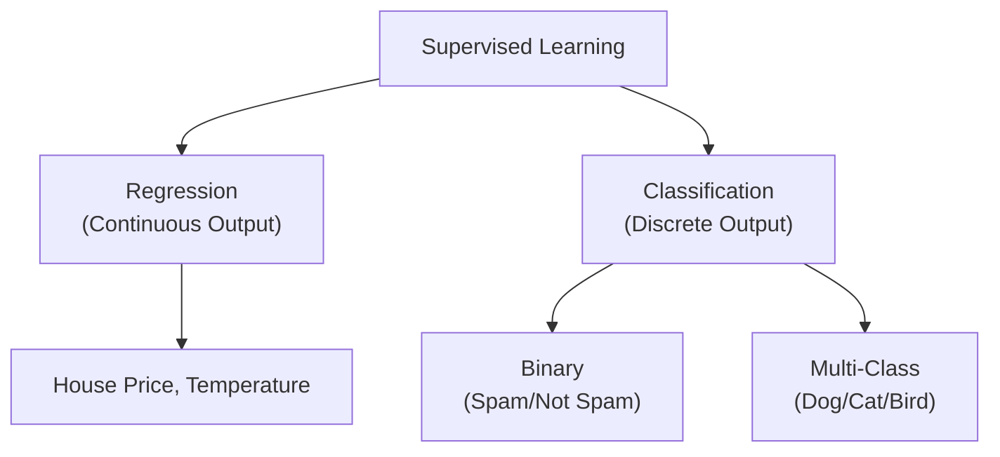
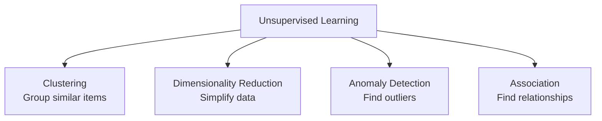
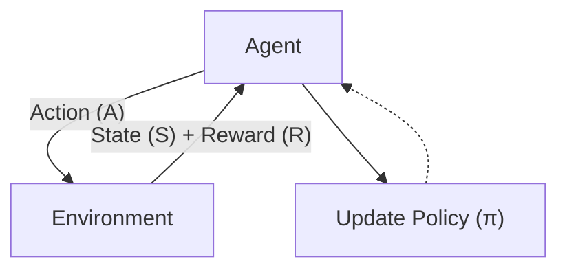
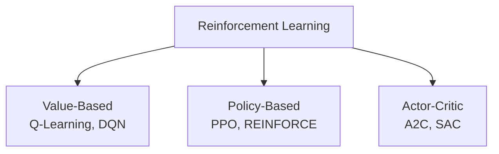

# Types of Machine Learning

---

Machine Learning is categorized into **4 main types** based on the level of supervision (labeled data):



---

## 1. Supervised Learning

**Supervised Learning** = Learning with a teacher. The model is trained on **labeled data** — each training example has an input (`X`) and the correct output (`Y`).

```
Traditional Programming:  Data + Rules → Answers
Machine Learning:         Data + Answers → Rules (the machine learns the rules)
```

- The model makes a prediction → compares it with the true label → calculates error → updates itself → repeats.
- Like a student learning from a teacher who provides the answer key.

### Two Main Types



#### Regression
- Predicts **continuous/numerical** values.
- Examples: House price prediction, temperature forecasting, stock price prediction, sales forecasting.
- Algorithms: Linear Regression, Polynomial Regression, SVR, Decision Tree Regressor, Random Forest Regressor.

#### Classification
- Predicts **discrete categories/classes**.
- Sub-types:
  - **Binary Classification** — 2 classes (Spam / Not Spam)
  - **Multi-class Classification** — 3+ classes (Dog / Cat / Horse)
  - **Multi-label Classification** — multiple labels per sample (Sunset + Beach + Person)
- Algorithms: Logistic Regression, SVM, K-NN, Decision Tree, Random Forest, Naive Bayes.

### When to Use Supervised Learning
- You have **labeled historical data**
- You want to **predict a future outcome**
- Examples: spam detection, house price prediction, disease diagnosis

### Real-World Examples

| Application | Input (X) | Output (Y) | Type |
|------------|-----------|------------|------|
| Email spam filter | Email text + metadata | Spam / Not Spam | Binary Classification |
| House price prediction | Sq.ft, bedrooms, location, age | Price (₹) | Regression |
| Medical diagnosis | Patient symptoms, test results | Disease name | Multi-class Classification |
| Credit scoring | Income, credit history, age | Credit score | Regression |
| Object detection | Image pixels | Bounding boxes + class | Classification |

---

## 2. Unsupervised Learning

**Unsupervised Learning** = Learning without a teacher. The model is given **unlabeled data** (only input `X`, no output `Y`). It must find patterns, structure, and relationships on its own.

- Like organizing a messy wardrobe — you group things by type, color, or season without anyone telling you the categories.

### When to Use Unsupervised Learning
- You have **unlabeled data** (most real-world data is unlabeled)
- You want to **discover hidden patterns** or **segment data**
- You want to **reduce dimensionality** for visualization or efficiency

### Four Main Types



#### Clustering
- Groups similar data points together.
- Points in the same cluster are more similar to each other than to points in other clusters.
- **K-Means Algorithm:**
  1. Pick K (number of clusters)
  2. Randomly place K centroids
  3. Assign each point to the nearest centroid
  4. Move centroid to center of its assigned points
  5. Repeat steps 3-4 until convergence
- Algorithms: K-Means, Hierarchical Clustering, DBSCAN, Mean Shift
- Examples: Customer segmentation, image segmentation, document clustering, recommendation systems

#### Dimensionality Reduction
- Reduces number of features while preserving important information.
- Why needed? Curse of dimensionality, visualization (humans can only visualize 2D/3D), noise reduction, computation speed.
- **PCA (Principal Component Analysis):** Finds directions where data varies the most and projects onto fewer dimensions.
- Algorithms: PCA, t-SNE, LDA, Autoencoders

#### Anomaly Detection
- Identifies rare items/events that differ significantly from the majority.
- Examples: Fraud detection, network intrusion, manufacturing defects, health monitoring.
- Algorithms: Isolation Forest, One-Class SVM, LOF

#### Association
- Discovers relationships between variables in large databases (Market Basket Analysis).
- Key metrics: Support (frequency), Confidence (reliability), Lift (strength).
- Classic Example: `{Diaper} → {Beer}` — customers buying diapers also likely to buy beer.
- Algorithms: Apriori, FP-Growth, Eclat

### Real-World Examples

| Application | Technique | What It Finds |
|------------|-----------|---------------|
| Customer segmentation (Amazon) | Clustering | Groups of customers with similar shopping habits |
| Gene expression analysis | Clustering | Groups of genes with similar functions |
| Face recognition preprocessing | Dimensionality Reduction | Compress 1000×1000 pixel images to 100 features |
| Fraud detection (Bank) | Anomaly Detection | Unusual transactions |
| Netflix recommendation | Clustering + Association | "People who watched X also watched Y" |
| Google News grouping | Clustering | News articles grouped by topic |

---

## 3. Semi-Supervised Learning

**Semi-Supervised Learning** = A hybrid approach that uses **a small amount of labeled data** + **a large amount of unlabeled data**.

### Why Use It?
- Labeling data is expensive and time-consuming (requires human experts).
- Unlabeled data is abundant and cheap to collect.
- Combines the accuracy of supervised learning with the scale of unsupervised learning.

### How It Works
1. Train on small labeled dataset (Supervised step)
2. Use model to pseudo-label unlabeled data (Unsupervised step)
3. Train on combined labeled + pseudo-labeled data
4. Repeat (self-training)

### Common Approaches
- **Self-Training** — Train → predict unlabeled → add high-confidence predictions → repeat
- **Co-Training** — Train two models on different feature views → each labels data for the other
- **Generative Models** — Learn from mixture distribution using both labeled and unlabeled data
- **Graph-Based Methods** — Build graph of data points → propagate labels through edges

### Real-World Examples
- **Medical Imaging** — Few X-rays labeled by radiologists; millions of unlabeled scans
- **Speech Recognition** — Small transcribed dataset; massive raw audio
- **Text Classification** — Few labeled documents; billions of web pages
- **Protein Sequence Classification** — Few verified functions; millions of unknown sequences

> Key Insight: Most real-world scenarios have a tiny fraction of labeled data and massive unlabeled data. Semi-supervised learning is extremely practical for production ML.

---

## 4. Reinforcement Learning

**Reinforcement Learning (RL)** = Learning through trial and error by interacting with an environment. An **agent** takes actions, receives **rewards** (positive) or **penalties** (negative), and learns the optimal **policy** to maximize cumulative reward.

### Key Components

| Component | Symbol | Description |
|-----------|--------|-------------|
| **Agent** | — | The learner / decision-maker |
| **Environment** | — | The world the agent interacts with |
| **State (S)** | S | Current situation of the agent |
| **Action (A)** | A | What the agent can do |
| **Reward (R)** | R | Feedback signal (+ve for good, -ve for bad) |
| **Policy (π)** | π | Strategy the agent follows to decide actions |

### The RL Loop



### How It Works (Step by Step)
1. Agent observes current state (S)
2. Agent takes an action (A) based on its policy
3. Environment transitions to a new state (S') and gives a reward (R)
4. Agent uses (S, A, R, S') to update its policy
5. Repeat until convergence

### Exploration vs Exploitation
- **Exploration** — trying new actions to discover their effects (risk of low reward)
- **Exploitation** — using known good actions to maximize reward (may miss better options)
- The agent must balance both to learn effectively

### Types of RL Algorithms



| Category | Description | Algorithms |
|----------|-------------|------------|
| **Model-Based** | Agent learns/uses a model of the environment to plan | Dynamic Programming, AlphaGo, MuZero |
| **Model-Free** | Agent learns directly from interaction | Q-Learning, SARSA, Policy Gradients |
| **Value-Based** | Learn value (expected reward) of each state/action | Q-Learning, Deep Q-Networks (DQN) |
| **Policy-Based** | Learn policy directly (which action in each state) | REINFORCE, PPO, TRPO |
| **Actor-Critic** | Combines value-based + policy-based (best of both) | A2C, A3C, SAC, PPO |

### Real-World Examples
- **Game Playing** — AlphaGo beating world champions; AlphaStar in StarCraft II
- **Self-Driving Cars** — Learning to navigate traffic, obey signals, avoid obstacles
- **Robotics** — Learning to walk, grasp objects, assemble parts
- **Stock Trading** — Learning buy/sell/hold strategy to maximize portfolio value
- **Resource Management** — Google's data center cooling (40% energy reduction using RL)
- **Healthcare** — Personalized treatment plans, drug discovery

---

## Summary

```
SUPERVISED      → Learn from labeled data → Predict
UNSUPERVISED   → Learn from unlabeled data → Discover patterns
SEMI-SUPERVISED → Learn from few labels + many unlabeled → Practical & efficient
REINFORCEMENT  → Learn by trial & error → Maximize reward
```

```
Data available? ─── Yes → Labels available? ─── Yes → Supervised Learning
                               │
                               └── No  → Unsupervised Learning
                   │
                   └── Some labels? → Semi-Supervised Learning

Sequential decisions? ─── Yes → Reinforcement Learning
```

---

*Based on CampusX video: "Types of Machine Learning for Beginners | Types of Machine learning in Hindi"*
