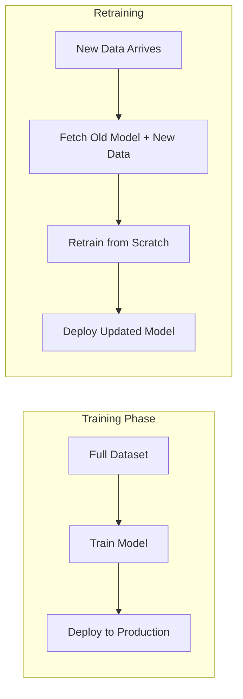
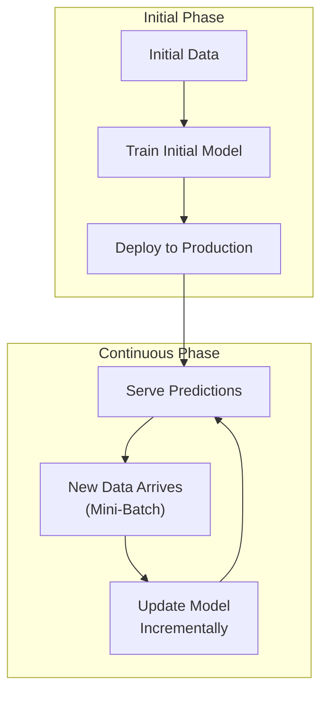
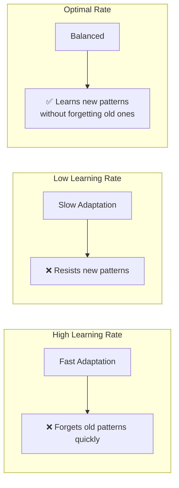
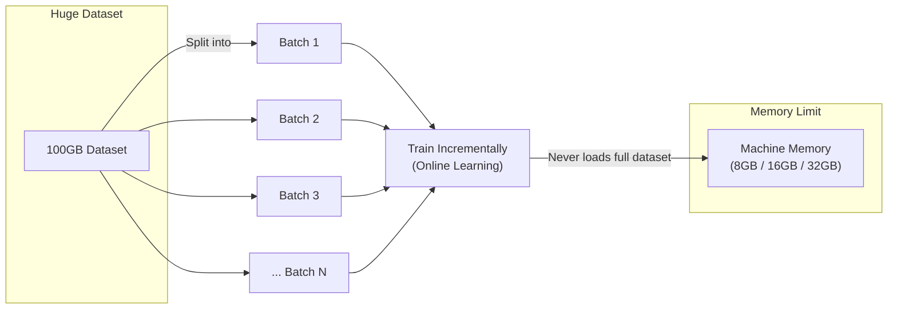
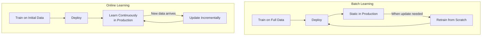
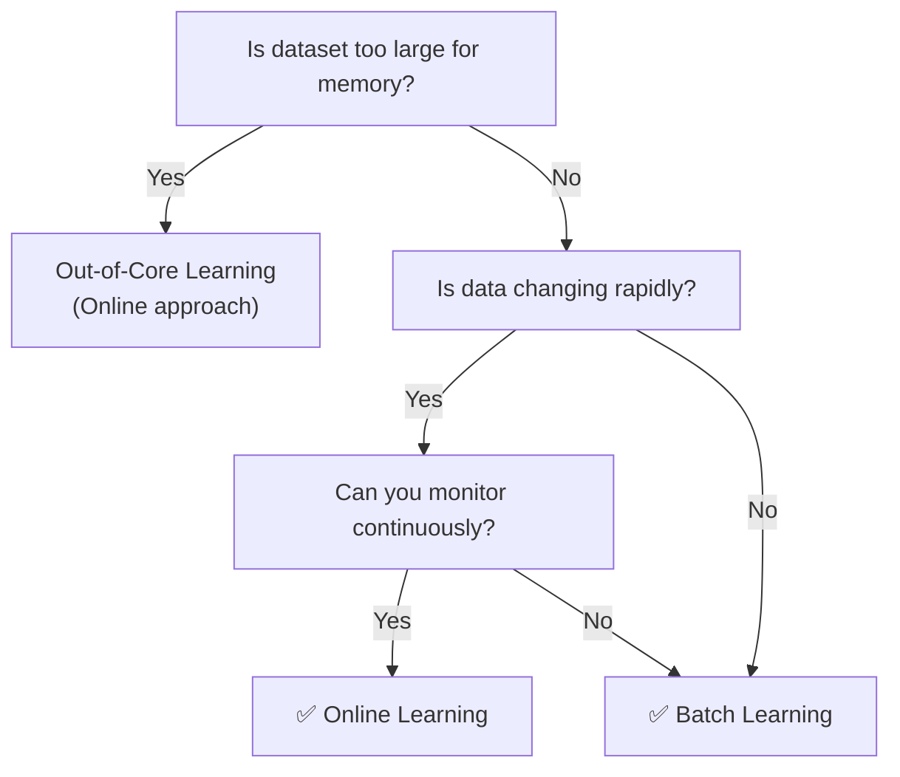
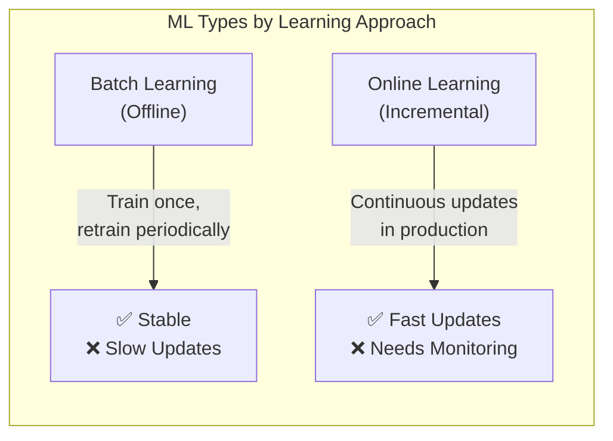

# Batch Machine Learning | Offline Vs Online Learning

---

## Overview

Machine Learning systems can also be categorized based on **how they learn from data**:

1. **Batch Learning (Offline Learning)** — Model trained once on full dataset, then deployed
2. **Online Learning (Incremental Learning)** — Model updated continuously with new data

---

## 1. Batch Learning (Offline Learning)

**Batch Learning** = The model is trained on the **entire dataset at once**, then deployed to production. It does **not** learn from new data unless explicitly retrained from scratch.

### How It Works



1. Model is trained on **all available data** at once
2. Trained model is deployed to production
3. Model **does NOT learn** from new data in production
4. When update is needed → retrain from scratch with old + new data
5. Retrained model is deployed again

### Characteristics

| Aspect | Description |
|--------|-------------|
| **Training** | Done once on the full dataset |
| **Update Frequency** | Weekly, monthly, or on-demand |
| **Resource Usage** | High — requires training on entire data each time |
| **Learning in Production** | ❌ No — model is static after deployment |
| **Implementation** | Simple and straightforward |

### Advantages
- **Stable** — model doesn't change unexpectedly in production
- **Simple to implement** and monitor
- **Easier to debug** — predictable behavior
- Good when **data doesn't change rapidly**

### Disadvantages
- **Expensive** — retraining from scratch uses a lot of compute
- **Slow to update** — takes time to retrain on full data
- **No real-time adaptation** — model becomes stale between updates
- **Not suitable** for rapidly changing environments

### When to Use
- Data changes **slowly** (monthly/quarterly)
- Retraining is **not time-sensitive**
- You have **enough compute resources** for full retraining
- Examples: House price prediction model (retrain yearly), customer churn model (retrain monthly)

---

## 2. Online Learning (Incremental Learning)

**Online Learning** = The model is trained **incrementally**, receiving data in **mini-batches** or **one sample at a time**. The model updates itself continuously, even while in production.

### How It Works



1. Model is initially trained on available data
2. Deployed to production
3. As **new data arrives** (in mini-batches), model **updates itself**
4. Model keeps learning **while serving predictions**

### Characteristics

| Aspect | Description |
|--------|-------------|
| **Training** | Done incrementally on small batches |
| **Update Frequency** | Continuous (real-time or near real-time) |
| **Resource Usage** | Low — each update uses only the new batch |
| **Learning in Production** | ✅ Yes — model learns continuously |
| **Implementation** | More complex, needs monitoring |

### Advantages
- **Fast updates** — model adapts quickly to new patterns
- **Resource efficient** — trains on small batches, not full data
- **Real-time adaptation** — ideal for changing environments
- **Out-of-core learning** — can handle data larger than memory

### Disadvantages
- **Unstable** — model behavior can change unexpectedly
- **Harder to debug** — constantly evolving
- **Risk of bias** — if new data is skewed, model becomes biased
- **Needs monitoring** — backups and safety checks required

### Online Learning Rate



- **High learning rate** → adapts very fast, but may **forget old data** (catastrophic forgetting)
- **Low learning rate** → adapts slowly, resists new patterns
- **Optimal** → balanced trade-off

### When to Use
- Data changes **rapidly** (real-time)
- Need **instant adaptation** to new patterns
- Dataset is **too large to fit in memory**
- Examples: Stock market prediction, recommendation systems, ad click prediction

---

## 3. Out-of-Core Learning

**Out-of-Core Learning** = A special application of online learning where data is **too large to fit in a single machine's memory**.



- Divide huge dataset into small batches
- Feed batches one-by-one using **online learning**
- Never loads the entire dataset into memory
- This is done **offline** (not in production)
- Despite the name "online learning," the actual training here is **offline** (batch-wise)

---

## Comparison: Batch vs Online



| Feature | Batch Learning | Online Learning |
|---------|---------------|-----------------|
| **Training Data** | Entire dataset at once | Mini-batches (incremental) |
| **Update Frequency** | Periodic (weekly/monthly) | Continuous (real-time) |
| **Compute Cost** | High (retrain all data) | Low (small batches) |
| **Adaptation Speed** | Slow | Fast |
| **Stability** | High | Low (can be unstable) |
| **Monitoring Needed** | Low | High |
| **Memory Requirement** | Full dataset in memory | Small batches only |
| **Best For** | Stable data, simple deployment | Rapidly changing data, large datasets |
| **Examples** | House price prediction, disease diagnosis | Stock trading, ad recommendation |

---

## 4. When to Choose Which?



### Rule of Thumb

```
Small data + Slow changes       → Batch Learning
Large data + Slow changes       → Batch Learning (with sufficient compute)
Small data + Fast changes       → Online Learning
Large data + Fast changes       → Online Learning (helps with out-of-core)
Limited monitoring              → Batch Learning (safer)
High need for real-time updates → Online Learning
```

---

## Summary



```
BATCH LEARNING    → Train → Deploy → (Static) → Retrain → Deploy
ONLINE LEARNING   → Train → Deploy → Learn → Update → Learn → Update ...
```

---

