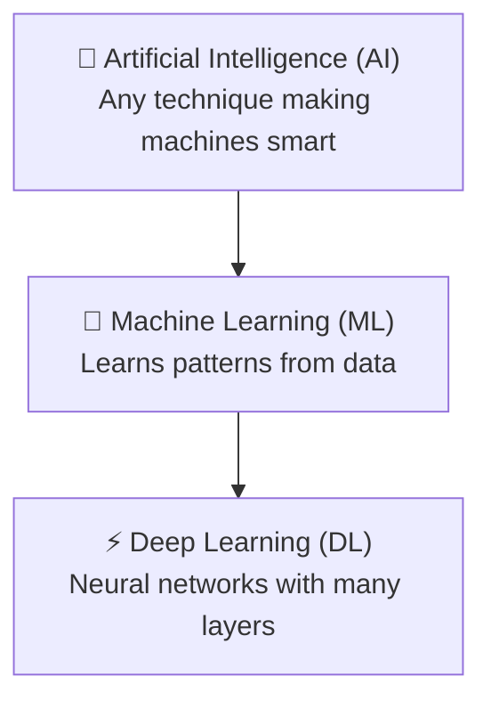

# AI vs ML vs DL — What is the Difference?

---

## 1. Artificial Intelligence (AI)

**AI** stands for **Artificial Intelligence**.

- The broadest concept — it is the **umbrella** under which ML and DL fall.
- The goal of AI is to create machines that can mimic human intelligence — thinking, reasoning, learning, and decision-making.
- AI includes both **rule-based systems** (expert systems) and **data-driven systems** (ML/DL).

### Expert Systems (Rule-based AI)

- A human expert writes **hard-coded rules** (if-else logic) that the machine follows.
- Example: If temperature > 100°C → "Turn off the engine."
- **Flaw:** These systems only work for **narrow, well-defined problems**. They fail on **fuzzy problems** — situations where the rules are not clear or cannot be predefined.
- Early engineers thought this was "true AI," but it's actually very limited.

> 💡 **Key Insight:** AI is NOT just about rules. True AI involves systems that can **learn, adapt, and handle uncertainty** — just like humans do.

---

## 2. Machine Learning (ML)

**ML** stands for **Machine Learning**.

- **Subset of AI** — every ML system is AI, but not every AI system is ML.
- Instead of writing explicit rules, we **feed data to the machine** and let it **learn patterns automatically**.
- The machine improves its performance on a task **without being explicitly programmed** for every scenario.

### How it works

```
Traditional Programming:  Data + Rules → Answers
Machine Learning:         Data + Answers → Rules (the machine learns the rules)
```

### Example

- Show the model **10,000 images of dogs** and **10,000 images of not-dogs**.
- The model figures out the patterns on its own (fur, ears, tail shape, etc.).
- Now give it a new image — it can correctly say **"dog"** or **"not dog"**.

> 💡 **Key Insight:** In ML, **feature engineering** is often manual — you (the developer) decide which features the model should look at (e.g., color, edges, textures).

---

## 3. Deep Learning (DL)

**DL** stands for **Deep Learning**.

- **Subset of ML** — every DL system is ML, but not every ML system is DL.
- DL uses **artificial neural networks** — systems inspired by the structure of the human brain (billions of connected neurons).
- Called **"deep"** because these networks have **multiple hidden layers** — more layers = deeper learning.
- Early neural networks had 2–3 layers; modern models can have **hundreds or even thousands** of layers.

### How it differs from ML

| Aspect | Machine Learning | Deep Learning |
|--------|----------------|---------------|
| **Feature Engineering** | Manual — you pick the features | Automatic — the network learns features itself |
| **Data Requirement** | Large datasets (thousands of examples) | Massive datasets (petabytes, millions of examples) |
| **Hardware** | Can run on regular CPUs | Needs **GPUs** for parallel computations |
| **Complexity** | Good for structured data (tables, CSV) | Excels at unstructured data (images, audio, video, text) |
| **Interpretability** | More explainable (e.g., decision trees) | "Black box" — hard to explain how it arrived at a decision |

### Example

- **Face recognition** on your phone — the neural network learns features like eye shape, nose structure, face轮廓 — without anyone manually defining "what an eye looks like."
- **Self-driving cars** — processing camera feeds, identifying pedestrians, traffic signs, and road conditions in real time.

---

## Visual Relationship



Or as nested sets:

```
            ┌─────────────────────────┐
            │   ARTIFICIAL INTELLIGENCE│
            │   ┌───────────────────┐  │
            │   │ MACHINE LEARNING  │  │
            │   │  ┌─────────────┐  │  │
            │   │  │ DEEP        │  │  │
            │   │  │ LEARNING    │  │  │
            │   │  └─────────────┘  │  │
            │   └───────────────────┘  │
            └─────────────────────────┘
```

**Rule:** Every DL system is ML, and every ML system is AI — but NOT the other way around.

---

## Comparison Table

| Aspect | AI | ML | DL |
|--------|----|----|----|
| **Definition** | Making machines intelligent | Learning from data without explicit programming | ML using multi-layer neural networks |
| **Approach** | Rules + Logic + Data | Data + Algorithms | Neural Networks + Massive Data |
| **Data Needed** | Can work with little/no data | Thousands to millions of examples | Millions to billions (petabyte-scale) |
| **Feature Extraction** | Manual (human writes rules) | Mostly manual | Automatic (network learns features) |
| **Hardware** | Any computer | CPU | GPU / TPU (high-end) |
| **Interpretability** | Fully explainable | Mostly explainable | "Black box" — hard to interpret |
| **Example** | Chess engine, smart thermostat | Spam filter, Netflix recommendations | Face unlock, ChatGPT, self-driving cars |

---

## Real-Life Examples

| Technology | AI? | ML? | DL? |
|------------|:---:|:---:|:---:|
| Chess engine (Deep Blue) | ✅ | ❌ | ❌ |
| Email spam filter | ✅ | ✅ | ❌ |
| Netflix recommendations | ✅ | ✅ | ❌ |
| Face unlock on phone | ✅ | ✅ | ✅ |
| ChatGPT / Gemini | ✅ | ✅ | ✅ |
| Self-driving car | ✅ | ✅ | ✅ |

---

## Summary

```
AI  → The big goal: making machines smart
ML  → The method: learning from data
DL  → The engine: neural networks solving the hardest problems
```

Each layer is **more specialized**, requires **more data**, and demands **more computing power** — but can solve **more complex problems**.

---

## Quick Quiz

1. Is every AI system also Machine Learning?
   - ❌ No. A rule-based expert system is AI but NOT ML.

2. Is every Deep Learning system also Machine Learning?
   - ✅ Yes. DL is a subset of ML.

3. What makes DL "deep"?
   - The multiple hidden layers in the neural network (not 1–2, but hundreds or thousands).

---

*Based on CampusX video: "AI Vs ML Vs DL for Beginners in Hindi"*
