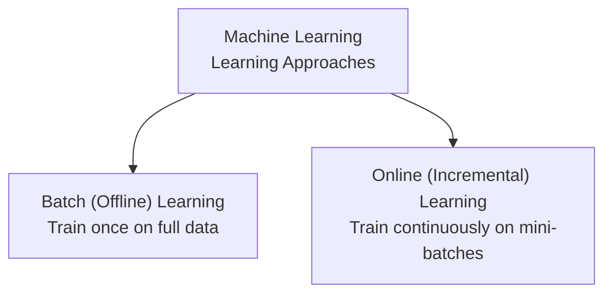
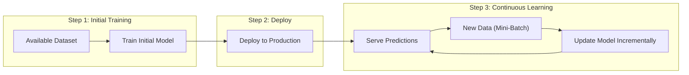
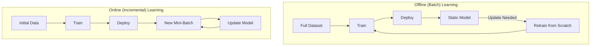
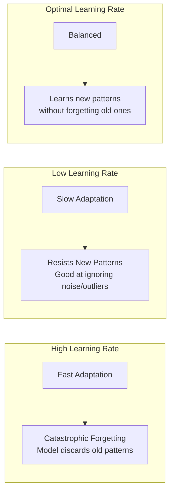
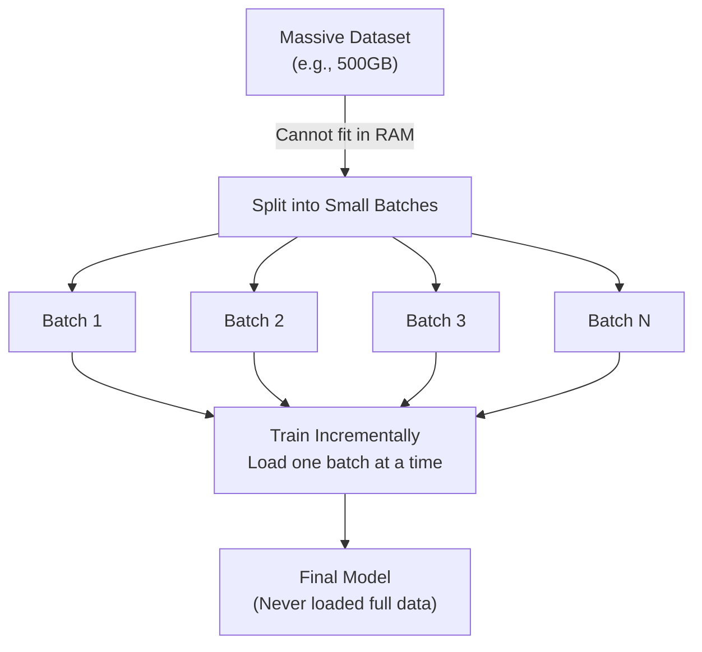
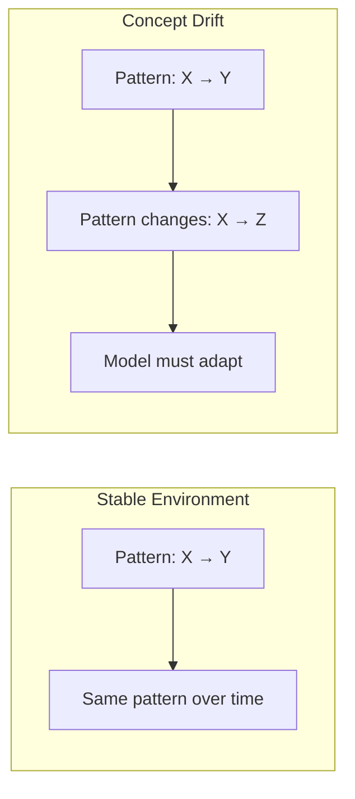
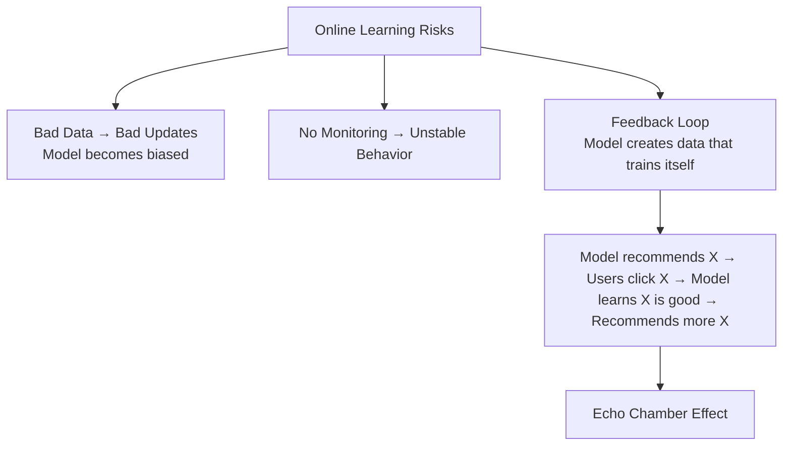
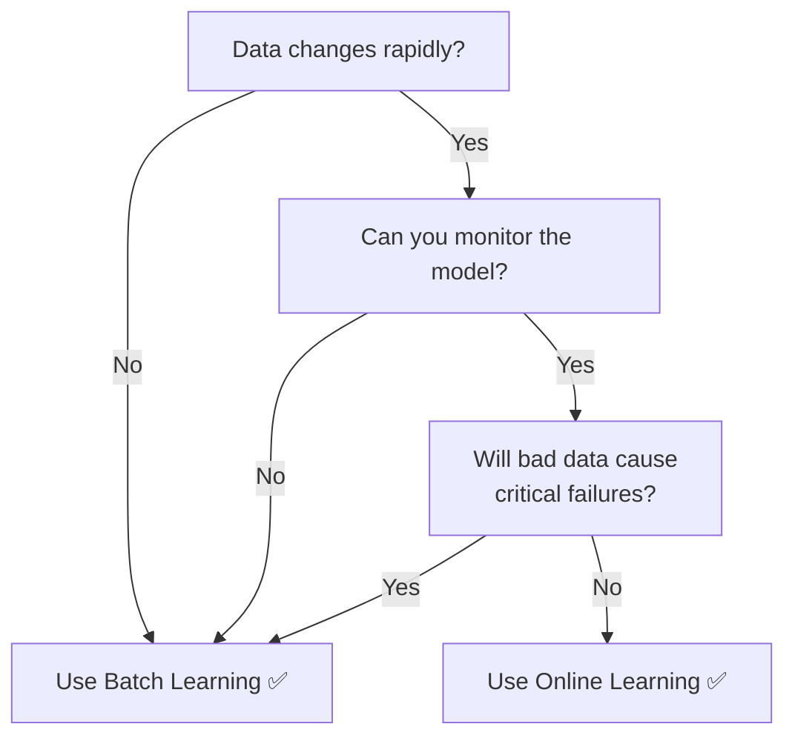
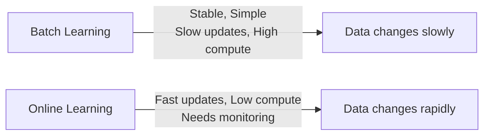

# Online Machine Learning | Online Vs Offline Learning

---

## Recap: Two Approaches



---

## 1. Online Learning — In Depth

**Online Learning** = The model is trained **incrementally** by feeding data in **mini-batches** (or one sample at a time). The model **updates itself continuously**, even while serving predictions in production.

### How It Works



### Training Process

```
Instead of: Train on ALL data → Deploy → (static) → Retrain from scratch
We do:      Train on SOME data → Deploy → Update with new data → Update → Update ...
```

- **Mini-batch** = small chunk of new data (e.g., 32, 64, or 128 samples)
- Model updates its parameters using **only the new batch**
- Old data is **not needed** for updates
- Model **continuously adapts** to new patterns

---

## 2. Online vs Offline — Side by Side



| Aspect | Offline (Batch) | Online (Incremental) |
|--------|----------------|---------------------|
| **Data Used** | Entire dataset at once | Mini-batches (small chunks) |
| **Training Frequency** | Once, then retrain periodically | Continuous |
| **Memory Needed** | Full dataset must fit in RAM | Only mini-batch needs to fit |
| **Compute Cost** | High (retrain everything) | Low (small updates) |
| **Adaptation Speed** | Slow (retrain cycle) | Fast (immediate updates) |
| **Model Stability** | High (static in production) | Low (keeps changing) |
| **Complexity** | Simple | Complex (needs monitoring) |

---

## 3. Online Learning Rate

The **learning rate** in online learning controls how quickly the model adapts to new data.



| Rate | Adaptation Speed | Old Pattern Retention | Noise Sensitivity |
|------|-----------------|---------------------|------------------|
| **High** | Very fast | Poor (forgets old data) | High (reacts to noise) |
| **Low** | Very slow | Strong (keeps old patterns) | Low (ignores outliers) |
| **Optimal** | Balanced | Balanced | Balanced |

### Key Insight
> Learning rate is a **critical hyperparameter** in online learning.
> - Too high → model chases every new data point (unstable)
> - Too low → model never adapts (defeats the purpose of online learning)

---

## 4. Out-of-Core Learning

**Out-of-Core Learning** = Using online learning techniques to train on datasets **too large to fit in memory**.



- Dataset is too large for a single machine's RAM
- Split into small batches that **fit in memory**
- Feed batches one-by-one using online learning
- Each batch is loaded, used for training, then **discarded**
- Enables training on datasets **larger than available RAM**

> **Important:** Although we use "online learning" techniques, out-of-core training happens **offline** (not in production). The name "online" refers to the incremental update strategy, not the deployment environment.

---

## 5. Challenges in Online Learning

### Concept Drift



- **Concept Drift** — the underlying relationship between input and output changes over time
- Examples:
  - Customer preferences change (fashion trends)
  - Economic conditions change (inflation affects buying behavior)
  - Seasonal patterns (holiday shopping vs normal)
- Online learning **handles concept drift naturally** (continuous updates)
- Batch learning **struggles** with drift (model becomes stale)

### Stability Issues



- **Bad data** in a mini-batch can corrupt the model
- **Monitoring** is essential — need to detect when model goes bad
- **Feedback loops** — model's predictions influence future training data
- Need **backup/rollback** mechanisms

### Practical Safeguards

| Safeguard | Description |
|-----------|-------------|
| **Monitoring** | Track model performance metrics in real-time |
| **Alarms** | Alert when accuracy drops below threshold |
| **Rollback** | Keep previous model versions to revert if needed |
| **A/B Testing** | Compare new model version with old version |
| **Human-in-the-loop** | Flag uncertain predictions for human review |
| **Periodic Checkpoints** | Save model snapshots at regular intervals |

---

## 6. When to Use Online Learning



### Good Use Cases
- **Stock market prediction** — patterns change by the second
- **Ad click prediction** — user preferences evolve daily
- **Recommendation systems** — new content, changing tastes
- **Weather forecasting** — continuous sensor data
- **Fraud detection** — fraud patterns constantly shift
- **IoT sensor monitoring** — real-time data streams

### Bad Use Cases
- **Medical diagnosis** — cannot risk unstable predictions
- **Credit approval** — regulatory requirements for explainability
- **Safety-critical systems** — need deterministic behavior

---

## 7. Algorithms That Support Online Learning

| Algorithm | Library | Online Support |
|-----------|---------|---------------|
| **SGD Regressor/Classifier** | sklearn.linear_model | ✅ `partial_fit()` |
| **Perceptron** | sklearn.linear_model | ✅ `partial_fit()` |
| **Passive-Aggressive** | sklearn.linear_model | ✅ `partial_fit()` |
| **SGD (Keras/TF)** | tensorflow.keras | ✅ `fit()` with batches |
| **PyTorch models** | pytorch | ✅ Manual mini-batch loop |

```python
# Example: Online Learning with SGDClassifier in sklearn
from sklearn.linear_model import SGDClassifier

model = SGDClassifier()

# Initial training
model.partial_fit(X_initial, y_initial, classes=[0, 1])

# Continuous updates as new data arrives
for mini_batch in data_stream:
    X_batch, y_batch = mini_batch
    model.partial_fit(X_batch, y_batch)
```

---

## Summary

```
BATCH (OFFLINE) LEARNING
  Train once on full dataset → Deploy → (Static) → Retrain from scratch

ONLINE (INCREMENTAL) LEARNING
  Train on initial data → Deploy → Update continuously with mini-batches
```



---

*Based on CampusX video: "Online Machine Learning | Online Learning | Online Vs Offline Machine Learning"*
