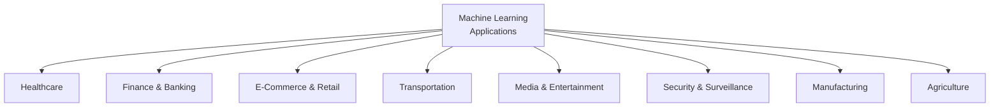
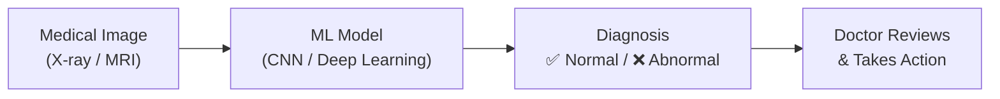
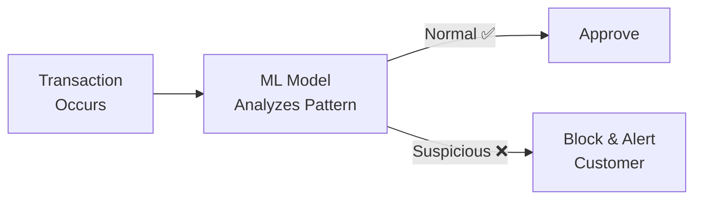
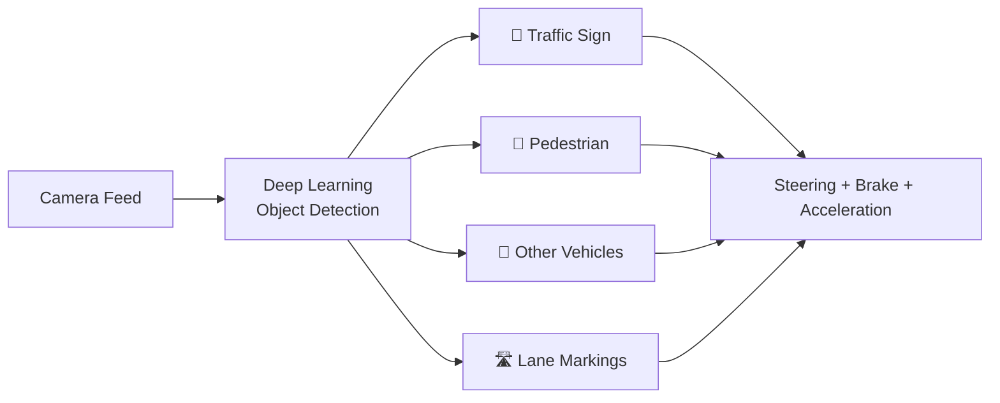
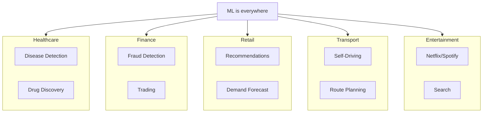

# Application of Machine Learning | Real Life ML Applications

---

## Where is ML Used?

Machine Learning is everywhere — from your phone to hospitals to banks. Here are the major application areas:



---

## 1. Healthcare

| Application | How ML Helps |
|-------------|-------------|
| **Disease Diagnosis** | Analyzing medical images (X-rays, MRIs) to detect tumors, fractures, diseases |
| **Drug Discovery** | Predicting which chemical compounds could work as medicines |
| **Personalized Treatment** | Recommending treatment plans based on patient history and genetics |
| **Health Monitoring** | Wearable devices (smartwatches) detecting irregular heartbeats, falls |
| **Medical Record Analysis** | Extracting insights from patient records to predict health risks |

**Example:** Google's AI can detect breast cancer from mammograms with higher accuracy than human radiologists.



---

## 2. Finance & Banking

| Application | How ML Helps |
|-------------|-------------|
| **Fraud Detection** | Identifying unusual transactions in real-time |
| **Credit Scoring** | Predicting if a customer will repay a loan |
| **Algorithmic Trading** | Making buy/sell decisions based on market data |
| **Customer Segmentation** | Grouping customers for targeted offers |
| **Risk Assessment** | Evaluating insurance or investment risks |

**Example:** Banks use ML to flag fraudulent credit card transactions within milliseconds.



---

## 3. E-Commerce & Retail

| Application | How ML Helps |
|-------------|-------------|
| **Recommendation Systems** | "Customers who bought X also bought Y" |
| **Demand Forecasting** | Predicting which products will be in demand |
| **Dynamic Pricing** | Adjusting prices based on demand, competition |
| **Customer Churn Prediction** | Identifying customers likely to leave |
| **Inventory Management** | Optimizing stock levels |
| **Visual Search** | Search products using images instead of text |

**Example:** Amazon's recommendation engine drives 35% of total sales.

```
You browse:  👟 Running Shoes
ML notices:  People who bought running shoes also bought sports socks
You see:     "Recommended for you" → 🧦 Sports Socks, 🏃 Fitness Tracker
```

---

## 4. Transportation

| Application | How ML Helps |
|-------------|-------------|
| **Self-Driving Cars** | Detecting obstacles, lanes, traffic signs, pedestrians |
| **Route Optimization** | Google Maps / Uber finding fastest route |
| **Traffic Prediction** | Predicting congestion before it happens |
| **Ride-Sharing** | Matching drivers with riders, surge pricing |
| **Predictive Maintenance** | Predicting when a vehicle needs servicing |

**Example:** Tesla's Autopilot uses deep learning to process camera feeds in real-time and navigate roads.



---

## 5. Media & Entertainment

| Application | How ML Helps |
|-------------|-------------|
| **Content Recommendation** | Netflix, YouTube, Spotify suggesting content |
| **Search Engines** | Google ranking search results |
| **Content Moderation** | Detecting hate speech, violence, spam |
| **Deepfakes** | AI-generated videos (both good & bad) |
| **Music Generation** | AI composing music |
| **Gaming** | AI opponents that learn from players |

**Example:** Netflix saves $1 billion per year through its recommendation system.

---

## 6. Security & Surveillance

| Application | How ML Helps |
|-------------|-------------|
| **Face Recognition** | Unlocking phones, airport security |
| **Spam Detection** | Gmail filtering spam emails |
| **Intrusion Detection** | Detecting cyber attacks on networks |
| **Behavioral Analysis** | Detecting suspicious activities in crowds |

---

## 7. Manufacturing

| Application | How ML Helps |
|-------------|-------------|
| **Predictive Maintenance** | Predicting machine failures before they happen |
| **Quality Control** | Detecting defects in products using computer vision |
| **Supply Chain Optimization** | Optimizing logistics and inventory |
| **Robotics** | Robots learning to assemble products |

---

## 8. Agriculture

| Application | How ML Helps |
|-------------|-------------|
| **Crop Monitoring** | Using drones + computer vision to monitor crop health |
| **Yield Prediction** | Predicting how much crop will be produced |
| **Soil Analysis** | Analyzing soil nutrients and recommending fertilizers |
| **Pest Detection** | Identifying pest infestations early |

---

## Industry-wise Summary



---

## Why ML is Preferred Over Traditional Programming?

| Scenario | Traditional Code | Machine Learning |
|----------|-----------------|-----------------|
| **Spam Detection** | Write rules for every spam pattern → impossible to maintain | ML learns patterns from data automatically |
| **Image Recognition** | Can't hardcode "what a cat looks like" | ML learns features from millions of images |
| **Speech Recognition** | Cannot write rules for every accent/pronunciation | ML learns from audio data |
| **Recommendations** | Cannot predict user preferences manually | ML finds hidden patterns in behavior |

> **Rule of Thumb:** If you can write explicit rules → use traditional programming. If rules are too complex or unknown → use ML.

---

