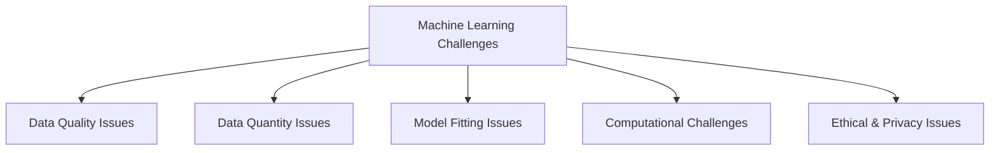
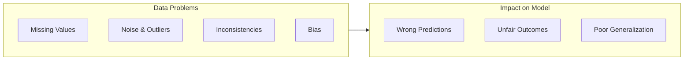
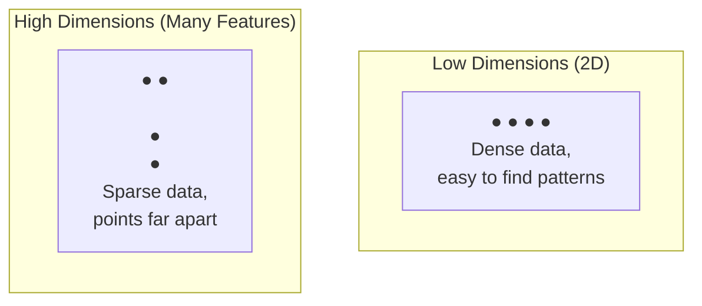
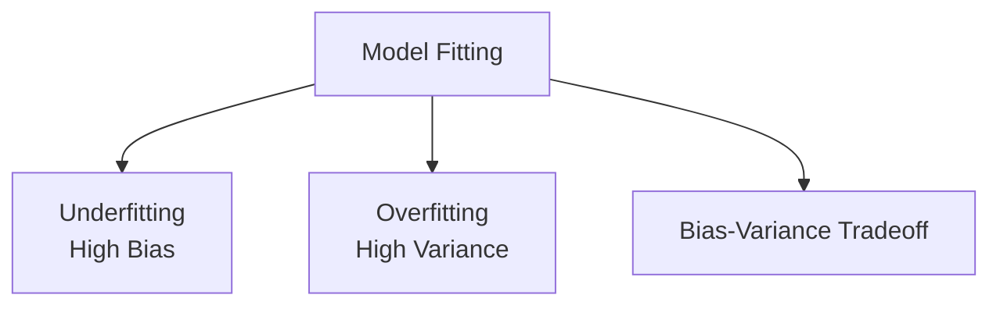
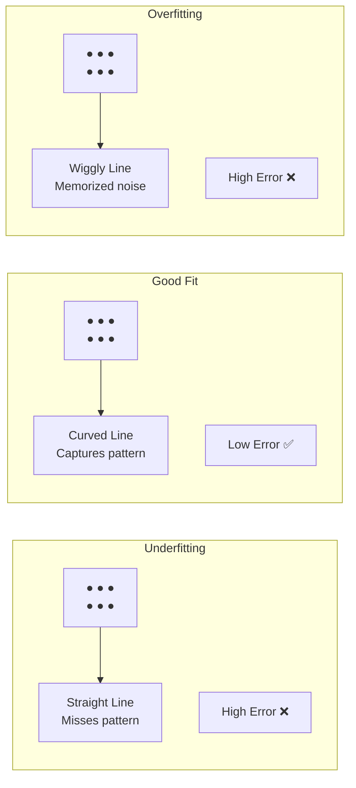
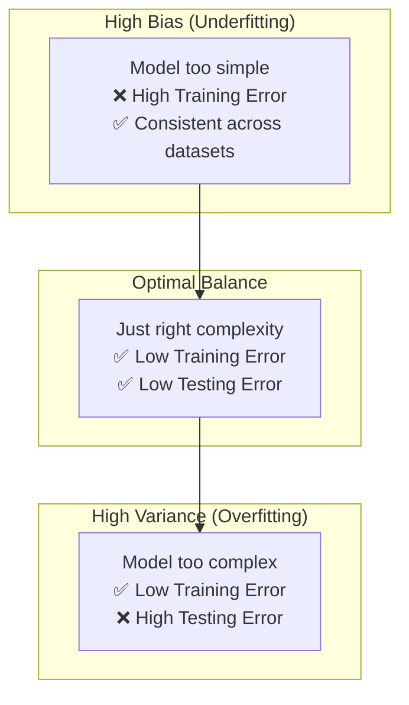
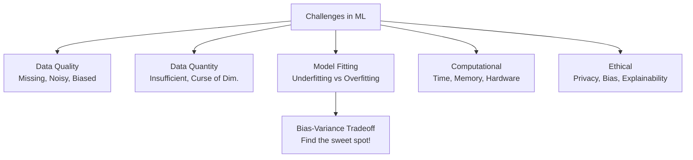

# Challenges in Machine Learning | Problems in Machine Learning

---

## Overview

Building a Machine Learning model is not easy. There are many **challenges** at every stage — from data collection to deployment.



---

## 1. Data Quality Issues

ML models are only as good as the data they are trained on. **Garbage In → Garbage Out.**

### Missing Values
- Data may have empty/null fields
- Examples: A patient's age missing, a product price not recorded
- Solutions: Remove rows, fill with mean/median/mode, or use predictive imputation

### Noisy Data
- Data contains errors, outliers, or random variations
- Examples: Sensor reading errors, typos in text data, mislabeled categories
- Solutions: Smoothing, outlier detection, manual correction

### Inconsistent Data
- Data formats differ across sources
- Examples: "USA" vs "United States" vs "US", dates in different formats (DD/MM vs MM/DD)
- Solutions: Standardization, data cleaning pipelines

### Biased Data
- Data does not represent the real-world population fairly
- Examples: Face recognition trained mostly on light skin tones, hiring model trained on male-dominated historical data
- Solutions: Careful data collection, bias detection, balanced datasets



---

## 2. Data Quantity Issues

### Insufficient Data
- ML models need **enough data** to learn meaningful patterns
- With very little data, models cannot generalize
- Rule of thumb: More complex problem → more data needed

### Curse of Dimensionality
- As number of features increases, the amount of data needed grows **exponentially**
- In high dimensions, data becomes **sparse** — points are far apart
- Models struggle to find meaningful patterns



| Dimension Count | Data Needed | Pattern Finding |
|----------------|-------------|-----------------|
| 2-3 features | Thousands | Easy |
| 10-50 features | Millions | Difficult |
| 1000+ features | Billions | Very difficult |

### Solutions
- **Dimensionality Reduction** (PCA, t-SNE)
- **Feature Selection** (pick only important features)
- **Data Augmentation** (create synthetic data)
- **Transfer Learning** (use pre-trained models)

---

## 3. Model Fitting Issues



### Underfitting (High Bias)

- Model is **too simple** to capture the underlying pattern
- Performs **poorly on both training and testing data**
- Like a student who hasn't studied enough

| Symptom | Cause | Solution |
|---------|-------|----------|
| High training error | Model too simple | Use more complex model |
| High testing error | Not enough features | Add more features |
| Misses patterns | Too much regularization | Reduce regularization |

### Overfitting (High Variance)

- Model is **too complex** — memorizes noise instead of learning patterns
- Performs **great on training, poorly on testing** data
- Like a student who memorized answers but doesn't understand concepts



| Symptom | Cause | Solution |
|---------|-------|----------|
| Low training error, high testing error | Model too complex | Simplify model |
| Reacts to noise | Too many features | Feature selection |
| Very sensitive to data changes | Overly complex | Regularization, more data |

### Bias-Variance Tradeoff



| Concept | Definition | Relation |
|---------|-----------|----------|
| **Bias** | Error due to oversimplification | High Bias → Underfitting |
| **Variance** | Error due to oversensitivity to data | High Variance → Overfitting |
| **Tradeoff** | Cannot minimize both simultaneously | Need to find optimal balance |

> **Key Insight:** Increasing model complexity **decreases bias** but **increases variance**. The goal is to find the **sweet spot** where total error is minimized.

### Solutions for Overfitting
| Technique | Description |
|-----------|-------------|
| **More Training Data** | Helps model generalize better |
| **Regularization** | Penalizes complex models (L1, L2) |
| **Cross-Validation** | Better evaluation, prevents overfitting |
| **Feature Selection** | Remove irrelevant features |
| **Early Stopping** | Stop training before overfitting |
| **Pruning** | For decision trees — remove unnecessary branches |
| **Dropout** | For neural networks — randomly drop neurons |

---

## 4. Computational Challenges

| Challenge | Description |
|-----------|-------------|
| **Training Time** | Complex models take hours/days to train |
| **Hardware Requirements** | Deep Learning needs GPUs/TPUs |
| **Memory Constraints** | Large datasets may not fit in RAM |
| **Inference Speed** | Need real-time predictions in production |

### Solutions
- **Cloud Computing** (AWS, GCP, Azure)
- **Distributed Training** (multiple machines)
- **Model Optimization** (quantization, pruning)
- **Efficient Algorithms** (approximate methods)

---

## 5. Ethical & Privacy Challenges

| Challenge | Description |
|-----------|-------------|
| **Data Privacy** | Personal data should not be exposed |
| **Model Bias** | Models can discriminate against groups |
| **Explainability** | "Black box" models are hard to trust |
| **Security** | Adversarial attacks can fool models |
| **Regulatory Compliance** | GDPR, HIPAA, etc. |

---

## Summary



```
OVERFITTING   → Model memorizes noise   → High Variance, Low Bias
UNDERFITTING  → Model misses patterns    → Low Variance, High Bias
BALANCED      → Model generalizes well   → Optimal Variance & Bias
```

---

*Based on CampusX video: "Challenges in Machine Learning | Problems in Machine Learning"*
