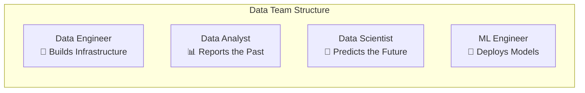
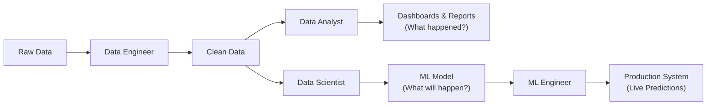
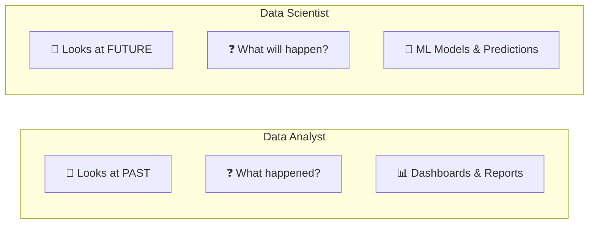
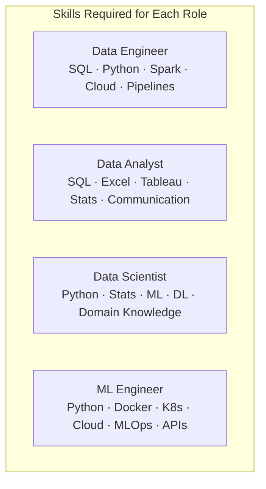
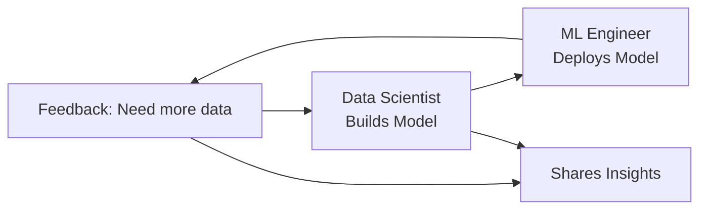
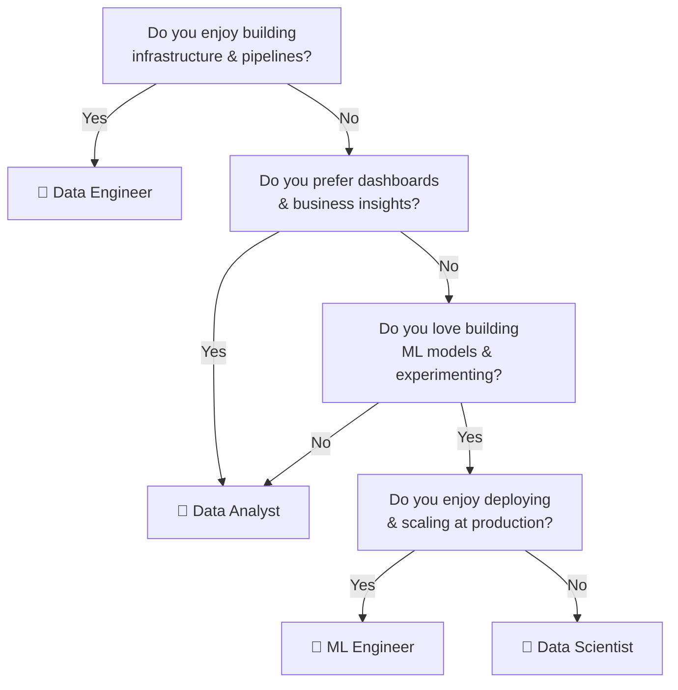

# Data Engineer Vs Data Analyst Vs Data Scientist Vs ML Engineer

---

## Overview

In the data industry, there are **4 main roles** that people often confuse. Each has a distinct focus, skillset, and responsibility.



---

## The Data Pipeline — Who Does What?



---

## Role 1: Data Engineer 🔧

**Focus:** Building and maintaining the infrastructure for data generation, storage, and processing.

### Responsibilities
- Build data pipelines (ETL — Extract, Transform, Load)
- Design and manage databases
- Ensure data is accessible, clean, and reliable
- Handle large-scale data processing
- Maintain data warehouses / data lakes

### Skills Required
| Skill | Why Needed |
|-------|-----------|
| **SQL** | Query and manage databases |
| **Python / Scala** | Build data pipelines |
| **Spark / Hadoop** | Process large datasets |
| **Cloud (AWS/GCP/Azure)** | Store and manage data |
| **Docker / Kubernetes** | Deploy data infrastructure |
| **Data Warehousing** | Design storage systems |

### Analogy
> **Data Engineer** = The plumber who ensures water (data) flows correctly through pipes (pipelines) to every tap (user).

---

## Role 2: Data Analyst 📊

**Focus:** Analyzing historical data to answer business questions and create reports.

### Responsibilities
- Create dashboards and visualizations
- Generate reports for business decisions
- Find trends and patterns in past data
- Answer: "What happened?" and "Why did it happen?"
- Present findings to stakeholders

### Skills Required
| Skill | Why Needed |
|-------|-----------|
| **SQL** | Query data |
| **Excel** | Quick analysis |
| **Tableau / Power BI** | Create dashboards |
| **Python (Pandas)** | Data manipulation |
| **Statistical Analysis** | Find insights |
| **Communication** | Present findings |

### Analogy
> **Data Analyst** = The sports commentator who tells you what happened in the game, who scored, and why the team won or lost.

---

## Role 3: Data Scientist 🔮

**Focus:** Using advanced analytics, statistics, and ML to predict future outcomes and generate insights.

### Responsibilities
- Build predictive models (ML algorithms)
- Perform A/B testing and experiments
- Ask and answer: "What will happen?" and "What should we do?"
- Feature engineering and model selection
- Communicate findings to leadership

### Skills Required
| Skill | Why Needed |
|-------|-----------|
| **Python / R** | Build models |
| **Statistics & Probability** | Foundation of ML |
| **Machine Learning Algorithms** | Train models |
| **SQL** | Query data |
| **Deep Learning** | For complex problems |
| **Domain Knowledge** | Understand the business |

### Data Scientist vs Data Analyst



### Analogy
> **Data Scientist** = The detective who not only looks at evidence but also predicts where the next crime might happen and suggests preventive actions.

---

## Role 4: Machine Learning Engineer 🚀

**Focus:** Deploying, scaling, and maintaining ML models in production.

### Responsibilities
- Deploy ML models to production
- Build APIs for model inference
- Optimize models for speed and scalability
- Monitor model performance in production
- Retrain and update models
- Bridge the gap between Data Science and Engineering

### Skills Required
| Skill | Why Needed |
|-------|-----------|
| **Python** | Build & deploy models |
| **Flask / FastAPI** | Create model APIs |
| **Docker / Kubernetes** | Containerize and orchestrate |
| **Cloud (AWS/GCP/Azure)** | Deploy at scale |
| **CI/CD** | Automate deployment |
| **MLOps** | Monitor & maintain models |
| **Deep Learning Frameworks** | TF, PyTorch |

### Analogy
> **ML Engineer** = The pit crew who takes the race car (model) built by the data scientist and makes sure it runs perfectly on the track (production).

---

## Comparison Table

| Aspect | Data Engineer | Data Analyst | Data Scientist | ML Engineer |
|--------|-------------|-------------|---------------|-------------|
| **Primary Focus** | Data infrastructure | Past insights | Future predictions | Production models |
| **Key Question** | "Is data available?" | "What happened?" | "What will happen?" | "Is model running?" |
| **Data Type** | Raw data pipelines | Clean, structured data | Clean + feature-engineered | Model inputs/outputs |
| **Tools** | SQL, Spark, Airflow, Kafka | SQL, Excel, Tableau, Power BI | Python, sklearn, TensorFlow | Python, Docker, K8s, FastAPI |
| **Output** | Clean, reliable data | Reports, dashboards | Models, insights | APIs, deployed systems |
| **Coding Level** | High | Low-Medium | Medium-High | High |
| **ML Knowledge** | Low | Low | High | Medium-High |
| **Deployment** | Data pipelines | None | Experimentation | Production systems |
| **Avg. Salary (India)** | ₹8-15 LPA | ₹5-10 LPA | ₹12-20 LPA | ₹15-25 LPA |

---

## Skill Comparison



---

## How They Work Together



### Real-Life Example: Netflix

| Role | What They Do at Netflix |
|------|------------------------|
| **Data Engineer** | Builds pipelines to collect user watch history, ratings, searches |
| **Data Analyst** | Creates dashboards showing "Most watched shows this week" |
| **Data Scientist** | Builds recommendation algorithm: "What will you watch next?" |
| **ML Engineer** | Deploys the recommendation model so millions of users get instant suggestions |

---

## Which Role Should You Choose?



| If You Like | Choose |
|-------------|--------|
| Building systems, databases, pipelines | **Data Engineer** |
| Charts, dashboards, business questions | **Data Analyst** |
| Math, statistics, building models | **Data Scientist** |
| Coding, deployment, scaling, DevOps | **ML Engineer** |

---

## Summary

```
DATA ENGINEER     → "I build the pipes that bring water to the city" 🏗️
DATA ANALYST      → "I tell you how much water was used yesterday" 📊
DATA SCIENTIST    → "I predict how much water will be needed tomorrow" 🔮
ML ENGINEER       → "I make sure the prediction system runs 24/7" 🚀
```

---

*Based on CampusX video: "Data Engineer Vs Data Analyst Vs Data Scientist Vs ML Engineer | Data Science Job Roles"*
