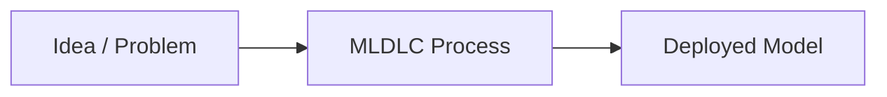
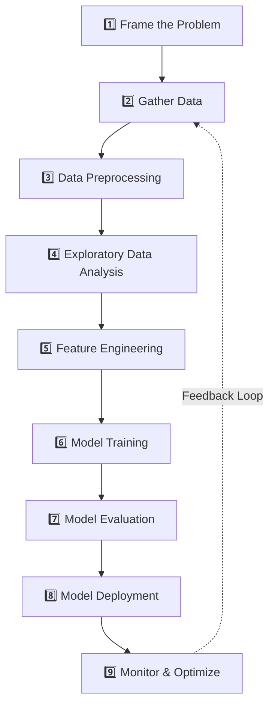
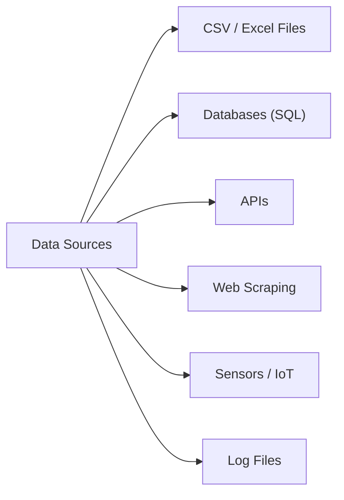
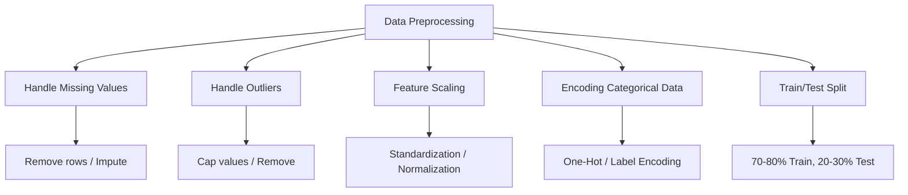
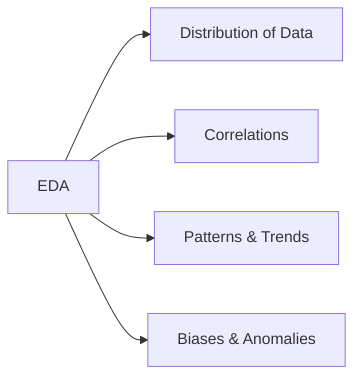
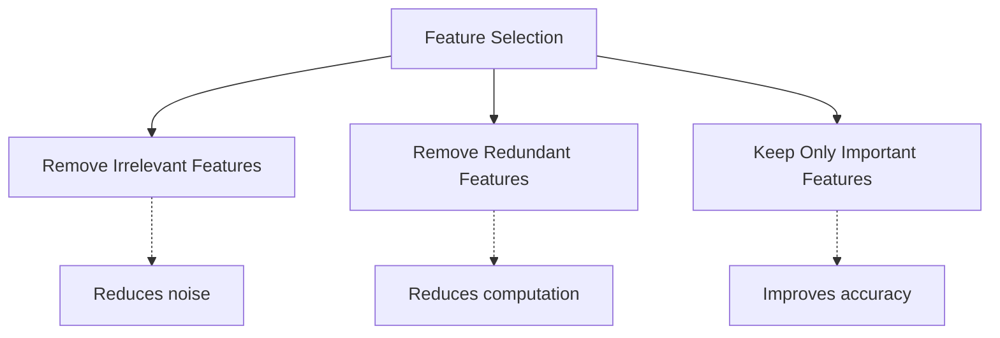
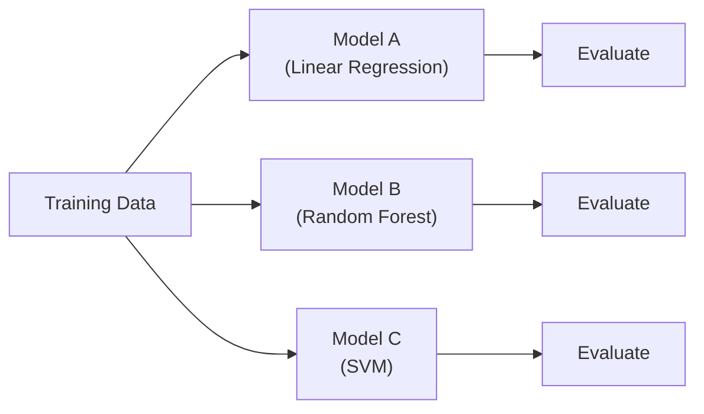
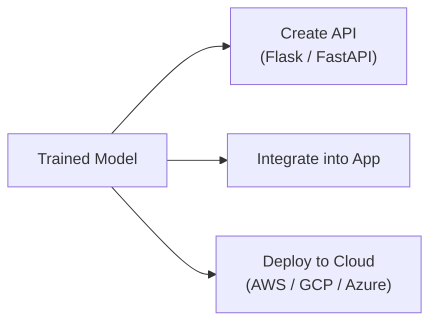
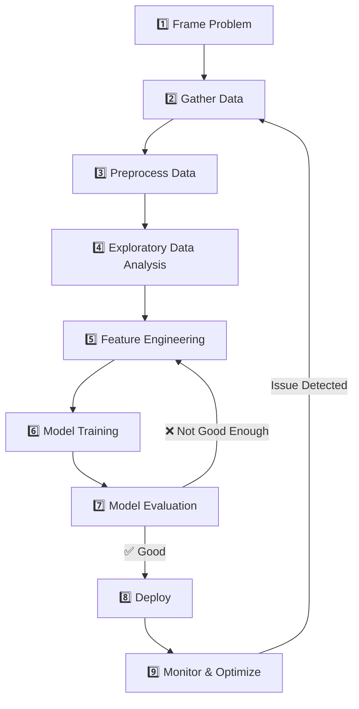

# Machine Learning Development Life Cycle | MLDLC

---

## What is MLDLC?

**MLDLC (Machine Learning Development Life Cycle)** is the step-by-step process of taking an ML project from **idea to production**. It is also called the **Data Science Life Cycle**.



---

## The 9 Steps of MLDLC



---

## Step 1: Frame the Problem

**Goal:** Clearly define what we want to achieve.

| Question | Why It Matters |
|----------|---------------|
| What is the business problem? | Defines project direction |
| Who are the stakeholders? | Knows who needs the results |
| What type of ML problem? | Supervised / Unsupervised / RL? |
| What is the success metric? | How do we measure "good"? |
| What data is needed? | Plan data collection |
| What is the budget/timeline? | Resource planning |
| How will it be deployed? | Batch / Online? |

**Examples:**
- ❌ Bad: "Let's use ML on our data"
- ✅ Good: "We want to predict which customers will churn next month so we can offer them discounts"

---

## Step 2: Gather Data

**Goal:** Collect data from all relevant sources.

### Data Sources



| Source | Example |
|--------|---------|
| **CSV Files** | Kaggle datasets, company exports |
| **Databases** | Customer data from SQL database |
| **APIs** | Twitter API, weather API |
| **Web Scraping** | Scraping product prices from websites |
| **Sensors** | Temperature, pressure sensors |
| **Logs** | Server logs, user activity logs |

---

## Step 3: Data Preprocessing

**Goal:** Clean and prepare raw data for analysis.

### Common Tasks



| Task | Description |
|------|-------------|
| **Missing Values** | Fill with mean/median/mode or drop rows |
| **Outliers** | Detect and handle extreme values |
| **Feature Scaling** | Bring all features to similar range |
| **Encoding** | Convert categories to numbers |
| **Train/Test Split** | Separate data for training and evaluation |

---

## Step 4: Exploratory Data Analysis (EDA)

**Goal:** Understand the data through visualizations and statistics.

### What We Look For



| Technique | Purpose |
|-----------|---------|
| **Histograms** | See distribution of each feature |
| **Box Plots** | Detect outliers |
| **Correlation Matrix** | Find relationships between features |
| **Pair Plots** | Visualize feature interactions |
| **Missing Value Maps** | See where data is missing |

---

## Step 5: Feature Engineering & Selection

**Goal:** Create better features and select the most important ones.

### Feature Engineering
- Create new features from existing ones
- Example: From "date" → extract "day of week", "month", "is_weekend"
- Example: From "height" and "width" → create "area"

### Feature Selection



| Method | Description |
|--------|-------------|
| **Filter Methods** | Correlation, Chi-square test |
| **Wrapper Methods** | Forward/Backward selection |
| **Embedded Methods** | Lasso, Decision Tree importance |

---

## Step 6: Model Training

**Goal:** Train ML models on the prepared data.

### Activities
- Choose candidate algorithms (Linear Regression, Random Forest, SVM, etc.)
- Train models on training data
- Tune hyperparameters



---

## Step 7: Model Evaluation

**Goal:** Check how well the model performs on unseen data.

### Evaluation Metrics

| Problem Type | Metrics |
|-------------|---------|
| **Regression** | MAE, MSE, RMSE, R² Score |
| **Classification** | Accuracy, Precision, Recall, F1-Score, ROC-AUC |
| **Clustering** | Silhouette Score, Inertia |

### Techniques
- **Cross-Validation** — more reliable evaluation
- **Test Set** — final check on unseen data
- **A/B Testing** — compare with existing solution

---

## Step 8: Model Deployment

**Goal:** Put the model into production.



| Deployment Type | Description |
|----------------|-------------|
| **Batch Prediction** | Run model periodically on new data |
| **Real-time API** | Model serves predictions on-demand |
| **Embedded** | Model runs on device (mobile, IoT) |

---

## Step 9: Monitor & Optimize

**Goal:** Track model performance and improve over time.

### Monitoring
- **Data Drift** — Is input data changing?
- **Concept Drift** — Is the relationship changing?
- **Performance Metrics** — Is accuracy dropping?
- **System Health** — Is the API responding fast enough?

### Optimization
- Retrain model with new data
- Try better algorithms
- Improve features
- Optimize infrastructure

---

## Complete MLDLC Flow



---

## Analogy: Building a House 🏠

| MLDLC Step | House Building Analogy |
|------------|----------------------|
| Frame Problem | Decide what kind of house to build |
| Gather Data | Buy bricks, cement, wood |
| Preprocess | Clean bricks, cut wood to size |
| EDA | Check if materials are good quality |
| Feature Engineering | Design windows, doors layout |
| Model Training | Build the house |
| Model Evaluation | Inspect if house is safe |
| Deployment | Move into the house |
| Monitor | Maintain and repair over time |

---

## Summary

```
1️⃣ Frame Problem     → What to build?
2️⃣ Gather Data       → Collect raw materials
3️⃣ Preprocess        → Clean & prepare
4️⃣ EDA               → Understand data
5️⃣ Feature Engineering → Create better features
6️⃣ Model Training    → Train algorithms
7️⃣ Evaluation        → Check performance
8️⃣ Deployment        → Put in production
9️⃣ Monitor           → Maintain & improve
```

---

*Based on CampusX video: "Machine Learning Development Life Cycle | MLDLC in Data Science"*
