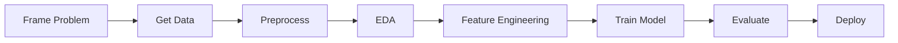
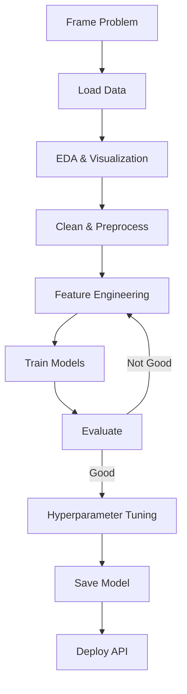

# End to End Toy Project | Complete ML Project Walkthrough

---

## Overview

A complete end-to-end ML project from **problem framing to deployment**. We'll build a **House Price Prediction** model step by step.



---

## Project: House Price Prediction

**Problem:** Predict the selling price of a house given its features.

| Component | Details |
|-----------|---------|
| **Problem Type** | Regression (predict continuous value) |
| **Target** | `price` — house selling price |
| **Features** | sqft, bedrooms, bathrooms, location, age, etc. |
| **Metric** | RMSE (Root Mean Squared Error), R² Score |
| **Baseline** | Predict mean price |

---

## Step 1: Setup Environment

```bash
# Create and activate environment
conda create --name house_price python=3.9
conda activate house_price

# Install packages
conda install numpy pandas matplotlib seaborn scikit-learn jupyter
```

---

## Step 2: Import Libraries

```python
# Data handling
import pandas as pd
import numpy as np

# Visualization
import matplotlib.pyplot as plt
import seaborn as sns

# Preprocessing & Modeling
from sklearn.model_selection import train_test_split
from sklearn.preprocessing import StandardScaler
from sklearn.linear_model import LinearRegression
from sklearn.tree import DecisionTreeRegressor
from sklearn.ensemble import RandomForestRegressor
from sklearn.metrics import mean_squared_error, r2_score

# Settings
plt.style.use('ggplot')
%matplotlib inline
pd.set_option('display.max_columns', None)
```

---

## Step 3: Load & Explore Data

```python
# Load data
df = pd.read_csv('house_data.csv')

# Quick look
print(df.head())
print(df.shape)
print(df.info())
print(df.describe())

# Check missing values
print(df.isnull().sum())

# Check target distribution
sns.histplot(df['price'], kde=True)
plt.title('Price Distribution')
plt.show()
```

---

## Step 4: Exploratory Data Analysis (EDA)

```python
# Correlation with target
corr = df.corr(numeric_only=True)['price'].sort_values(ascending=False)
print(corr)

# Correlation heatmap
plt.figure(figsize=(12, 8))
sns.heatmap(df.corr(numeric_only=True), annot=True, cmap='RdBu_r')
plt.title('Feature Correlations')
plt.show()

# Scatter plots for top features
fig, axes = plt.subplots(2, 3, figsize=(15, 10))
top_features = corr.index[1:7]  # Top 6 features (excluding price)
for i, feature in enumerate(top_features):
    row, col = i // 3, i % 3
    axes[row, col].scatter(df[feature], df['price'], alpha=0.5)
    axes[row, col].set_xlabel(feature)
    axes[row, col].set_ylabel('Price')
plt.tight_layout()
plt.show()

# Box plots for categorical features
for col in df.select_dtypes(include='object').columns:
    plt.figure(figsize=(10, 4))
    sns.boxplot(x=df[col], y=df['price'])
    plt.xticks(rotation=45)
    plt.title(f'Price by {col}')
    plt.show()
```

---

## Step 5: Data Preprocessing

```python
# Handle missing values
df['bedrooms'] = df['bedrooms'].fillna(df['bedrooms'].median())
df['bathrooms'] = df['bathrooms'].fillna(df['bathrooms'].median())

# Handle outliers using IQR
def cap_outliers(df, column):
    Q1 = df[column].quantile(0.25)
    Q3 = df[column].quantile(0.75)
    IQR = Q3 - Q1
    lower = Q1 - 1.5 * IQR
    upper = Q3 + 1.5 * IQR
    df[column] = df[column].clip(lower, upper)
    return df

for col in ['sqft', 'price']:
    df = cap_outliers(df, col)

# Encode categorical variables
df = pd.get_dummies(df, columns=['location', 'condition'], drop_first=True)

# Separate features and target
X = df.drop('price', axis=1)
y = df['price']

# Train-test split
X_train, X_test, y_train, y_test = train_test_split(
    X, y, test_size=0.2, random_state=42
)

# Feature scaling
scaler = StandardScaler()
X_train_scaled = scaler.fit_transform(X_train)
X_test_scaled = scaler.transform(X_test)
```

---

## Step 6: Train Models

```python
# Dictionary of models
models = {
    'Linear Regression': LinearRegression(),
    'Decision Tree': DecisionTreeRegressor(random_state=42),
    'Random Forest': RandomForestRegressor(random_state=42)
}

# Train and evaluate each model
results = {}
for name, model in models.items():
    model.fit(X_train_scaled, y_train)
    y_pred = model.predict(X_test_scaled)
    
    rmse = np.sqrt(mean_squared_error(y_test, y_pred))
    r2 = r2_score(y_test, y_pred)
    
    results[name] = {'RMSE': rmse, 'R²': r2}
    print(f"{name}: RMSE = ${rmse:,.2f}, R² = {r2:.4f}")
```

**Sample Output:**
```
Linear Regression: RMSE = $52,340, R² = 0.6750
Decision Tree: RMSE = $45,210, R² = 0.7210
Random Forest: RMSE = $38,450, R² = 0.7850
```

---

## Step 7: Model Evaluation

```python
# Visualize predictions vs actual
best_model = models['Random Forest']
y_pred = best_model.predict(X_test_scaled)

plt.figure(figsize=(8, 6))
plt.scatter(y_test, y_pred, alpha=0.5)
plt.plot([y_test.min(), y_test.max()], 
         [y_test.min(), y_test.max()], 'r--')
plt.xlabel('Actual Price')
plt.ylabel('Predicted Price')
plt.title('Actual vs Predicted Price')
plt.show()

# Residual plot
residuals = y_test - y_pred
plt.figure(figsize=(8, 4))
plt.scatter(y_pred, residuals, alpha=0.5)
plt.axhline(y=0, color='r', linestyle='--')
plt.xlabel('Predicted Price')
plt.ylabel('Residuals')
plt.title('Residual Plot')
plt.show()

# Feature importance (for tree-based models)
if hasattr(best_model, 'feature_importances_'):
    importance = pd.DataFrame({
        'feature': X.columns,
        'importance': best_model.feature_importances_
    }).sort_values('importance', ascending=False)

    plt.figure(figsize=(10, 6))
    plt.barh(importance['feature'][:10], importance['importance'][:10])
    plt.xlabel('Importance')
    plt.title('Top 10 Feature Importances')
    plt.gca().invert_yaxis()
    plt.show()
```

---

## Step 8: Hyperparameter Tuning

```python
from sklearn.model_selection import GridSearchCV

param_grid = {
    'n_estimators': [100, 200, 300],
    'max_depth': [10, 15, 20, None],
    'min_samples_split': [2, 5, 10],
    'min_samples_leaf': [1, 2, 4]
}

rf = RandomForestRegressor(random_state=42)
grid_search = GridSearchCV(
    rf, param_grid, cv=5, 
    scoring='r2', n_jobs=-1, verbose=1
)
grid_search.fit(X_train_scaled, y_train)

print(f"Best Parameters: {grid_search.best_params_}")
print(f"Best CV R²: {grid_search.best_score_:.4f}")

# Evaluate tuned model
best_rf = grid_search.best_estimator_
y_pred_tuned = best_rf.predict(X_test_scaled)
rmse_tuned = np.sqrt(mean_squared_error(y_test, y_pred_tuned))
r2_tuned = r2_score(y_test, y_pred_tuned)
print(f"Tuned Model: RMSE = ${rmse_tuned:,.2f}, R² = {r2_tuned:.4f}")
```

---

## Step 9: Save & Deploy Model

```python
import joblib

# Save the model and scaler
joblib.dump(best_rf, 'house_price_model.pkl')
joblib.dump(scaler, 'scaler.pkl')

# Load them later
# loaded_model = joblib.load('house_price_model.pkl')
# loaded_scaler = joblib.load('scaler.pkl')
```

### Simple Prediction Function

```python
def predict_price(sqft, bedrooms, bathrooms, location, age):
    """Predict house price given features."""
    # Load model and scaler
    model = joblib.load('house_price_model.pkl')
    scaler = joblib.load('scaler.pkl')
    
    # Create input dataframe
    input_data = pd.DataFrame([{
        'sqft': sqft,
        'bedrooms': bedrooms,
        'bathrooms': bathrooms,
        'age': age,
        'location_Mumbai': 1 if location == 'Mumbai' else 0,
        'location_Delhi': 1 if location == 'Delhi' else 0,
        'location_Bangalore': 1 if location == 'Bangalore' else 0,
        'condition_Good': 1 if condition == 'Good' else 0,
        'condition_Excellent': 1 if condition == 'Excellent' else 0
    }])
    
    # Scale and predict
    input_scaled = scaler.transform(input_data)
    price = model.predict(input_scaled)[0]
    return price

# Example usage
predicted = predict_price(
    sqft=1500, bedrooms=3, bathrooms=2, 
    location='Mumbai', age=5
)
print(f"Predicted Price: ${predicted:,.2f}")
```

---

## Step 10: Create API (FastAPI)

```python
# app.py — save this as a separate file
from fastapi import FastAPI
from pydantic import BaseModel
import joblib
import pandas as pd
import numpy as np

app = FastAPI()
model = joblib.load('house_price_model.pkl')
scaler = joblib.load('scaler.pkl')

class HouseFeatures(BaseModel):
    sqft: float
    bedrooms: int
    bathrooms: int
    age: int
    location: str
    condition: str

@app.post("/predict")
def predict_price(features: HouseFeatures):
    input_data = pd.DataFrame([{
        'sqft': features.sqft,
        'bedrooms': features.bedrooms,
        'bathrooms': features.bathrooms,
        'age': features.age,
        'location_Mumbai': 1 if features.location == 'Mumbai' else 0,
        'location_Delhi': 1 if features.location == 'Delhi' else 0,
        'location_Bangalore': 1 if features.location == 'Bangalore' else 0,
        'condition_Good': 1 if features.condition == 'Good' else 0,
        'condition_Excellent': 1 if features.condition == 'Excellent' else 0
    }])
    
    input_scaled = scaler.transform(input_data)
    price = model.predict(input_scaled)[0]
    
    return {"predicted_price": round(price, 2)}
```

```bash
# Run the API
uvicorn app:app --reload

# Test with curl
curl -X POST "http://localhost:8000/predict" \
  -H "Content-Type: application/json" \
  -d '{"sqft":1500,"bedrooms":3,"bathrooms":2,"age":5,"location":"Mumbai","condition":"Good"}'
```

---

## Complete Project Checklist

```
☐ Problem framed (regression, target = price)
☐ Environment setup (conda, packages)
☐ Data loaded and explored
☐ EDA performed (correlations, distributions)
☐ Missing values handled
☐ Outliers capped
☐ Categorical variables encoded
☐ Train/test split
☐ Features scaled
☐ Baseline model trained
☐ Multiple models compared
☐ Best model tuned
☐ Model evaluated (RMSE, R², residuals)
☐ Model saved (joblib/pickle)
☐ Prediction function created
☐ API deployed (FastAPI)
```

---

## Summary



```
FRAME   → House price prediction (regression)
DATA    → house_data.csv
EDA     → Correlations, scatter plots, box plots
CLEAN   → Missing values, outliers, encoding
MODEL   → Linear Regression, Decision Tree, Random Forest
TUNE    → GridSearchCV
DEPLOY  → FastAPI + joblib
```

> **Key Insight:** Always start simple — get a baseline working first, then iterate. An end-to-end pipeline with a simple model is better than a perfect model that never deploys.

---

*Based on CampusX video: "End to End Toy Project | Machine Learning Project for Beginners"*
