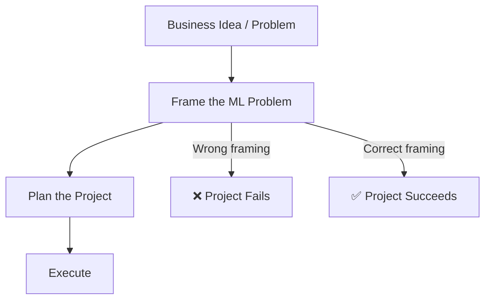
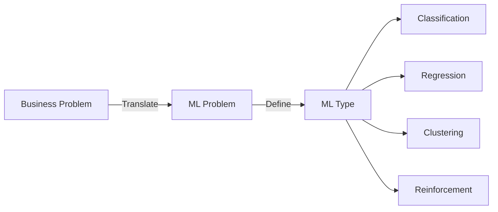
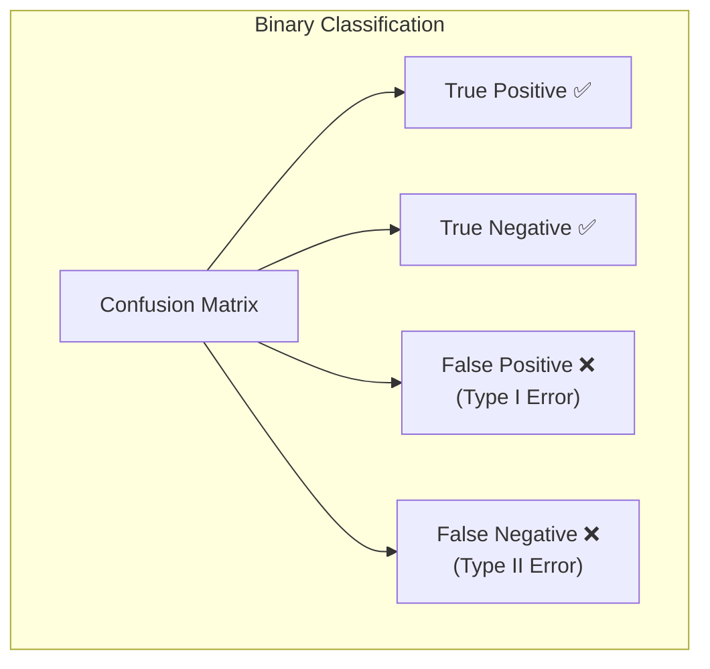
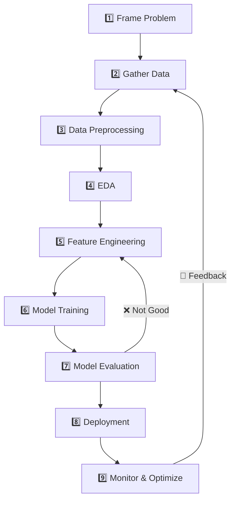
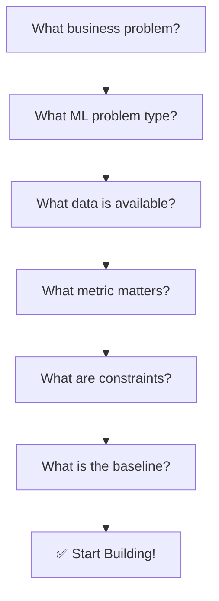

# How to Frame a Machine Learning Problem | Plan a Data Science Project

---

## Overview

Before writing any code, you must **frame the problem correctly**. A well-framed problem leads to a successful ML project. A poorly framed problem wastes time, resources, and produces useless models.



---

## Step 1: Understand the Business Problem

### Questions to Ask Stakeholders

| Question | Purpose |
|----------|---------|
| What is the current problem? | Understand pain points |
| How is it solved today? | Baseline for comparison |
| What would success look like? | Define business metrics |
| Who will use the solution? | Understand end users |
| What decisions will be made? | Actionable insights vs nice-to-know |
| What is the budget/timeline? | Resource constraints |

### Example: Churn Prediction

```
❌ Bad framing: "Let's use ML on our customer data"
✅ Good framing: "We want to predict which customers will churn in the next 30 days 
   so we can send them targeted discount offers and reduce churn by 20%"
```

---

## Step 2: Translate Business Problem → ML Problem



### Translation Framework

| Business Question | ML Problem Type | Example |
|------------------|----------------|---------|
| "Is this spam?" | Binary Classification | Email spam filter |
| "What is the price?" | Regression | House price prediction |
| "Which category?" | Multi-class Classification | Dog breed identification |
| "Is this unusual?" | Anomaly Detection | Fraud detection |
| "Group customers" | Clustering | Customer segmentation |
| "What will user watch?" | Recommendation | Netflix suggestions |

### Define the 5 Key Components

| Component | Question | Example (Churn Prediction) |
|-----------|----------|---------------------------|
| **X (Features)** | What data do we have? | Usage frequency, plan type, complaints, tenure |
| **y (Target)** | What are we predicting? | `churn = 1` if cancelled, `0` if active |
| **Task Type** | Classification or Regression? | Binary Classification |
| **Metric** | How do we measure success? | Precision, Recall, F1-Score |
| **Constraints** | Any limitations? | Real-time prediction needed, interpretability required |

---

## Step 3: Choose the Right Evaluation Metric

### Classification Metrics



| Metric | Formula | When to Use |
|--------|---------|-------------|
| **Accuracy** | (TP+TN)/(TP+TN+FP+FN) | Balanced classes |
| **Precision** | TP/(TP+FP) | Minimize false positives (spam detection) |
| **Recall** | TP/(TP+FN) | Minimize false negatives (disease detection) |
| **F1-Score** | 2×(P×R)/(P+R) | Imbalanced classes |
| **ROC-AUC** | Area under ROC curve | Ranking quality |

### Regression Metrics

| Metric | Formula | When to Use |
|--------|---------|-------------|
| **MAE** | avg(\|y - ŷ\|) | Interpretable error |
| **MSE** | avg((y-ŷ)²) | Penalize large errors |
| **RMSE** | √MSE | Same unit as target |
| **R²** | 1 - (SS_res/SS_tot) | Model fit quality |
| **MAPE** | avg(\|(y-ŷ)/y\|×100) | Percentage error |

> **Rule of Thumb:** Choose the metric that best reflects the **business cost** of wrong predictions.

---

## Step 4: Plan the Data Science Project

### The 9-Step MLDLC



### Project Planning Checklist

| Phase | Deliverable |
|-------|-------------|
| **Framing** | Problem statement document, success criteria |
| **Data** | Data sources identified, collection pipeline |
| **EDA** | Visualizations, insights, data quality report |
| **Modeling** | Baseline model, candidate algorithms, tuned model |
| **Evaluation** | Performance report, business impact analysis |
| **Deployment** | API, monitoring dashboard, rollback plan |

---

## Step 5: Baseline Model — Your First Benchmark

**Always start with a simple baseline** before trying complex models.

### Baseline Strategies

| Data Type | Baseline | Why |
|-----------|----------|-----|
| **Classification** | Majority class classifier | "Always predict the most common class" |
| **Regression** | Mean/Median predictor | "Always predict the average value" |
| **Time Series** | Naive forecast | "Tomorrow = Today" |
| **Text** | TF-IDF + Logistic Regression | Simple but strong |

```python
from sklearn.dummy import DummyClassifier, DummyRegressor

# Classification baseline
dummy_clf = DummyClassifier(strategy='most_frequent')
dummy_clf.fit(X_train, y_train)
baseline_accuracy = dummy_clf.score(X_test, y_test)

# Regression baseline
dummy_reg = DummyRegressor(strategy='mean')
dummy_reg.fit(X_train, y_train)
baseline_rmse = ...  # evaluate
```

> **Key Insight:** If your complex model doesn't beat the baseline, something is wrong.

---

## Step 6: Common Pitfalls in Problem Framing

### Pitfall 1: Solving the Wrong Problem

```
❌ "Build a model to predict customer satisfaction"
✅ "Build a model to identify customers at risk of leaving"
```

### Pitfall 2: Leakage

- **Target Leakage:** Using future information to predict the present
- **Example:** Using "number of support calls" to predict churn — but customers call support *after* deciding to churn

### Pitfall 3: Ignoring Business Constraints

| Constraint | Impact |
|------------|--------|
| **Latency** | Model must predict in <100ms |
| **Explainability** | Must explain why a loan was rejected |
| **Data Freshness** | Model trained on old data may not work |
| **Compute Budget** | Limited GPU/CPU resources |

### Pitfall 4: Wrong Evaluation Metric

```
❌ Accuracy on fraud detection (99.9% non-fraud → 99.9% accuracy by predicting "not fraud")
✅ Precision-Recall / F1-Score for imbalanced datasets
```

---

## Summary



### The Framing Checklist

```
☐ Business problem clearly defined
☐ Translated to ML problem (classification/regression/etc.)
☐ Target variable (y) identified
☐ Features (X) identified
☐ Evaluation metric chosen (business-aligned)
☐ Constraints documented (latency, interpretability, etc.)
☐ Baseline model planned
☐ Success criteria defined
☐ Stakeholders aligned
```

> **Key Insight:** Spend 40% of your project time on problem framing and data understanding. This investment saves you from building the wrong solution.

---

*Based on CampusX video: "How to Frame a Machine Learning Problem | How to plan a Data Science Project Effectively"*
