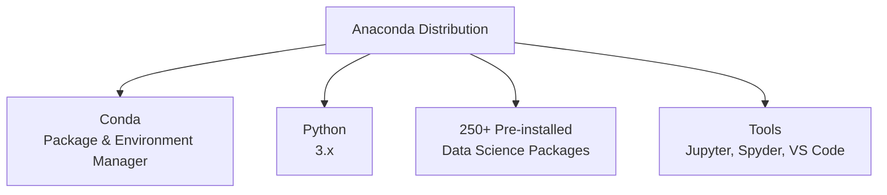
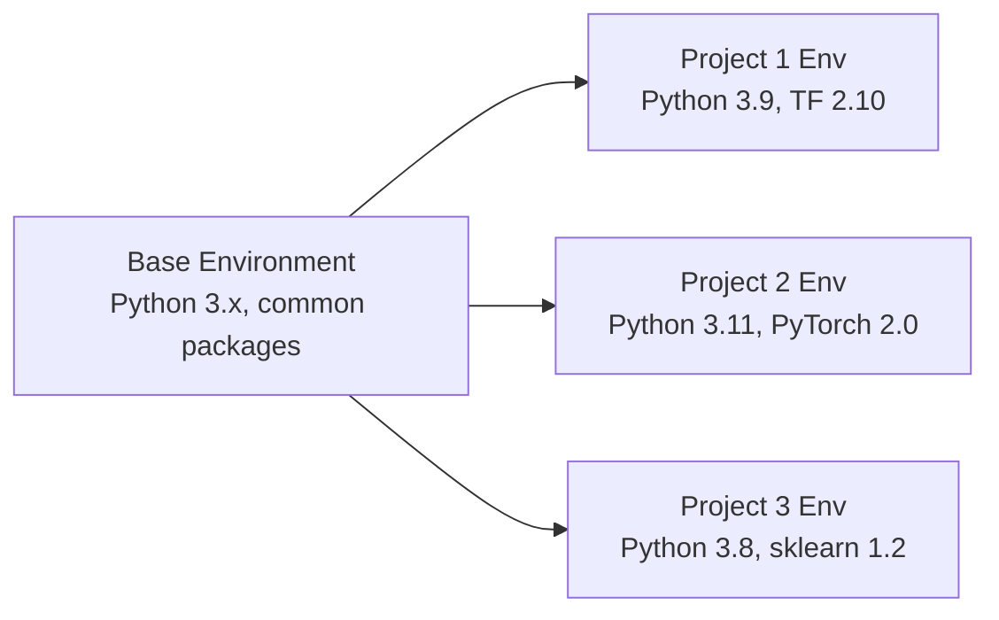
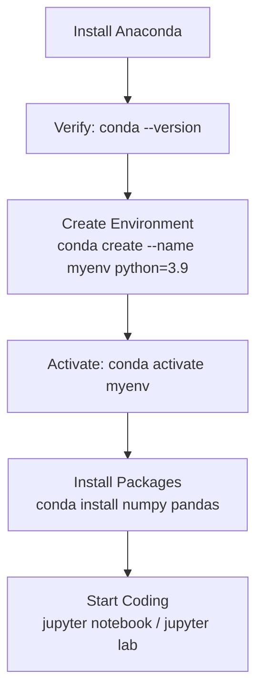

# Installing Anaconda For Data Science | Setting Up Python Environment

---

## Overview

**Anaconda** is the most popular Python distribution for Data Science and Machine Learning. It comes pre-installed with 250+ data science packages (NumPy, Pandas, Matplotlib, Scikit-learn, Jupyter, etc.).



---

## 1. Why Anaconda?

| Feature | Benefit |
|---------|---------|
| **Pre-installed packages** | No need to manually install NumPy, Pandas, etc. |
| **Conda package manager** | Better than pip for data science dependencies |
| **Environment management** | Isolate projects with different Python versions/packages |
| **Jupyter integration** | Comes with Jupyter Notebook and JupyterLab |
| **Cross-platform** | Windows, macOS, Linux |

### Anaconda vs Miniconda

| | Anaconda | Miniconda |
|--|----------|-----------|
| **Size** | ~3 GB | ~400 MB |
| **Packages** | 250+ pre-installed | Minimal (just conda + Python) |
| **Best for** | Beginners, quick setup | Advanced users, limited space |
| **Install** | `pip` install packages as needed | You install what you need |

---

## 2. Download & Install

### Step 1: Download

Go to: **[https://www.anaconda.com/download](https://www.anaconda.com/download)**

- Choose your OS (Windows / macOS / Linux)
- Download the latest Python 3.x version

### Step 2: Install

#### Windows
1. Run the `.exe` installer
2. Click "Next" through the wizard
3. **Important:** Check "Add Anaconda to my PATH environment variable" (optional but recommended)
4. Click "Install"

#### macOS
1. Run the `.pkg` installer
2. Follow the installation wizard
3. Or install via command line:

```bash
# Download the installer
curl -O https://repo.anaconda.com/archive/Anaconda3-2024.10-1-MacOSX-x86_64.sh

# Run the installer
bash Anaconda3-2024.10-1-MacOSX-x86_64.sh

# Follow prompts and agree to license
```

#### Linux
```bash
# Download
wget https://repo.anaconda.com/archive/Anaconda3-2024.10-1-Linux-x86_64.sh

# Install
bash Anaconda3-2024.10-1-Linux-x86_64.sh
```

### Step 3: Verify Installation

```bash
# Check conda version
conda --version

# Check Python version
python --version

# List installed packages
conda list
```

---

## 3. Conda Basics — Package Management

### Installing Packages

```bash
# Install a package
conda install numpy

# Install multiple packages
conda install numpy pandas matplotlib

# Install a specific version
conda install numpy=1.24.0

# Install from conda-forge (community channel)
conda install -c conda-forge scikit-learn

# Install with pip (if not available on conda)
pip install tensorflow
```

### Updating & Removing

```bash
# Update a package
conda update numpy

# Update all packages
conda update --all

# Update conda itself
conda update conda

# Remove a package
conda remove numpy
```

### Searching for Packages

```bash
# Search for a package
conda search numpy

# Search with specific version
conda search numpy=1.24
```

---

## 4. Conda Environments

**Why environments?** Different projects need different package versions. Environments keep them isolated.



### Creating Environments

```bash
# Create environment with Python
conda create --name myenv python=3.9

# Create with specific packages
conda create --name mlproject python=3.9 numpy pandas matplotlib

# Create from environment file
conda env create -f environment.yml
```

### Activating & Deactivating

```bash
# Activate environment
conda activate myenv

# Deactivate (go back to base)
conda deactivate
```

### Managing Environments

```bash
# List all environments
conda env list

# Remove an environment
conda env remove --name myenv

# Export environment (share with others)
conda env export > environment.yml

# Create env from exported file
conda env create -f environment.yml
```

### environment.yml Example

```yaml
name: mlproject
channels:
  - conda-forge
  - defaults
dependencies:
  - python=3.9
  - numpy=1.24
  - pandas=2.0
  - matplotlib=3.7
  - seaborn=0.12
  - scikit-learn=1.2
  - jupyter=1.0
  - pip
  - pip:
    - tensorflow==2.12
    - torch==2.0
```

---

## 5. Jupyter Notebook & JupyterLab

Anaconda comes with Jupyter pre-installed.

### Starting Jupyter

```bash
# Jupyter Notebook (classic)
jupyter notebook

# JupyterLab (modern interface)
jupyter lab
```

### Jupyter Shortcuts

| Shortcut | Action |
|----------|--------|
| `Shift + Enter` | Run cell and move to next |
| `Ctrl + Enter` | Run cell in place |
| `Alt + Enter` | Run cell and insert below |
| `Esc` | Command mode |
| `Enter` | Edit mode |
| `A` | Insert cell above |
| `B` | Insert cell below |
| `DD` | Delete cell |
| `M` | Change to Markdown cell |
| `Y` | Change to Code cell |

---

## 6. Common Issues & Fixes

### Issue 1: Conda Command Not Found

```bash
# Windows: Add to PATH manually or use Anaconda Prompt
# macOS/Linux: Add to .bashrc or .zshrc
export PATH="/path/to/anaconda3/bin:$PATH"
```

### Issue 2: Slow Conda Operations

```bash
# Use libmamba solver (much faster)
conda install -n base conda-libmamba-solver
conda config --set solver libmamba
```

### Issue 3: Package Not Found

```bash
# Try conda-forge channel
conda install -c conda-forge package_name

# Or use pip as fallback
pip install package_name
```

### Issue 4: Out of Disk Space

```bash
# Clean conda cache
conda clean --all

# Remove unused packages
conda clean --packages
```

---

## Summary



```
INSTALL  → Download from anaconda.com
VERIFY   → conda --version
ENV      → conda create --name myenv python=3.9
ACTIVATE → conda activate myenv
PACKAGES → conda install numpy pandas matplotlib
JUPYTER  → jupyter notebook
```

---

*Based on CampusX video: "Installing Anaconda For Data Science | How to Install Anaconda"*
