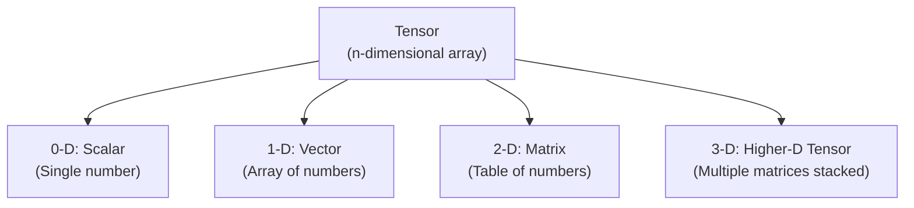
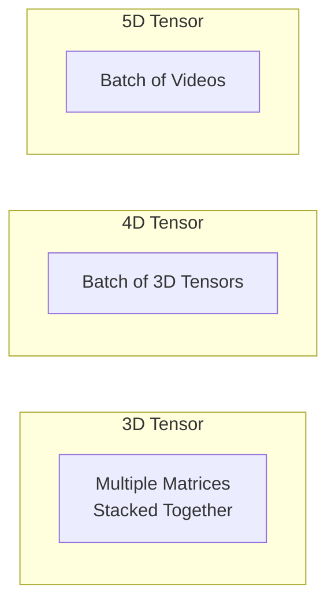
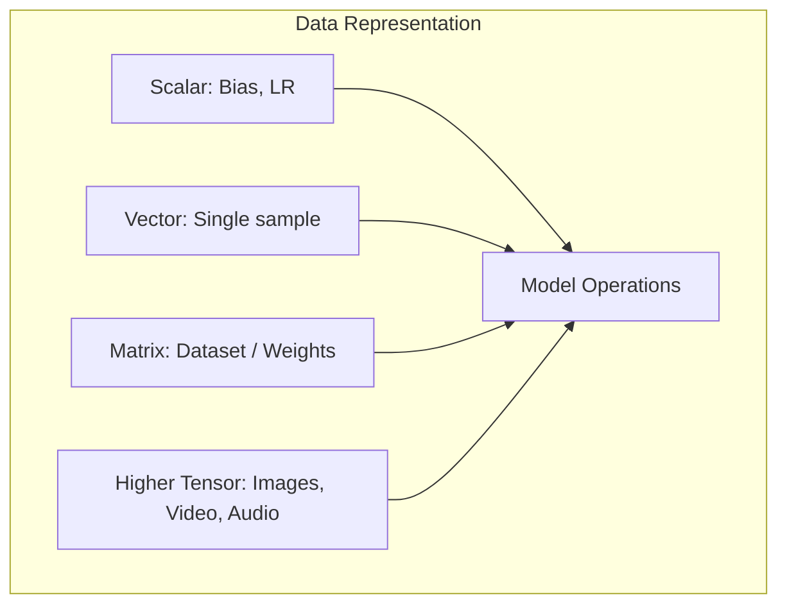
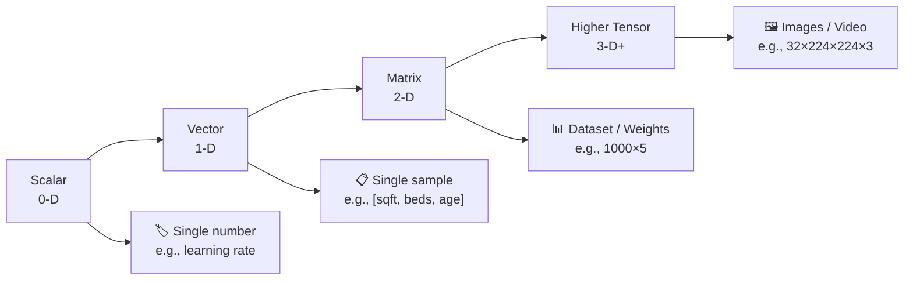

# What are Tensors | Scalars, Vectors, Matrices & Tensors

---

## Overview

In Machine Learning and Deep Learning, data is represented as **tensors**. A tensor is a generalization of scalars, vectors, and matrices to any number of dimensions.



---

## 1. Scalar (0-D Tensor)

**Scalar** = A single number. The simplest tensor.

| Aspect | Description |
|--------|-------------|
| **Dimensions** | 0 (no axis) |
| **Shape** | `()` |
| **Example** | `5`, `3.14`, `-42` |
| **Notation** | Lowercase: `a`, `x`, `y` |
| **In NumPy** | `np.array(5)` |

```python
import numpy as np

scalar = np.array(5)
print(scalar.ndim)   # 0
print(scalar.shape)  # ()
```

**Real-world use:** Learning rate, bias term, regularization strength.

---

## 2. Vector (1-D Tensor)

**Vector** = An ordered array of numbers. Has one axis.

| Aspect | Description |
|--------|-------------|
| **Dimensions** | 1 (one axis) |
| **Shape** | `(n,)` |
| **Example** | `[1, 2, 3, 4, 5]` |
| **Notation** | Bold lowercase: **x**, **w** |
| **In NumPy** | `np.array([1, 2, 3])` |

```python
vector = np.array([1, 2, 3, 4, 5])
print(vector.ndim)   # 1
print(vector.shape)  # (5,)
```

**Real-world use:** A single data sample (e.g., house features: `[sqft, bedrooms, age]`).

---

## 3. Matrix (2-D Tensor)

**Matrix** = A grid/table of numbers. Has two axes (rows and columns).

| Aspect | Description |
|--------|-------------|
| **Dimensions** | 2 (two axes) |
| **Shape** | `(m, n)` — m rows, n columns |
| **Example** | `[[1,2],[3,4],[5,6]]` |
| **Notation** | Bold uppercase: **X**, **W** |
| **In NumPy** | `np.array([[1,2],[3,4]])` |

```python
matrix = np.array([[1, 2, 3],
                   [4, 5, 6]])
print(matrix.ndim)   # 2
print(matrix.shape)  # (2, 3)
```

**Real-world use:** A dataset (rows = samples, columns = features). Grayscale image (height × width).

---

## 4. Higher-Dimensional Tensors (3-D, 4-D, ...)

**Higher-D Tensor** = Stack of matrices. Used for complex data like images, videos, sequences.



### 3-D Tensor

```python
# Shape: (depth, height, width) or (samples, features, timesteps)
tensor_3d = np.array([[[1,2],[3,4]],
                      [[5,6],[7,8]]])
print(tensor_3d.ndim)   # 3
print(tensor_3d.shape)  # (2, 2, 2)
```

**Real-world use:** Color image (height × width × RGB channels), time-series data (batch × timesteps × features).

### 4-D Tensor

```python
# Shape: (batch_size, height, width, channels)
tensor_4d = np.random.randn(32, 64, 64, 3)
print(tensor_4d.shape)  # (32, 64, 64, 3)
```

**Real-world use:** Batch of color images for training a CNN.

---

## Tensor Dimensions Summary

| Rank | Name | Shape Example | NumPy `ndim` | Real-World Data |
|------|------|--------------|-------------|-----------------|
| **0** | Scalar | `()` | 0 | Learning rate, bias |
| **1** | Vector | `(5,)` | 1 | Single sample (5 features) |
| **2** | Matrix | `(100, 5)` | 2 | Dataset (100 samples, 5 features) |
| **3** | 3-Tensor | `(32, 64, 64)` | 3 | Grayscale video / single color image |
| **4** | 4-Tensor | `(32, 64, 64, 3)` | 4 | Batch of color images |
| **5** | 5-Tensor | `(10, 32, 64, 64, 3)` | 5 | Batch of videos |

---

## Tensor Operations

### Element-wise Operations

```python
a = np.array([1, 2, 3])
b = np.array([4, 5, 6])

print(a + b)  # [5, 7, 9]
print(a * b)  # [4, 10, 18]
print(a ** 2) # [1, 4, 9]
```

### Broadcasting

NumPy automatically expands smaller tensors to match larger ones.

```python
a = np.array([[1,2,3],
              [4,5,6]])  # Shape: (2, 3)
b = np.array([10, 20, 30])  # Shape: (3,)

print(a + b)
# [[11, 22, 33],
#  [14, 25, 36]]
```

### Matrix Multiplication (Dot Product)

```python
X = np.array([[1,2],[3,4]])  # (2,2)
W = np.array([[5],[6]])       # (2,1)
result = X @ W                # (2,1)
print(result)
# [[17],
#  [39]]
```

### Reshaping

```python
tensor = np.array([1,2,3,4,5,6])
print(tensor.reshape(2, 3))
# [[1,2,3],
#  [4,5,6]]
```

---

## Tensors in Deep Learning Frameworks

```python
# NumPy (CPU)
import numpy as np
np_tensor = np.array([1,2,3])

# PyTorch (CPU/GPU)
import torch
torch_tensor = torch.tensor([1,2,3])

# TensorFlow/Keras
import tensorflow as tf
tf_tensor = tf.constant([1,2,3])
```

| Feature | NumPy | PyTorch | TensorFlow |
|---------|-------|---------|------------|
| **Device** | CPU only | CPU + GPU | CPU + GPU |
| **Gradients** | ❌ No | ✅ Autograd | ✅ GradientTape |
| **Deep Learning** | ❌ No | ✅ Yes | ✅ Yes |
| **Use** | General purpose | Research / DL | Production / DL |

---

## Why Tensors Matter in ML/DL



| Concept | Tensor Representation |
|---------|----------------------|
| **Dataset of 1000 houses, 5 features each** | Matrix of shape `(1000, 5)` |
| **Weights of a neural network layer** | Matrix of shape `(input_dim, output_dim)` |
| **Batch of 32 color images (224×224)** | 4D tensor of shape `(32, 224, 224, 3)` |
| **Batch of 10 videos, 100 frames each** | 5D tensor of shape `(10, 100, 224, 224, 3)` |
| **Output probabilities (10 classes)** | Vector of shape `(10,)` |

> **Key Insight:** Everything in ML/DL is a tensor — data, weights, activations, gradients. Understanding tensor shapes is critical for building correct models.

---

## Summary



```
SCALAR  → 0 axes → Shape ()
VECTOR  → 1 axis → Shape (n,)
MATRIX  → 2 axes → Shape (m, n)
TENSOR  → 3+ axes → Shape (d1, d2, ..., dn)
```

---

*Based on CampusX video: "What are Tensors | Scalar | Vector | Matrix | Tensors"*
