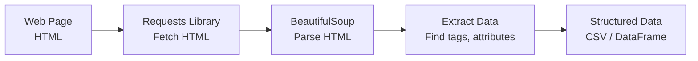
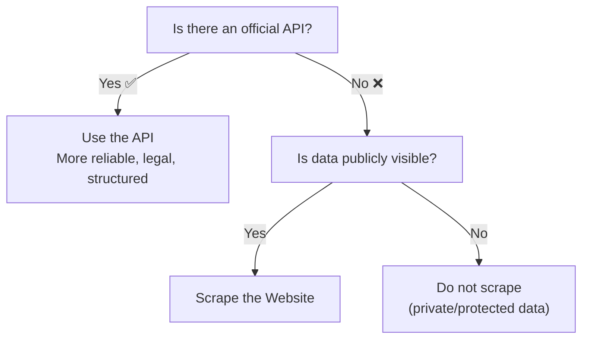
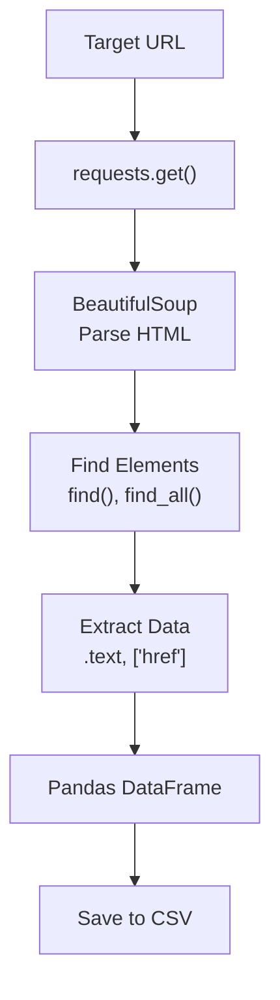

# Fetching Data using Web Scraping | Web Scraping for ML

---

## Overview

Web scraping is the process of **extracting data from websites** automatically. It's a valuable skill when:
- No API is available
- You need data that's publicly displayed on web pages
- You want to collect training data for ML projects



---

## 1. Legal & Ethical Considerations

**Before scraping any website, check:**

| Check | Why |
|-------|-----|
| **robots.txt** | `website.com/robots.txt` — tells which pages can be scraped |
| **Terms of Service** | Some websites explicitly prohibit scraping |
| **Rate Limiting** | Don't overload the server — add delays between requests |
| **Public Data Only** | Don't scrape behind login pages or private data |

```python
# Always check robots.txt first
# https://www.example.com/robots.txt
```

> **Golden Rule:** Scrape responsibly. Be polite. Don't harm the website.

---

## 2. Essential Libraries

```python
# Install
# pip install requests beautifulsoup4 lxml

import requests
from bs4 import BeautifulSoup
import pandas as pd
import time
```

| Library | Purpose |
|---------|---------|
| **Requests** | Fetch HTML content from URLs |
| **BeautifulSoup** | Parse HTML and extract data |
| **lxml** | Fast HTML/XML parser (backend for BS4) |
| **Selenium** | For JavaScript-rendered pages |
| **Scrapy** | Large-scale scraping framework |

---

## 3. Basic Scraping Workflow

### Step 1: Fetch the HTML

```python
url = "https://example.com/products"
response = requests.get(url)

print(response.status_code)  # 200 = success
print(response.text[:500])   # First 500 chars of HTML
```

### Step 2: Parse with BeautifulSoup

```python
soup = BeautifulSoup(response.text, 'lxml')
print(soup.prettify()[:1000])  # Formatted HTML
```

### Step 3: Extract Data

```python
# Find by tag name
title = soup.find('h1')
print(title.text)

# Find by class
products = soup.find_all('div', class_='product')

# Find by id
main = soup.find('div', id='main-content')

# Find by attribute
links = soup.find_all('a', href=True)
```

### Step 4: Structure the Data

```python
data = []
for product in products:
    item = {
        'name': product.find('h2').text.strip(),
        'price': product.find('span', class_='price').text.strip(),
        'rating': product.find('div', class_='rating').text.strip()
    }
    data.append(item)

df = pd.DataFrame(data)
df.to_csv('products.csv', index=False)
```

---

## 4. BeautifulSoup — Key Methods

### Finding Elements

| Method | Description | Example |
|--------|-------------|---------|
| `find()` | Find first matching element | `soup.find('h1')` |
| `find_all()` | Find all matching elements | `soup.find_all('div', class_='item')` |
| `select()` | CSS selector | `soup.select('div.product p.price')` |
| `select_one()` | First CSS selector match | `soup.select_one('#main h1')` |

### Navigating the Parse Tree

```python
# Parent
tag.parent

# Children
list(tag.children)

# Next sibling
tag.next_sibling

# Previous sibling
tag.previous_sibling

# Find all descendants with a tag
tag.find_all('a')
```

### Extracting Data

```python
# Text content
tag.text
tag.get_text()

# Attribute value
tag['href']
tag.get('href')
tag.get('class')

# Tag name
tag.name
```

---

## 5. Handling Dynamic Pages (JavaScript)

**Problem:** Some websites load data with JavaScript — `requests` can't execute JS.

### Solution 1: Find the API

```python
# Open browser DevTools → Network tab → XHR/Fetch
# Look for API calls that return JSON
import requests
api_url = "https://api.example.com/data"
data = requests.get(api_url).json()
```

### Solution 2: Use Selenium

```python
from selenium import webdriver
from selenium.webdriver.common.by import By

driver = webdriver.Chrome()
driver.get("https://example.com")

# Wait for dynamic content to load
time.sleep(3)

# Extract rendered HTML
soup = BeautifulSoup(driver.page_source, 'lxml')
data = soup.find_all('div', class_='item')

driver.quit()
```

---

## 6. Real Example: Scraping a Table

```python
import requests
from bs4 import BeautifulSoup
import pandas as pd

url = "https://example.com/data-table"
response = requests.get(url)
soup = BeautifulSoup(response.text, 'lxml')

# Find the table
table = soup.find('table')

# Extract headers
headers = []
for th in table.find_all('th'):
    headers.append(th.text.strip())

# Extract rows
rows = []
for tr in table.find_all('tr')[1:]:  # Skip header row
    cells = tr.find_all('td')
    row = [cell.text.strip() for cell in cells]
    rows.append(row)

# Create DataFrame
df = pd.DataFrame(rows, columns=headers)
print(df.head())
```

---

## 7. Pagination — Scraping Multiple Pages

```python
all_products = []

for page in range(1, 11):
    url = f"https://example.com/products?page={page}"
    response = requests.get(url)
    soup = BeautifulSoup(response.text, 'lxml')
    
    products = soup.find_all('div', class_='product')
    for product in products:
        item = {
            'name': product.find('h2').text.strip(),
            'price': product.find('span', class_='price').text.strip()
        }
        all_products.append(item)
    
    print(f"Scraped page {page}")
    time.sleep(1)  # Be polite — delay between requests

df = pd.DataFrame(all_products)
print(f"Total products scraped: {len(df)}")
```

---

## 8. Scraping Best Practices

### Politeness & Anti-Blocking

```python
# Set a user-agent (identify yourself)
headers = {
    'User-Agent': 'Mozilla/5.0 (Windows NT 10.0; Win64; x64) AppleWebKit/537.36'
}
response = requests.get(url, headers=headers)

# Add delay between requests
time.sleep(2)  # Wait 2 seconds

# Handle errors gracefully
try:
    response = requests.get(url, timeout=10)
    response.raise_for_status()  # Raise exception for 4xx/5xx
except requests.exceptions.RequestException as e:
    print(f"Error: {e}")
```

### Error Handling

```python
def safe_scrape(url):
    try:
        response = requests.get(url, timeout=10)
        response.raise_for_status()
        return BeautifulSoup(response.text, 'lxml')
    except requests.exceptions.HTTPError as e:
        print(f"HTTP Error: {e}")
    except requests.exceptions.ConnectionError:
        print("Connection Error")
    except requests.exceptions.Timeout:
        print("Timeout")
    return None
```

---

## 9. When to Scrape vs Use APIs



| Approach | Pros | Cons |
|----------|------|------|
| **API** | Reliable, structured, legal | May have rate limits, cost |
| **Web Scraping** | Any public data, no API needed | Fragile (HTML changes), slower, legal gray area |

---

## Summary



```
FETCH   → requests.get(url)
PARSE   → BeautifulSoup(html, 'lxml')
EXTRACT → soup.find_all('div', class_='item')
STRUCTURE → pd.DataFrame(data)
SAVE    → df.to_csv('data.csv', index=False)
```

> **Key Insight:** Always check for an API first. If no API exists, scrape responsibly with delays, user-agent headers, and respect robots.txt.

---

*Based on CampusX video: "Fetching data using Web Scraping | Web Scraping for Data Science"*
