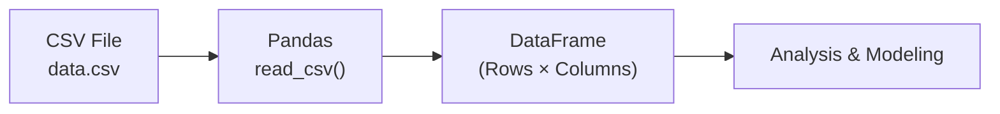
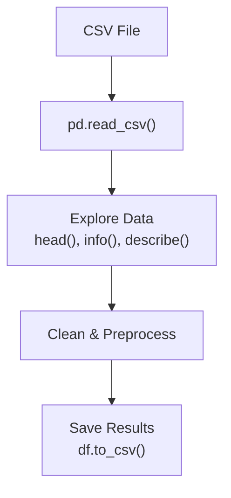

# Working with CSV Files | Reading & Writing Data

---

## Overview

CSV (Comma-Separated Values) is the most common format for storing tabular data. In ML, almost every project starts by loading a CSV file.



---

## 1. Reading CSV Files

### Basic Reading

```python
import pandas as pd

# Read entire CSV
df = pd.read_csv('data.csv')

# First 5 rows
print(df.head())

# Shape (rows, columns)
print(df.shape)  # (1000, 10)
```

### Common Parameters

```python
# Read specific columns
df = pd.read_csv('data.csv', usecols=['name', 'age', 'salary'])

# Read only first 100 rows
df = pd.read_csv('data.csv', nrows=100)

# Skip rows
df = pd.read_csv('data.csv', skiprows=5)

# Specify delimiter (for TSV files)
df = pd.read_csv('data.tsv', delimiter='\t')

# Handle missing values
df = pd.read_csv('data.csv', na_values=['NA', 'N/A', 'null', '-'])

# No header row
df = pd.read_csv('data.csv', header=None)

# Custom column names
df = pd.read_csv('data.csv', names=['col1', 'col2', 'col3'])
```

| Parameter | Description | Example |
|-----------|-------------|---------|
| `filepath` | Path to CSV file | `'data.csv'` |
| `sep` / `delimiter` | Delimiter character | `','`, `'\t'`, `';'` |
| `header` | Row to use as column names | `0` (default), `None` |
| `names` | Custom column names | `['A', 'B', 'C']` |
| `index_col` | Column to use as row index | `0`, `'id'` |
| `usecols` | Columns to load | `['col1', 'col3']` |
| `nrows` | Number of rows to read | `1000` |
| `skiprows` | Rows to skip | `[0, 2, 5]` |
| `na_values` | Values to treat as NaN | `['NA', 'null']` |
| `dtype` | Data types for columns | `{'age': float}` |
| `parse_dates` | Columns to parse as dates | `['date']` |

### Handling Large Files

```python
# Read in chunks (memory efficient)
chunk_iter = pd.read_csv('large_file.csv', chunksize=10000)

for chunk in chunk_iter:
    process(chunk)  # process each chunk

# Read specific columns only
df = pd.read_csv('large_file.csv', usecols=['id', 'target'])
```

---

## 2. Exploring the DataFrame

```python
# Basic info
df.info()          # Column names, types, non-null counts
df.describe()      # Statistical summary (numeric columns)
df.describe(include='object')  # Summary for categorical columns

# Data types
print(df.dtypes)

# Missing values
print(df.isnull().sum())

# Unique values
print(df['column'].nunique())
print(df['column'].value_counts())
```

---

## 3. Writing CSV Files

```python
# Basic write
df.to_csv('output.csv', index=False)

# Without header
df.to_csv('output.csv', index=False, header=False)

# With custom separator
df.to_csv('output.csv', sep=';', index=False)

# Only specific columns
df.to_csv('output.csv', columns=['name', 'age'], index=False)

# Handle missing values
df.to_csv('output.csv', na_rep='NULL', index=False)

# Compression
df.to_csv('output.csv.gz', compression='gzip', index=False)
```

| Parameter | Description | Example |
|-----------|-------------|---------|
| `path_or_buf` | Output path | `'output.csv'` |
| `sep` | Delimiter | `','` |
| `na_rep` | String for missing values | `'NULL'` |
| `index` | Write row index? | `False` |
| `header` | Write column names? | `True` |
| `columns` | Columns to write | `['col1', 'col3']` |
| `compression` | Compression type | `'gzip'`, `'zip'` |

---

## 4. Other File Formats

```python
# Excel
df = pd.read_excel('data.xlsx', sheet_name='Sheet1')
df.to_excel('output.xlsx', sheet_name='Results', index=False)

# JSON
df = pd.read_json('data.json')
df.to_json('output.json', orient='records')

# SQL
from sqlalchemy import create_engine
engine = create_engine('sqlite:///database.db')
df = pd.read_sql('SELECT * FROM table', engine)
df.to_sql('table', engine, if_exists='replace', index=False)

# Parquet (efficient for large datasets)
df = pd.read_parquet('data.parquet')
df.to_parquet('output.parquet', index=False)

# Pickle (Python native, fastest)
df = pd.to_pickle('data.pkl')
df = pd.read_pickle('data.pkl')
```

---

## 5. Handling Common CSV Issues

### Issue 1: Encoding Problems

```python
# Try different encodings
df = pd.read_csv('data.csv', encoding='utf-8')
df = pd.read_csv('data.csv', encoding='latin1')
df = pd.read_csv('data.csv', encoding='cp1252')
```

### Issue 2: Mixed Data Types

```python
# Force column types
df = pd.read_csv('data.csv', dtype={'age': int, 'price': float})

# Or convert after loading
df['age'] = df['age'].astype(int)
df['price'] = pd.to_numeric(df['price'], errors='coerce')
```

### Issue 3: Parsing Dates

```python
df = pd.read_csv('data.csv', parse_dates=['date_column'])
# Or specify date format for speed
df = pd.read_csv('data.csv', parse_dates=['date'], 
                 date_parser=lambda x: pd.to_datetime(x, format='%Y-%m-%d'))
```

### Issue 4: Trailing/Leading Whitespace

```python
df = pd.read_csv('data.csv', skipinitialspace=True)

# Clean all string columns
df = df.applymap(lambda x: x.strip() if isinstance(x, str) else x)
```

---

## Quick Reference Cheatsheet

| Task | Code |
|------|------|
| Read CSV | `pd.read_csv('file.csv')` |
| Read TSV | `pd.read_csv('file.tsv', sep='\t')` |
| Read Excel | `pd.read_excel('file.xlsx')` |
| Write CSV | `df.to_csv('out.csv', index=False)` |
| First 5 rows | `df.head()` |
| Last 5 rows | `df.tail()` |
| Basic info | `df.info()` |
| Summary stats | `df.describe()` |
| Column names | `df.columns` |
| Shape | `df.shape` |
| Data types | `df.dtypes` |
| Missing values | `df.isnull().sum()` |

---

## Summary



```
LOAD   → pd.read_csv('data.csv')
EXPLORE → df.head(), df.info(), df.describe()
WRITE  → df.to_csv('output.csv', index=False)
```

---

*Based on CampusX video: "Working with CSV Files | Reading and Writing CSV Files in Python"*
