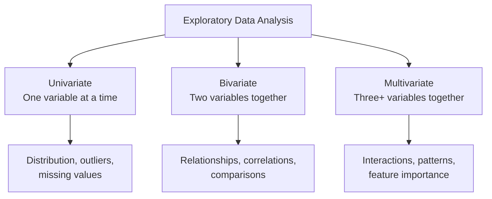
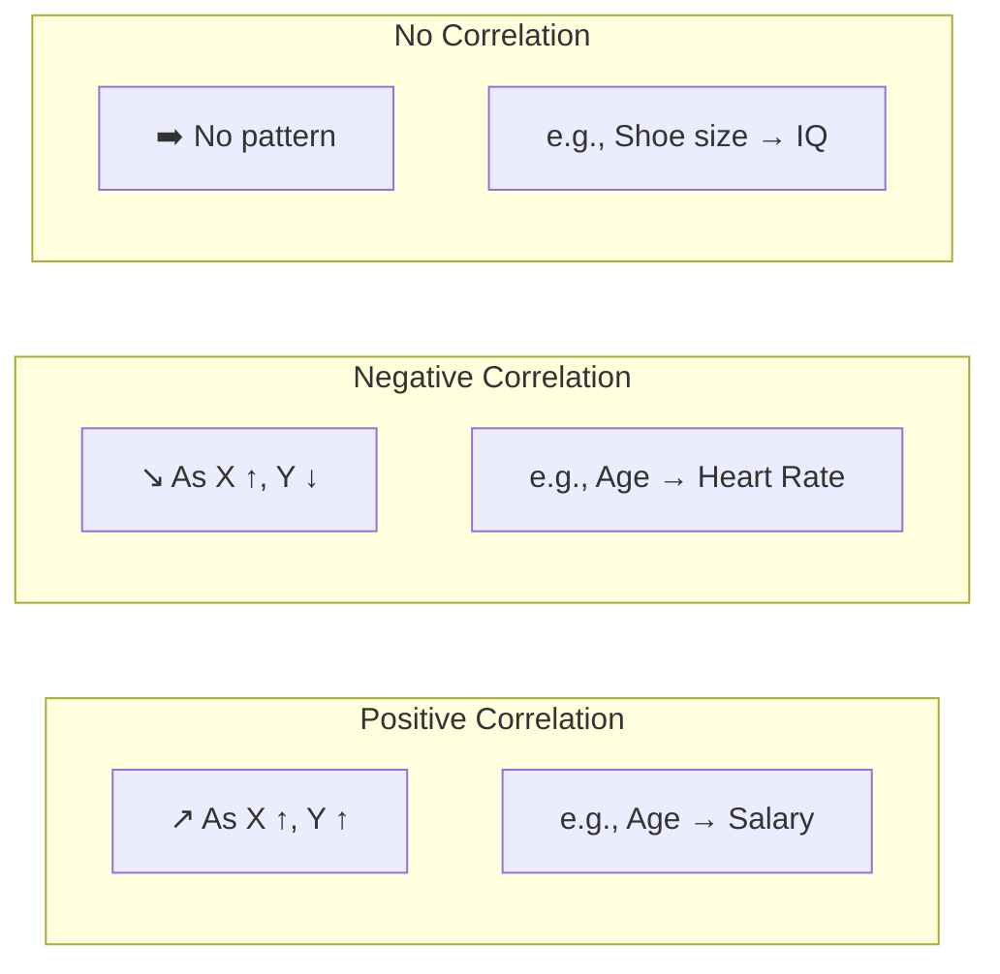
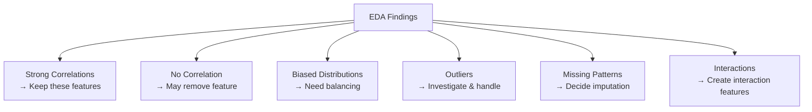
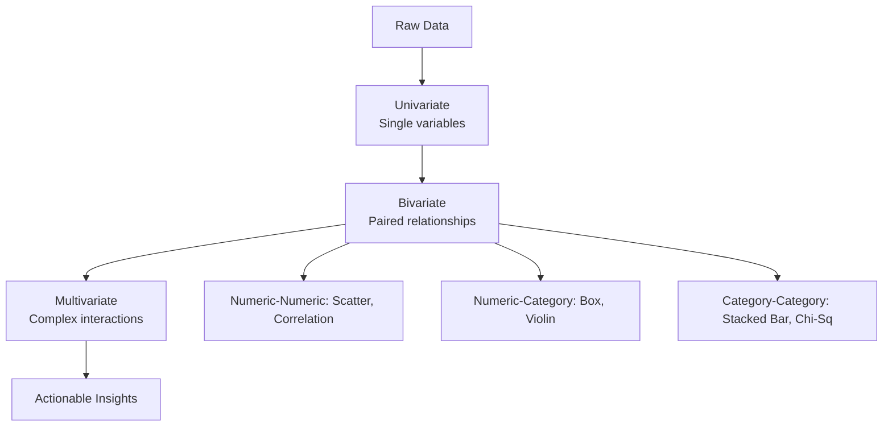

# EDA using Bivariate and Multivariate Analysis

---

## Overview

EDA (Exploratory Data Analysis) has three levels of analysis:



---

## 1. Bivariate Analysis — Two Variables

**Goal:** Understand the relationship between two variables.

### Types of Bivariate Analysis

| Variable 1 | Variable 2 | Analysis Type | Visualization |
|-----------|-----------|---------------|--------------|
| Numeric | Numeric | Correlation | Scatter plot, Pair plot |
| Numeric | Categorical | Comparison | Box plot, Violin plot |
| Categorical | Categorical | Association | Stacked bar, Heatmap |

---

### A) Numeric vs Numeric

#### Scatter Plot

```python
import seaborn as sns
import matplotlib.pyplot as plt

# Scatter plot — relationship between two numeric variables
plt.figure(figsize=(8, 6))
sns.scatterplot(x='age', y='salary', data=df)
plt.title('Age vs Salary')
plt.show()
```



#### Correlation Coefficient

```python
# Pearson correlation (linear relationship)
corr = df['age'].corr(df['salary'])
print(f"Correlation: {corr:.3f}")

# Full correlation matrix
corr_matrix = df.corr(numeric_only=True)
print(corr_matrix)
```

| Correlation Value | Strength | Direction |
|------------------|----------|-----------|
| **1.0** | Perfect | Positive |
| **0.7 to 0.9** | Strong | Positive |
| **0.4 to 0.6** | Moderate | Positive |
| **0.1 to 0.3** | Weak | Positive |
| **0** | None | — |
| **-0.1 to -0.3** | Weak | Negative |
| **-0.4 to -0.6** | Moderate | Negative |
| **-0.7 to -0.9** | Strong | Negative |
| **-1.0** | Perfect | Negative |

#### Correlation Heatmap

```python
plt.figure(figsize=(10, 8))
sns.heatmap(corr_matrix, annot=True, cmap='RdBu_r', 
            vmin=-1, vmax=1, center=0)
plt.title('Correlation Heatmap')
plt.show()
```

#### Pair Plot (Multiple Numeric Columns)

```python
# Scatter matrix for all numeric columns
sns.pairplot(df, hue='target')
plt.show()
```

---

### B) Numeric vs Categorical

#### Box Plot

```python
# Compare numeric distribution across categories
plt.figure(figsize=(8, 6))
sns.boxplot(x='gender', y='salary', data=df)
plt.title('Salary Distribution by Gender')
plt.show()
```

**What to Look For:**
- **Median difference** — Does one category have higher values?
- **IQR spread** — Which category has more variability?
- **Outliers** — Are there extreme values in any category?

#### Violin Plot

```python
# Box plot + density plot combined
plt.figure(figsize=(8, 6))
sns.violinplot(x='city', y='salary', data=df)
plt.xticks(rotation=45)
plt.title('Salary Distribution by City')
plt.show()
```

#### Bar Plot (Mean/Median Comparison)

```python
# Average salary by city
avg_salary = df.groupby('city')['salary'].mean().sort_values(ascending=False)
sns.barplot(x=avg_salary.index, y=avg_salary.values)
plt.xticks(rotation=45)
plt.title('Average Salary by City')
plt.show()
```

---

### C) Categorical vs Categorical

#### Stacked Bar Chart

```python
# Cross-tabulation
ct = pd.crosstab(df['gender'], df['purchased'])
ct.plot(kind='bar', stacked=True)
plt.title('Purchase Behavior by Gender')
plt.show()
```

#### Heatmap of Frequency

```python
# Visualize cross-tab as heatmap
ct = pd.crosstab(df['city'], df['purchased'])
sns.heatmap(ct, annot=True, fmt='d', cmap='Blues')
plt.title('Purchase Frequency by City')
plt.show()
```

#### Chi-Square Test (Statistical Significance)

```python
from scipy.stats import chi2_contingency

ct = pd.crosstab(df['gender'], df['purchased'])
chi2, p_value, dof, expected = chi2_contingency(ct)
print(f"Chi-Square: {chi2:.3f}, p-value: {p_value:.4f}")

if p_value < 0.05:
    print("✅ Significant association between variables")
else:
    print("❌ No significant association")
```

---

## 2. Multivariate Analysis — Three+ Variables

**Goal:** Understand complex interactions between multiple variables.

### Techniques

| Technique | Variables | Purpose |
|-----------|-----------|---------|
| **Pair Plot** | All numeric | Overall patterns |
| **Correlation Heatmap** | All numeric | Feature relationships |
| **Faceted Plots** | 3+ | Compare across categories |
| **3D Scatter Plot** | 3 numeric | 3D relationships |
| **Parallel Coordinates** | Many numeric | Multi-dimensional patterns |

### Faceted Grid (Conditional Relationships)

```python
# Relationship between age and salary, separated by gender
g = sns.FacetGrid(df, col='gender', hue='purchased')
g.map(sns.scatterplot, 'age', 'salary')
g.add_legend()
plt.show()
```

### 3D Scatter Plot

```python
from mpl_toolkits.mplot3d import Axes3D

fig = plt.figure(figsize=(10, 8))
ax = fig.add_subplot(111, projection='3d')
ax.scatter(df['age'], df['salary'], df['purchase'], 
           c=df['target'], cmap='viridis')
ax.set_xlabel('Age')
ax.set_ylabel('Salary')
ax.set_zlabel('Purchase')
plt.title('3D: Age vs Salary vs Purchase')
plt.show()
```

### Parallel Coordinates

```python
from pandas.plotting import parallel_coordinates

# Normalize data first
df_norm = df.copy()
for col in df.select_dtypes(include=np.number).columns:
    df_norm[col] = (df[col] - df[col].min()) / (df[col].max() - df[col].min())

plt.figure(figsize=(12, 6))
parallel_coordinates(df_norm, 'target', colormap='viridis')
plt.title('Parallel Coordinates Plot')
plt.show()
```

---

## 3. Complete EDA Workflow

```python
def complete_eda(df):
    # 1. Univariate Analysis
    print("=== UNIVARIATE ANALYSIS ===")
    print(df.describe())
    
    # 2. Missing Values
    print("\n=== MISSING VALUES ===")
    print(df.isnull().sum())
    
    # 3. Bivariate — Correlation
    print("\n=== CORRELATION MATRIX ===")
    corr = df.corr(numeric_only=True)
    print(corr)
    
    # 4. Bivariate — Target Analysis
    if 'target' in df.columns:
        print("\n=== TARGET VS FEATURES ===")
        for col in df.select_dtypes(include=np.number).columns:
            if col != 'target':
                corr_val = df[col].corr(df['target'])
                print(f"{col} vs target: {corr_val:.3f}")
    
    # 5. Visualizations
    fig, axes = plt.subplots(2, 2, figsize=(15, 10))
    
    # Heatmap
    sns.heatmap(corr, annot=True, cmap='RdBu_r', ax=axes[0,0])
    axes[0,0].set_title('Correlation Heatmap')
    
    # Pair plot of first 4 numeric columns
    numeric_cols = df.select_dtypes(include=np.number).columns[:4]
    if len(numeric_cols) >= 2:
        sns.scatterplot(data=df, x=numeric_cols[0], y=numeric_cols[1], 
                       hue='target' if 'target' in df.columns else None,
                       ax=axes[0,1])
        axes[0,1].set_title(f'{numeric_cols[0]} vs {numeric_cols[1]}')
    
    # Box plots for categorical vs numeric
    cat_cols = df.select_dtypes(include='object').columns
    if len(cat_cols) > 0 and len(numeric_cols) > 0:
        sns.boxplot(data=df, x=cat_cols[0], y=numeric_cols[0], ax=axes[1,0])
        axes[1,0].set_title(f'{numeric_cols[0]} by {cat_cols[0]}')
    
    # Distribution of target
    if 'target' in df.columns:
        if df['target'].dtype == 'object':
            df['target'].value_counts().plot(kind='bar', ax=axes[1,1])
        else:
            sns.histplot(df['target'], kde=True, ax=axes[1,1])
        axes[1,1].set_title('Target Distribution')
    
    plt.tight_layout()
    plt.show()
```

---

## 4. Key Insights to Look For



### Pattern Identification Guide

| Pattern | Meaning | Action |
|---------|---------|--------|
| **Linear relationship** | Strong predictor | Keep feature |
| **Non-linear relationship** | May need transformation | Try polynomial features |
| **No relationship** | Weak predictor | Consider removing |
| **Different distributions by category** | Good for classification | Use as feature |
| **Clusters in data** | Natural groupings | Clustering, segmentation |
| **Outliers** | Data errors or rare events | Investigate, cap, or remove |

---

## 5. Common EDA Mistakes

| Mistake | Why It's Bad | Fix |
|---------|-------------|-----|
| Skipping EDA | Don't understand data | Always do EDA first |
| Only looking at correlations | Misses non-linear relationships | Use scatter plots |
| Ignoring missing values | Biased models | Analyze and handle carefully |
| Not separating train/test | Data leakage | Split before EDA |
| Confusing correlation with causation | Wrong conclusions | Always verify |
| Over-analyzing | Analysis paralysis | Focus on actionable insights |

---

## Summary



```
BIVARIATE ANALYSIS
  Numeric vs Numeric   → Scatter plot + Correlation
  Numeric vs Category  → Box plot + Violin plot
  Category vs Category → Stacked bar + Chi-Square test

MULTIVARIATE ANALYSIS
  All variables → Pair plot + Correlation heatmap
  Conditional   → Faceted plots (FacetGrid)
  Multi-dim     → Parallel coordinates
```

> **Key Insight:** Bivariate analysis reveals relationships. Multivariate analysis reveals interactions. Together, they guide feature selection, engineering, and model choice.

---

*Based on CampusX video: "EDA using Bivariate and Multivariate Analysis | Exploratory Data Analysis"*
