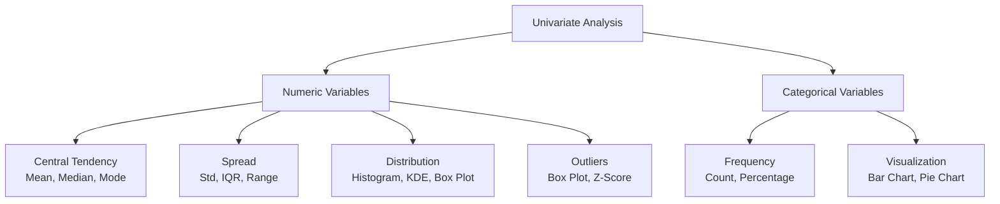
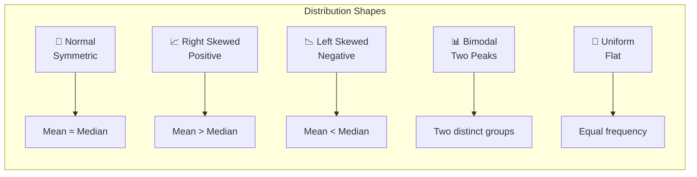
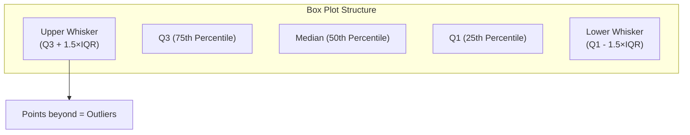
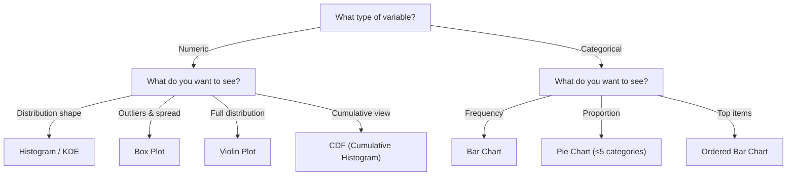
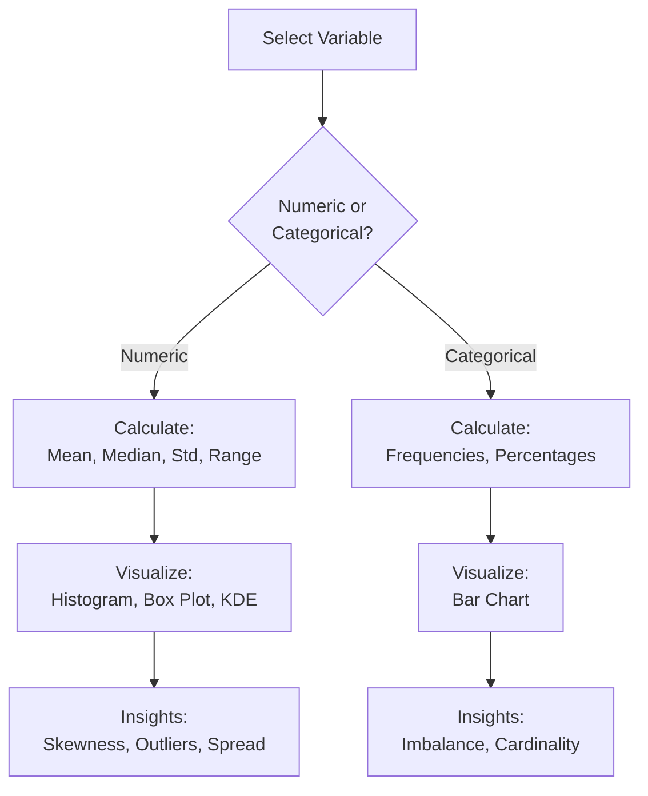

# EDA using Univariate Analysis | Single Variable Analysis

---

## Overview

**Univariate Analysis** is the simplest form of data analysis — we analyze **one variable at a time**. It helps us understand the distribution, central tendency, spread, and quality of each variable individually.



---

## 1. Numeric Variables — Analysis

### Central Tendency

| Measure | What It Tells | When to Use |
|---------|--------------|-------------|
| **Mean** | Average value | Symmetric distribution (no outliers) |
| **Median** | Middle value (50th percentile) | Skewed distribution or outliers |
| **Mode** | Most frequent value | Discrete/continuous data |

```python
import pandas as pd
import numpy as np
import matplotlib.pyplot as plt
import seaborn as sns

# Load data
df = pd.read_csv('data.csv')

# Central tendency
col = 'salary'
print(f"Mean:   {df[col].mean():.2f}")
print(f"Median: {df[col].median():.2f}")
print(f"Mode:   {df[col].mode().values}")
```

**Interpretation:**
- If **mean ≈ median** → symmetric distribution
- If **mean > median** → right-skewed (positive skew)
- If **mean < median** → left-skewed (negative skew)

---

### Spread (Dispersion)

| Measure | What It Tells | Formula |
|---------|--------------|---------|
| **Range** | Min to Max | `max - min` |
| **Variance** | Average squared deviation from mean | `Σ(x - μ)² / n` |
| **Standard Deviation** | Spread in original units | `√Variance` |
| **IQR** | Middle 50% of data (Q3 - Q1) | `75th - 25th percentile` |

```python
# Spread
print(f"Range:  {df[col].min():.2f} → {df[col].max():.2f}")
print(f"Std:    {df[col].std():.2f}")
print(f"Var:    {df[col].var():.2f}")
print(f"IQR:    {df[col].quantile(0.75) - df[col].quantile(0.25):.2f}")

# 5-number summary
print(df[col].describe())
# count, mean, std, min, 25%, 50%, 75%, max
```

---

### Distribution Visualization

#### Histogram

```python
# Histogram with KDE (Kernel Density Estimate)
plt.figure(figsize=(10, 4))

plt.subplot(1, 2, 1)
sns.histplot(df['age'], bins=30, kde=True)
plt.title('Age Distribution (Histogram + KDE)')
plt.xlabel('Age')

plt.subplot(1, 2, 2)
sns.histplot(df['age'], bins=30, kde=True, cumulative=True)
plt.title('Cumulative Distribution')
plt.xlabel('Age')

plt.tight_layout()
plt.show()
```

**What to look for:**
- **Shape:** Symmetric, skewed (left/right), uniform, bimodal
- **Peaks:** Single peak (unimodal), two peaks (bimodal)
- **Gaps:** Missing values or unusual ranges
- **Tail:** Long tail indicates outliers



#### KDE Plot (Kernel Density Estimate)

```python
# Smooth density curve (better for comparing distributions)
plt.figure(figsize=(8, 4))
sns.kdeplot(df['age'], fill=True, bw_adjust=0.5)
plt.title('Age Density Plot')
plt.show()
```

| Parameter | Effect |
|-----------|--------|
| `bw_adjust=0.5` | Smaller → more detailed (may overfit) |
| `bw_adjust=1.0` | Default |
| `bw_adjust=2.0` | Larger → smoother (may underfit) |

#### Box Plot

```python
# Box plot — outliers and quartiles at a glance
plt.figure(figsize=(6, 4))
sns.boxplot(y=df['age'])
plt.title('Age Box Plot')
plt.show()
```

**Box Plot Anatomy:**



```python
# Horizontal box plot (good for many variables)
df[['age', 'salary', 'experience']].boxplot(figsize=(10, 6))
plt.xticks(rotation=45)
plt.title('Multiple Box Plots')
plt.show()
```

#### Violin Plot

```python
# Violin = Box plot + KDE (shows full distribution)
plt.figure(figsize=(10, 4))

plt.subplot(1, 2, 1)
sns.violinplot(y=df['age'])
plt.title('Violin Plot')

plt.subplot(1, 2, 2)
sns.violinplot(y=df['age'], inner='quartile')
plt.title('Violin Plot with Quartiles')

plt.tight_layout()
plt.show()
```

| Plot Type | Best For |
|-----------|----------|
| **Histogram** | Understanding distribution shape and bins |
| **KDE** | Smooth comparison of multiple distributions |
| **Box Plot** | Quick outlier detection and quartile view |
| **Violin Plot** | Full distribution shape + quartile info |

---

### Skewness & Kurtosis

```python
# Skewness — asymmetry of distribution
from scipy.stats import skew, kurtosis

for col in df.select_dtypes(include=np.number).columns:
    s = skew(df[col].dropna())
    k = kurtosis(df[col].dropna(), fisher=True)
    
    print(f"\n{col}:")
    print(f"  Skewness: {s:.3f}", end=" → ")
    if abs(s) < 0.5:
        print("Approximately symmetric")
    elif s > 0.5:
        print("Right skewed (positive)")
    elif s < -0.5:
        print("Left skewed (negative)")
    
    print(f"  Kurtosis: {k:.3f}", end=" → ")
    if abs(k) < 0.5:
        print("Mesokurtic (normal-like)")
    elif k > 0.5:
        print("Leptokurtic (heavy tails, more outliers)")
    elif k < -0.5:
        print("Platykurtic (light tails, fewer outliers)")
```

| Skewness | Shape | Transformation |
|----------|-------|---------------|
| **0** | Symmetric | None needed |
| **> 1** | Highly right-skewed | Log, sqrt, Box-Cox |
| **< -1** | Highly left-skewed | Square, cube, Box-Cox |

---

## 2. Categorical Variables — Analysis

### Frequency Analysis

```python
# Frequency counts
city_counts = df['city'].value_counts()
print(city_counts)

# Percentage
city_pct = df['city'].value_counts(normalize=True) * 100
print(city_pct)

# Frequency table (count + percentage)
freq_table = pd.DataFrame({
    'count': city_counts,
    'percentage': city_pct
})
print(freq_table)
```

### Bar Chart

```python
# Bar chart — frequency of categories
plt.figure(figsize=(12, 4))

plt.subplot(1, 2, 1)
df['city'].value_counts().plot(kind='bar')
plt.title('City Distribution (Count)')
plt.xticks(rotation=45)

plt.subplot(1, 2, 2)
df['city'].value_counts().plot(kind='barh')
plt.title('City Distribution (Horizontal)')

plt.tight_layout()
plt.show()
```

### Pie Chart

```python
# Pie chart (use sparingly — bar charts are usually better)
plt.figure(figsize=(6, 6))
df['gender'].value_counts().plot(kind='pie', autopct='%1.1f%%')
plt.title('Gender Distribution')
plt.ylabel('')  # Hide y-label
plt.show()
```

> **Note:** Pie charts work well for 2-5 categories. For more categories, use a bar chart.

### Ordered Bar Chart

```python
# Sort by frequency (most informative)
plt.figure(figsize=(10, 4))
top_cities = df['city'].value_counts().head(10)
sns.barplot(x=top_cities.index, y=top_cities.values, 
            order=top_cities.index)
plt.title('Top 10 Cities')
plt.xticks(rotation=45)
plt.show()
```

---

## 3. Detecting Data Quality Issues

### Missing Values

```python
# Count missing
missing_count = df.isnull().sum()
missing_pct = (df.isnull().sum() / len(df)) * 100

missing_df = pd.DataFrame({
    'Missing Count': missing_count,
    'Missing %': missing_pct.round(2)
})
print(missing_df[missing_df['Missing Count'] > 0])
```

### Impossible Values

```python
# Check for impossible values
for col in df.select_dtypes(include=np.number).columns:
    if df[col].min() < 0:
        print(f"{col}: Has negative values ({df[col].min()})")
    
    if col == 'age' and df[col].max() > 150:
        print(f"{col}: Has impossible age ({df[col].max()})")
    
    if col == 'salary' and df[col].min() == 0:
        zero_count = (df[col] == 0).sum()
        if zero_count > 0:
            print(f"{col}: {zero_count} zero values — check if valid")
```

### Cardinality Check (Categorical)

```python
# High cardinality — too many unique values
for col in df.select_dtypes(include='object').columns:
    n_unique = df[col].nunique()
    print(f"{col}: {n_unique} unique values")
    
    if n_unique > 50:
        print(f"  ⚠️ High cardinality — consider grouping or encoding")
    
    if n_unique == len(df):
        print(f"  ⚠️ Unique identifier — likely not useful as feature")
```

---

## 4. Summary Statistics Report

```python
def univariate_report(df):
    """Generate a comprehensive univariate analysis report."""
    
    print("=" * 60)
    print("UNIVARIATE ANALYSIS REPORT")
    print("=" * 60)
    
    # Numeric variables
    print("\n--- NUMERIC VARIABLES ---")
    numeric_cols = df.select_dtypes(include=np.number).columns
    
    for col in numeric_cols:
        data = df[col].dropna()
        print(f"\n{col}:")
        print(f"  Count: {len(data)} | Missing: {df[col].isnull().sum()}")
        print(f"  Mean: {data.mean():.2f} | Median: {data.median():.2f}")
        print(f"  Std: {data.std():.2f} | IQR: {data.quantile(0.75) - data.quantile(0.25):.2f}")
        print(f"  Min: {data.min():.2f} | Max: {data.max():.2f}")
        print(f"  Skew: {data.skew():.2f} | Kurtosis: {data.kurtosis():.2f}")
    
    # Categorical variables
    print("\n--- CATEGORICAL VARIABLES ---")
    cat_cols = df.select_dtypes(include='object').columns
    
    for col in cat_cols:
        print(f"\n{col}:")
        print(f"  Count: {df[col].count()} | Missing: {df[col].isnull().sum()}")
        print(f"  Unique: {df[col].nunique()}")
        print(f"  Top 5:")
        for val, count in df[col].value_counts().head(5).items():
            pct = count / len(df) * 100
            print(f"    {val}: {count} ({pct:.1f}%)")

univariate_report(df)
```

---

## 5. Visualization Decision Tree



---

## 6. Actionable Insights from Univariate Analysis

| Finding | What It Means | Action |
|---------|--------------|--------|
| **Skewed distribution** | Model may struggle | Log/Box-Cox transformation |
| **Outliers present** | May skew model | Cap, remove, or treat separately |
| **Bimodal distribution** | Two distinct groups | Consider splitting or clustering |
| **High missing %** | Feature may be unreliable | Impute carefully or drop |
| **Constant/ near-constant** | No predictive power | Drop the feature |
| **High cardinality** | Sparse encoding | Group rare categories |
| **Imbalanced categories** | Model bias | Stratify or resample |
| **Zeros in positive-only** | Data error or special value | Investigate and handle |

---

## Summary



### Univariate Checklist

```
For EACH variable:
☐ Is it numeric or categorical?
☐ What is its distribution?
☐ Are there missing values? (count + %)
☐ Are there outliers?
☐ Is it skewed? (for numeric)
☐ Is it imbalanced? (for categorical)
☐ Are there impossible/invalid values?
☐ Does it have enough variation to be useful?
```

> **Key Insight:** Univariate analysis reveals the "health" of each variable. Fix data quality issues at this stage before moving to bivariate or multivariate analysis.

---

*Based on CampusX video: "EDA using Univariate Analysis | Exploratory Data Analysis"*
