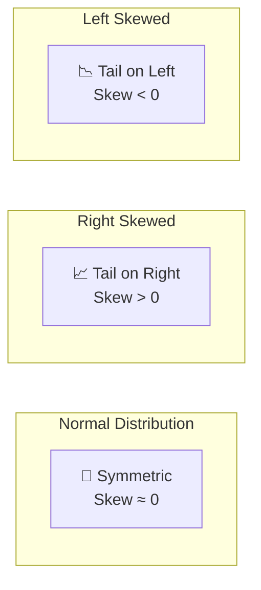
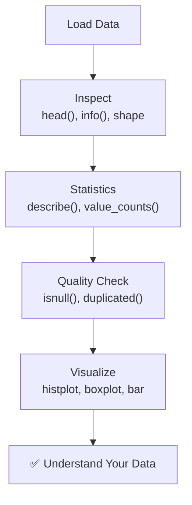

# Understanding Your Data | Data Understanding in ML

---

## Overview

Before building any ML model, you must **understand your data** — its structure, quality, distributions, and relationships. This is the foundation of EDA (Exploratory Data Analysis).


---

## 1. First Steps — Data Inspection

### Load & Look

```python
import pandas as pd
import numpy as np

df = pd.read_csv('data.csv')

# Quick peek
print(df.head())      # First 5 rows
print(df.tail())      # Last 5 rows
print(df.sample(5))   # Random 5 rows

# Shape
print(f"Rows: {df.shape[0]}, Columns: {df.shape[1]}")

# Column names
print(df.columns.tolist())
```

### Data Types & Memory

```python
# Column types and non-null counts
df.info()

# Memory usage
print(df.memory_usage(deep=True))
```

**Output from `df.info()`:**
```
<class 'pandas.core.frame.DataFrame'>
RangeIndex: 1000 entries, 0 to 999
Data columns (total 8 columns):
 #   Column    Non-Null Count  Dtype  
---  ------    --------------  -----  
 0   age       1000 non-null   int64  
 1   salary    985 non-null    float64
 2   gender    1000 non-null   object 
 3   city      950 non-null    object 
 4   purchase  800 non-null    float64
dtypes: float64(2), int64(1), object(2)
```

---

## 2. Statistical Summary

### For Numeric Columns

```python
df.describe()
```

| Statistic | age | salary | purchase |
|-----------|-----|--------|----------|
| **count** | 1000.0 | 985.0 | 800.0 |
| **mean** | 35.2 | 52000.0 | 245.0 |
| **std** | 12.5 | 15000.0 | 180.0 |
| **min** | 18.0 | 12000.0 | 0.0 |
| **25%** | 25.0 | 40000.0 | 100.0 |
| **50%** | 33.0 | 50000.0 | 200.0 |
| **75%** | 45.0 | 62000.0 | 320.0 |
| **max** | 70.0 | 120000.0 | 1500.0 |

```python
# Additional stats
print(df['age'].skew())      # Skewness (asymmetry)
print(df['age'].kurtosis())  # Kurtosis (tail heaviness)
print(df['age'].var())       # Variance
```

### For Categorical Columns

```python
df.describe(include='object')
```

| Statistic | gender | city |
|-----------|--------|------|
| **count** | 1000 | 950 |
| **unique** | 2 | 25 |
| **top** | Male | Mumbai |
| **freq** | 540 | 180 |

```python
# Frequency counts
df['city'].value_counts()
df['city'].value_counts(normalize=True)  # Percentages

# Cross-tabulation
pd.crosstab(df['gender'], df['purchased'])
```

---

## 3. Missing Values Analysis

```python
# Count missing values per column
print(df.isnull().sum())

# Percentage of missing values
print((df.isnull().sum() / len(df)) * 100)

# Visualize missing values
import missingno as msno
msno.matrix(df)
msno.bar(df)

# Check if missing values are correlated
msno.heatmap(df)
```

| Column | Missing Count | Missing % |
|--------|--------------|-----------|
| age | 0 | 0% |
| salary | 15 | 1.5% |
| gender | 0 | 0% |
| city | 50 | 5% |
| purchase | 200 | 20% |

> **Key Insight:** Understanding *why* data is missing is more important than knowing *how much* is missing.

---

## 4. Data Types & Value Ranges

### Check Unique Values

```python
# Unique values in each column
for col in df.columns:
    print(f"{col}: {df[col].nunique()} unique values")

# Check for constant columns
constant_cols = [col for col in df.columns if df[col].nunique() == 1]
print(f"Constant columns: {constant_cols}")
```

### Check Value Ranges

```python
# Min/Max for each numeric column
for col in df.select_dtypes(include=np.number).columns:
    print(f"{col}: {df[col].min()} → {df[col].max()}")

# Check for negative values in positive-only columns
print(df[df['age'] < 0])
print(df[df['salary'] < 0])
```

### Check for Duplicates

```python
# Duplicate rows
print(f"Duplicate rows: {df.duplicated().sum()}")

# View duplicates
print(df[df.duplicated(keep=False)])

# Duplicates in specific columns
print(df.duplicated(subset=['email', 'phone']).sum())
```

---

## 5. Visualizing Distributions

### Univariate Analysis (Single Variable)

```python
import matplotlib.pyplot as plt
import seaborn as sns

# Histogram — distribution of a numeric variable
plt.figure(figsize=(10, 4))
plt.subplot(1, 2, 1)
sns.histplot(df['age'], bins=30, kde=True)
plt.title('Age Distribution')

# Box plot — detect outliers
plt.subplot(1, 2, 2)
sns.boxplot(y=df['age'])
plt.title('Age Box Plot')
plt.tight_layout()
plt.show()
```

```python
# Bar chart — categorical distribution
plt.figure(figsize=(10, 4))
df['city'].value_counts().plot(kind='bar')
plt.title('City Distribution')
plt.xticks(rotation=45)
plt.tight_layout()
plt.show()
```

### Detecting Skewness



```python
# Check skewness
for col in df.select_dtypes(include=np.number).columns:
    skew = df[col].skew()
    if abs(skew) > 1:
        print(f"{col}: Skewed ({skew:.2f}) — consider transformation")
```

---

## 6. Outlier Detection

### Using IQR Method

```python
def detect_outliers_iqr(data, column):
    Q1 = data[column].quantile(0.25)
    Q3 = data[column].quantile(0.75)
    IQR = Q3 - Q1
    lower = Q1 - 1.5 * IQR
    upper = Q3 + 1.5 * IQR
    
    outliers = data[(data[column] < lower) | (data[column] > upper)]
    return outliers

outliers_age = detect_outliers_iqr(df, 'age')
print(f"Outliers in age: {len(outliers_age)}")
```

### Using Z-Score Method

```python
from scipy import stats

z_scores = np.abs(stats.zscore(df['age']))
outliers = df[z_scores > 3]
print(f"Outliers (z-score > 3): {len(outliers)}")
```

---

## 7. Data Quality Report — Template

```python
def data_quality_report(df):
    report = pd.DataFrame({
        'Data Type': df.dtypes,
        'Non-Null Count': df.count(),
        'Null Count': df.isnull().sum(),
        'Null %': (df.isnull().sum() / len(df) * 100).round(2),
        'Unique Values': df.nunique(),
        'Min': df.min(numeric_only=True),
        'Max': df.max(numeric_only=True),
        'Mean': df.mean(numeric_only=True).round(2),
        'Std': df.std(numeric_only=True).round(2)
    })
    return report

report = data_quality_report(df)
print(report)
```

---

## Summary



### Checklist

```
☐ Loaded data successfully?
☐ Checked shape & column names?
☐ Identified data types?
☐ Counted missing values?
☐ Checked for duplicates?
☐ Analyzed statistical summary?
☐ Detected outliers?
☐ Visualized distributions?
☐ Identified data quality issues?
```

> **Key Insight:** "Know thy data" — 80% of ML success comes from understanding data, not fancy algorithms.

---

*Based on CampusX video: "Understanding Your Data | Understand Your Data in 5 Minutes"*
