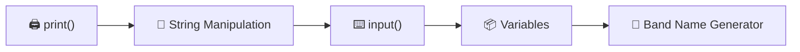
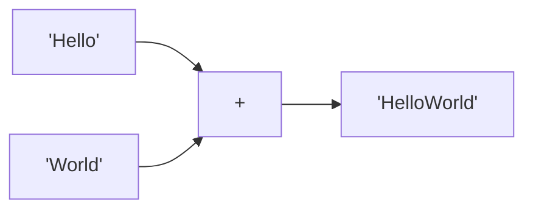
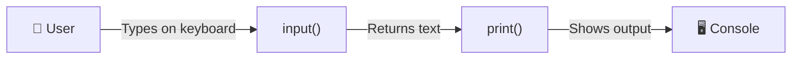
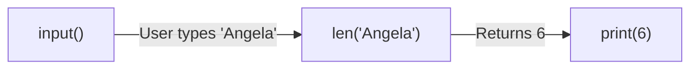
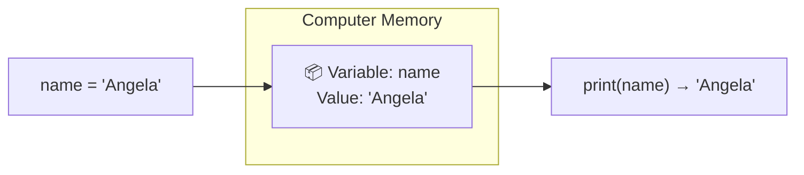
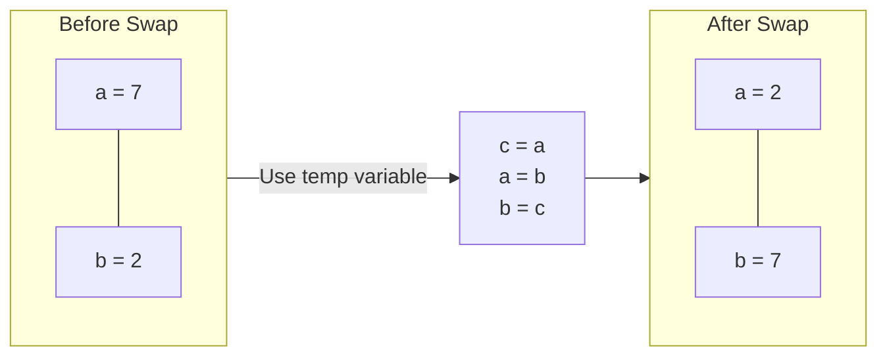
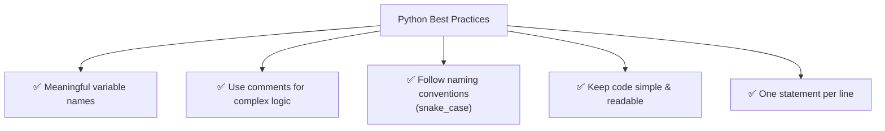
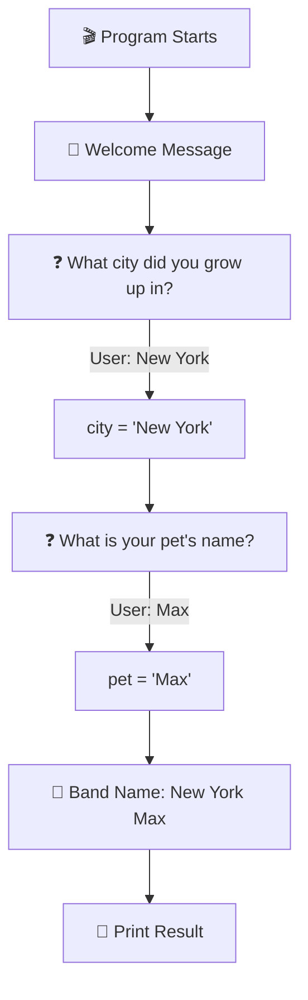
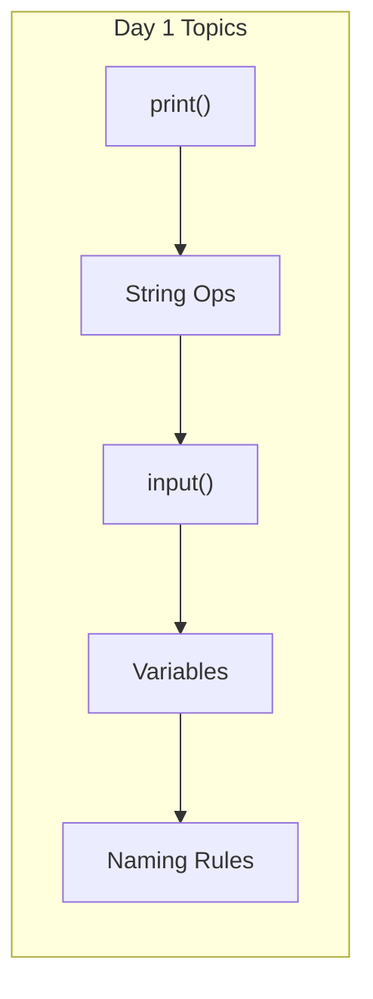

# Day 1 — Working with Variables in Python to Manage Data

---

## Overview

Day 1 covers the absolute basics of Python — printing, taking input, storing data in variables, and string manipulation.



---

## 1. Printing to the Console — `print()`

The `print()` function outputs text to the console.

### Basic Syntax

```python
print("Hello World!")
```

```
Output: Hello World!
```

### Quotes Matter

```python
print("Hello World!")   # ✅ Double quotes
print('Hello World!')   # ✅ Single quotes (same result)
print(Hello World!)     # ❌ ERROR — no quotes
```

> **Rule:** Text must be wrapped in quotes. Without quotes, Python thinks it's code.

### Multiple `print()` Statements

```python
print("Day 1 - Python Print Function")
print("The function is declared like this:")
print("print('what to print')")
```

```
Output:
Day 1 - Python Print Function
The function is declared like this:
print('what to print')
```

Each `print()` automatically adds a **new line** at the end.

---

## 2. String Manipulation

### String Concatenation — `+`



```python
print("Hello" + "World")     # HelloWorld (no space)
print("Hello" + " " + "World")  # Hello World (with space)
```

### New Lines — `\n`

```python
print("Hello\nWorld")
```

```
Output:
Hello
World
```

### Escape Characters — `\'` or `\"`

```python
print("She said: \"Hello!\"")   # She said: "Hello!"
print('It\'s a nice day')       # It's a nice day
```

### String Manipulation Summary

```python
print("Hello " + "World")            # Concatenation
print("Hello\nWorld")                # New line
print("Hello\tWorld")                # Tab
print("Hello\\World")                # Backslash
print("She said \"Hello\"")          # Double quote inside string
```

---

## 3. The Python Input Function — `input()`

The `input()` function takes input from the user via the console.



### Basic Syntax

```python
input("A prompt for the user: ")
```

- Prints the prompt text
- Waits for the user to type something and press Enter
- Returns whatever the user typed as a **string**

### Example

```python
input("What is your name? ")
```

```
What is your name? |  (cursor waits for input)
```

### Using `input()` Inside `print()`

```python
print("Hello " + input("What is your name? "))
```

```
What is your name? Angela
Hello Angela
```

**How it works:**
1. Python sees `input("What is your name? ")` first
2. Waits for user to type "Angela" and press Enter
3. User's input replaces the function call
4. Now `print("Hello " + "Angela")` executes
5. Output: `Hello Angela`

### Getting Length with `len()`

```python
print(len(input("What is your name? ")))
```

```
What is your name? Angela
6
```



---

## 4. Python Variables

A **variable** is a container for storing data.

```python
name = "Angela"
print(name)
```



### Why Variables?

Without variables:
```python
print("Hello " + input("What is your name? "))
# Can't reuse the name later
```

With variables:
```python
name = input("What is your name? ")
print("Hello " + name)
print("Your name has " + str(len(name)) + " characters")
# Can reuse 'name' multiple times!
```

### Swapping Variables

```python
a = 7
b = 2

# Swap values
c = a   # c = 7
a = b   # a = 2
b = c   # b = 7
```



---

## 5. Variable Naming Rules

### ✅ Do's

| Rule | Example |
|------|---------|
| Use descriptive names | `user_name` not `u` |
| Use underscores for spaces | `first_name` not `firstname` |
| Start with letter or underscore | `name` ✅, `_name` ✅ |
| Use lowercase | `city_name` ✅ |

### ❌ Don'ts

| Mistake | Wrong | Right |
|---------|-------|-------|
| No spaces | `my name = "Angela"` | `my_name = "Angela"` |
| Don't start with number | `1st_name = "Angela"` | `first_name = "Angela"` |
| Don't use reserved words | `print = "Hello"` | `message = "Hello"` |
| No special characters | `my-name = "Angela"` | `my_name = "Angela"` |

### Reserved Keywords (Can't Use as Variable Names)

```
False, None, True, and, as, assert, async, await, break,
class, continue, def, del, elif, else, except, finally,
for, from, global, if, import, in, is, lambda, nonlocal,
not, or, pass, raise, return, try, while, with, yield
```

---

## 6. Comments

Comments are ignored by Python — they help humans understand code.

```python
# This is a single-line comment

"""
This is a
multi-line comment
"""
```

```python
# Get user's name
name = input("What is your name? ")

# Print greeting
print("Hello " + name)
```

---

## 7. Best Practices (From Day 1)



| Practice | Bad ❌ | Good ✅ |
|----------|-------|--------|
| Variable naming | `x = "Angela"` | `user_name = "Angela"` |
| Spacing | `print("Hello")` | `print("Hello")` (spaces around operators) |
| Comments | No comments | `# Get user city` |
| Readability | `print(len(input("Name: ")))` | `name = input("Name: "); print(len(name))` |

---

## 8. Day 1 Project — Band Name Generator 🎸



### Code

```python
# 1. Welcome message
print("Welcome to the Band Name Generator!")

# 2. Ask for city
city = input("What city did you grow up in?\n")

# 3. Ask for pet name
pet = input("What is your pet's name?\n")

# 4. Combine and print
print("Your band name could be: " + city + " " + pet)
```

### Sample Run

```
Welcome to the Band Name Generator!
What city did you grow up in?
New York
What is your pet's name?
Max
Your band name could be: New York Max
```

---

## Summary



| Concept | Syntax | Purpose |
|---------|--------|---------|
| **Print** | `print("text")` | Output to console |
| **Input** | `input("prompt")` | Get user input |
| **Variable** | `name = value` | Store data |
| **Concatenate** | `"a" + "b"` | Join strings |
| **Length** | `len(string)` | Count characters |
| **New Line** | `\n` | Break line |

---

*Based on Dr. Angela Yu's "100 Days of Code: The Complete Python Pro Bootcamp" — Day 1*
