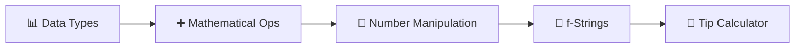
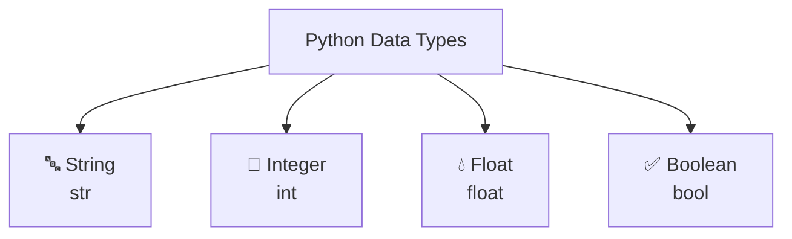
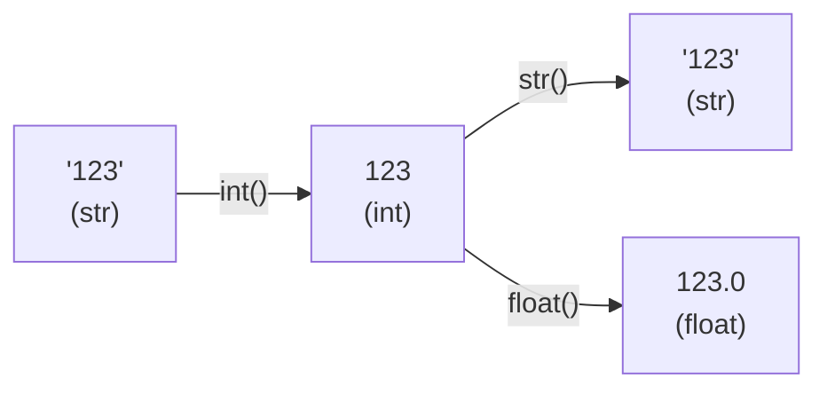
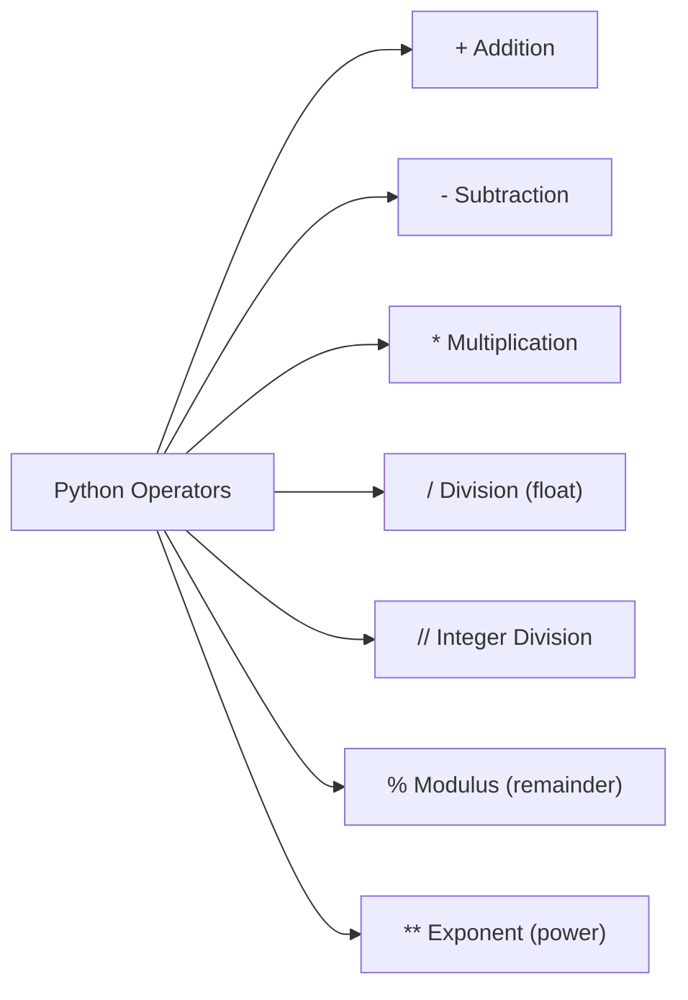
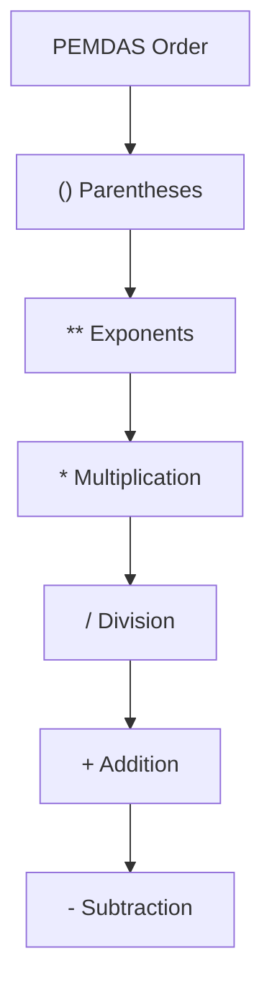
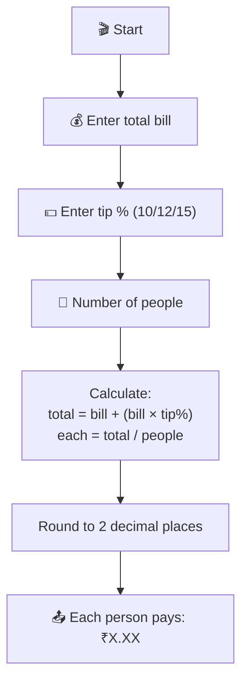

# Day 2 — Understanding Data Types and How to Manipulate Strings

---

## Overview

Day 2 covers **data types** (the kinds of values Python works with), **mathematical operations**, and **string manipulation** techniques.



---

## 1. Python Data Types

Every value in Python has a **type**. The main primitive types are:



| Type | Example | Description |
|------|---------|-------------|
| **String** | `"Hello"`, `'123'` | Text — wrapped in quotes |
| **Integer** | `123`, `-5`, `1000` | Whole numbers (no decimal) |
| **Float** | `3.14`, `-0.5`, `2.0` | Decimal numbers |
| **Boolean** | `True`, `False` | True/False values |

### Checking Type — `type()`

```python
print(type("Hello"))   # <class 'str'>
print(type(123))       # <class 'int'>
print(type(3.14))      # <class 'float'>
print(type(True))      # <class 'bool'>
```

### Type Conversion



```python
# String to Integer
print(int("123") + 456)   # 579

# Integer to String
print("Your score is " + str(100))   # "Your score is 100"

# Integer to Float
print(float(10))   # 10.0
```

### Common Errors

```python
print("100" + 50)    # ❌ TypeError — can't add str + int
print("100" + "50")  # ✅ "10050" (string concatenation)
print(100 + 50)      # ✅ 150 (integer addition)
```

---

## 2. Mathematical Operations



| Operator | Name | Example | Result |
|----------|------|---------|--------|
| `+` | Addition | `3 + 2` | `5` |
| `-` | Subtraction | `3 - 2` | `1` |
| `*` | Multiplication | `3 * 2` | `6` |
| `/` | Division | `3 / 2` | `1.5` |
| `//` | Integer Division | `3 // 2` | `1` |
| `%` | Modulus | `3 % 2` | `1` |
| `**` | Exponent | `3 ** 2` | `9` |

### PEMDAS — Order of Operations



Same level = **left to right**.

```python
print(3 + 5 * 2)        # 13  (multiplication first)
print((3 + 5) * 2)      # 16  (parentheses first)
print(2 ** 3 + 1)       # 9   (exponent first: 8 + 1)
print(10 / 2 * 3)       # 15.0 (left to right: 5.0 * 3)
```

---

## 3. Number Manipulation

### Rounding — `round()`

```python
print(round(3.14159, 2))   # 3.14
print(round(3.5))           # 4
```

### Floor Division — `//`

```python
print(10 / 3)    # 3.333... (float)
print(10 // 3)   # 3 (int — drops decimal)
```

### Augmented Assignment Operators

```python
score = 0
score += 10     # score = score + 10
score -= 5      # score = score - 5
score *= 2      # score = score * 2
score /= 3      # score = score / 3
```

---

## 4. f-Strings (String Formatting)

f-strings make it easy to mix strings and variables.

```python
name = "Angela"
age = 35
print(f"Hello {name}, you are {age} years old.")
# Output: Hello Angela, you are 35 years old.
```

### Without f-Strings (Painful)

```python
print("Hello " + name + ", you are " + str(age) + " years old.")
```

### With f-Strings (Clean)

```python
print(f"Hello {name}, you are {age} years old.")
```

> **Rule:** Use f-strings whenever you need to mix variables with text.

---

## 5. Best Practices

| Practice | Bad ❌ | Good ✅ |
|----------|-------|--------|
| Type conversion | `str(100) + 50` (still wrong) | `int("100") + 50` |
| f-strings | `"Hello " + name + "!"` | `f"Hello {name}!"` |
| Meaningful names | `a = 3.14` | `pi = 3.14` |
| Augmented assignment | `x = x + 1` | `x += 1` |

---

## 6. Day 2 Project — Tip Calculator 🧮



### Code

```python
print("Welcome to the tip calculator!")

bill = float(input("What was the total bill? ₹"))
tip = int(input("What percentage tip? (10/12/15) "))
people = int(input("How many people to split? "))

total_bill = bill * (1 + tip / 100)
each_pay = round(total_bill / people, 2)

print(f"Each person should pay: ₹{each_pay}")
```

### Sample Run

```
Welcome to the tip calculator!
What was the total bill? ₹1500
What percentage tip? (10/12/15) 12
How many people to split? 3
Each person should pay: ₹560.0
```

---

## Summary

| Concept | Syntax | Example |
|---------|--------|---------|
| **Data Types** | `int`, `float`, `str`, `bool` | `age = 25` (int) |
| **Type Check** | `type(value)` | `type("Hi")` → str |
| **Type Convert** | `int()`, `str()`, `float()` | `int("123")` |
| **Math Ops** | `+ - * / // % **` | `10 % 3` → 1 |
| **f-String** | `f"text {var}"` | `f"Age: {age}"` |
| **Round** | `round(num, decimals)` | `round(3.141, 2)` → 3.14 |

---

*Based on Dr. Angela Yu's "100 Days of Code: The Complete Python Pro Bootcamp" — Day 2*
