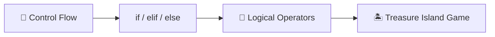
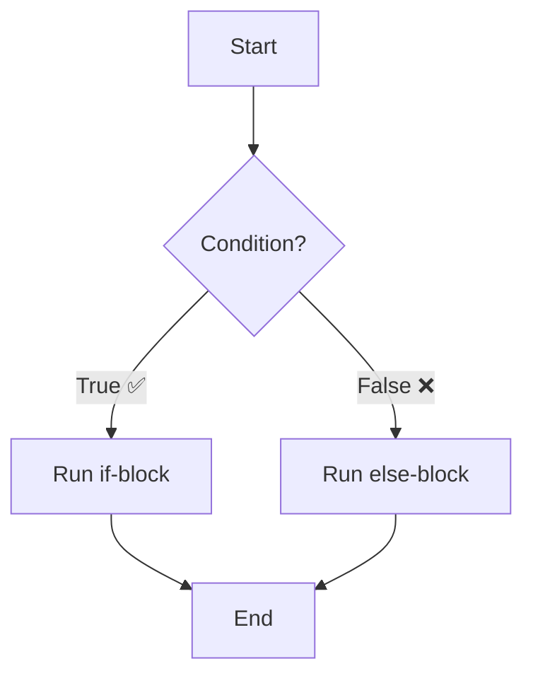
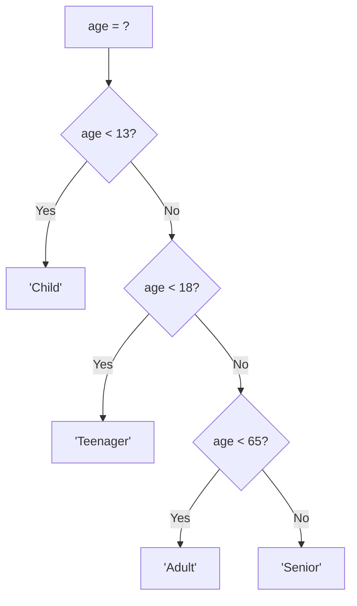
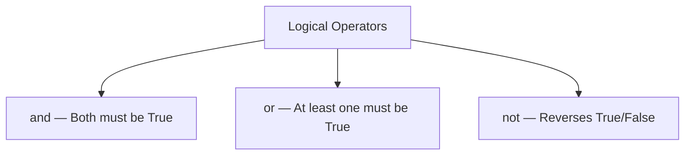
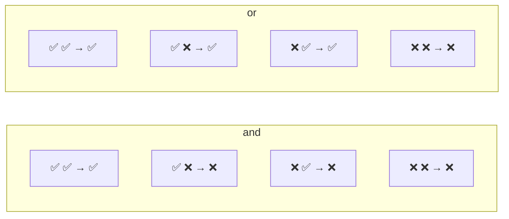
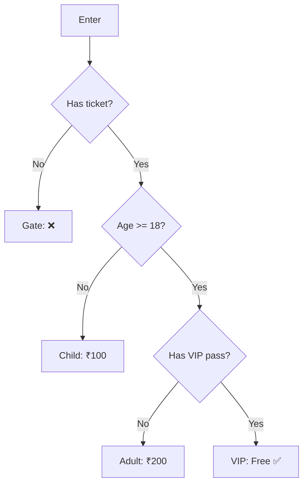
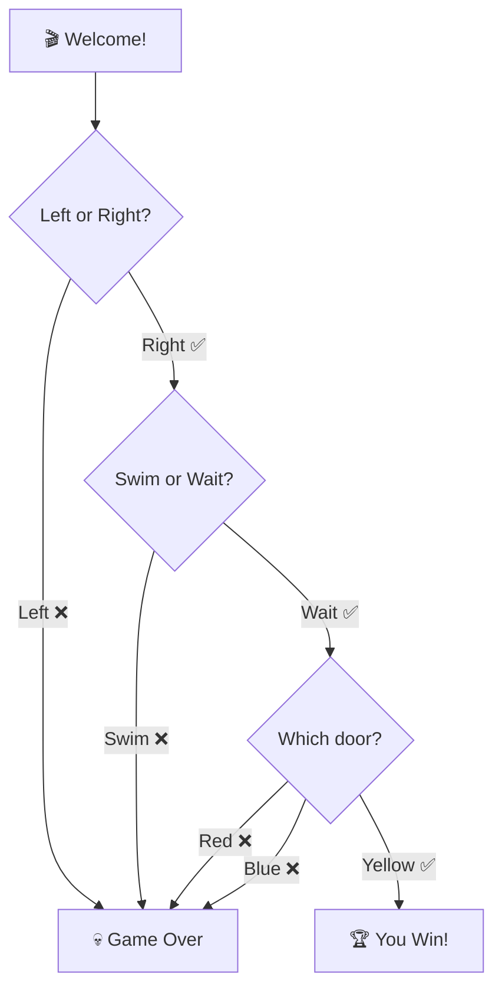
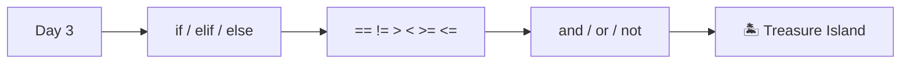

# Day 3 — Control Flow and Logical Operators

---

## Overview

Day 3 introduces **conditional statements** — making decisions in code using `if`, `elif`, `else`, and **logical operators**.



---

## 1. Conditional Statements — `if / elif / else`



### Basic Syntax

```python
if condition:
    # code to run if condition is True
else:
    # code to run if condition is False
```

> ⚠️ **Indentation is critical** — Python uses indentation (usually 4 spaces) to define code blocks.

### Example

```python
age = 18

if age >= 18:
    print("You can vote! ✅")
else:
    print("Too young to vote ❌")
```

### Multiple Conditions — `elif`

```python
if age < 13:
    print("Child")
elif age < 18:
    print("Teenager")
elif age < 65:
    print("Adult")
else:
    print("Senior")
```



---

## 2. Comparison Operators

| Operator | Meaning | Example | Result |
|----------|---------|---------|--------|
| `==` | Equal to | `5 == 5` | `True` |
| `!=` | Not equal to | `5 != 3` | `True` |
| `>` | Greater than | `5 > 3` | `True` |
| `<` | Less than | `5 < 3` | `False` |
| `>=` | Greater or equal | `5 >= 5` | `True` |
| `<=` | Less or equal | `5 <= 3` | `False` |

```python
# Common mistake
if name = "Angela":   # ❌ = is assignment, not comparison
if name == "Angela":  # ✅ == is comparison
```

---

## 3. Logical Operators



| Operator | Example | Result |
|----------|---------|--------|
| `and` | `True and False` | `False` |
| `and` | `True and True` | `True` |
| `or` | `True or False` | `True` |
| `or` | `False or False` | `False` |
| `not` | `not True` | `False` |
| `not` | `not False` | `True` |

### Truth Table



### Examples

```python
# and — both conditions must be True
age = 25
if age >= 18 and age <= 60:
    print("Working age adult")

# or — at least one condition must be True
day = "Sunday"
if day == "Saturday" or day == "Sunday":
    print("Weekend! 🎉")

# not — reverses the condition
is_weekend = False
if not is_weekend:
    print("Time to work 💼")
```

---

## 4. Nested if/else

You can put `if` statements **inside** other `if` statements.



```python
has_ticket = True
age = 20
has_vip = False

if has_ticket:
    print("Gate opened ✅")
    if age >= 18:
        print("Adult section")
        if has_vip:
            print("VIP Lounge access")
        else:
            print("General seating")
    else:
        print("Children's area")
else:
    print("No entry ❌")
```

> ⚠️ **Avoid deep nesting** — too many nested `if`s makes code hard to read. Use logical operators instead.

---

## 5. `in` Keyword — Check Membership

```python
letter = "a"
if letter in "aeiou":
    print(f"{letter} is a vowel")
```

---

## 6. Best Practices

| Practice | Bad ❌ | Good ✅ |
|----------|-------|--------|
| Redundant comparison | `if x == True:` | `if x:` |
| Deep nesting | 4+ levels of `if` | Use `and` / `or` |
| Meaningful conditions | `if a:` (what is a?) | `if user_is_logged_in:` |
| Consistent indentation | Mix tabs and spaces | Always 4 spaces |

---

## 7. Day 3 Project — Treasure Island 🏝️



### Code

```python
print("Welcome to Treasure Island!")
print("Your mission is to find the treasure.")

choice1 = input("Left or Right? ").lower()
if choice1 == "left":
    print("Fall into a hole. 💀 Game Over!")
else:
    choice2 = input("Swim or Wait? ").lower()
    if choice2 == "swim":
        print("Attacked by trout. 💀 Game Over!")
    else:
        choice3 = input("Which door? Red, Blue, Yellow: ").lower()
        if choice3 == "yellow":
            print("🏆 You Win! You found the treasure!")
        elif choice3 == "red":
            print("Burned by fire. 💀 Game Over!")
        elif choice3 == "blue":
            print("Eaten by beasts. 💀 Game Over!")
        else:
            print("💀 Game Over!")
```

---

## Summary



| Concept | Syntax | Purpose |
|---------|--------|---------|
| **if** | `if x > 0:` | Run code if condition is True |
| **elif** | `elif x > 10:` | Check another condition |
| **else** | `else:` | Fallback if all conditions False |
| **and** | `a > 0 and b > 0` | Both must be True |
| **or** | `a > 0 or b > 0` | At least one must be True |
| **not** | `not is_ready` | Reverse True/False |
| **in** | `'a' in 'hello'` | Check membership |

---

*Based on Dr. Angela Yu's "100 Days of Code: The Complete Python Pro Bootcamp" — Day 3*
