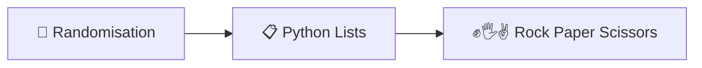
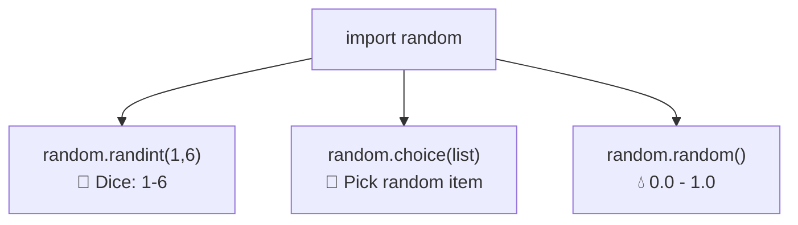
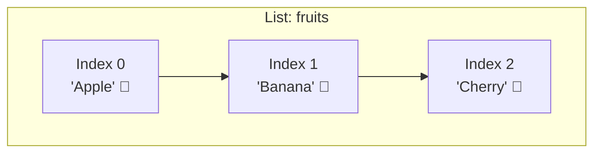
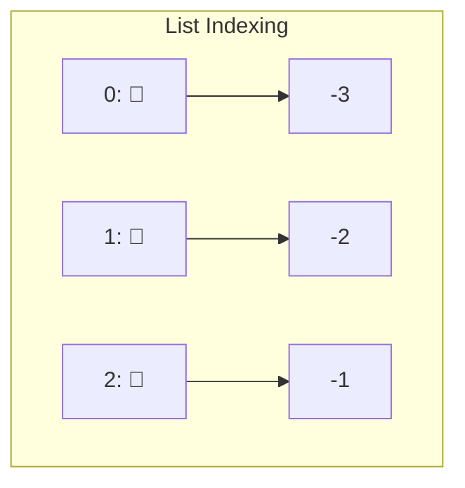
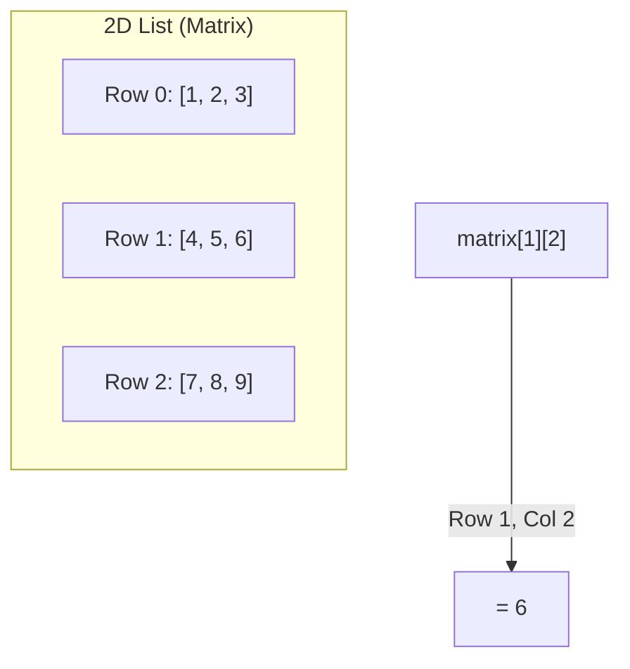
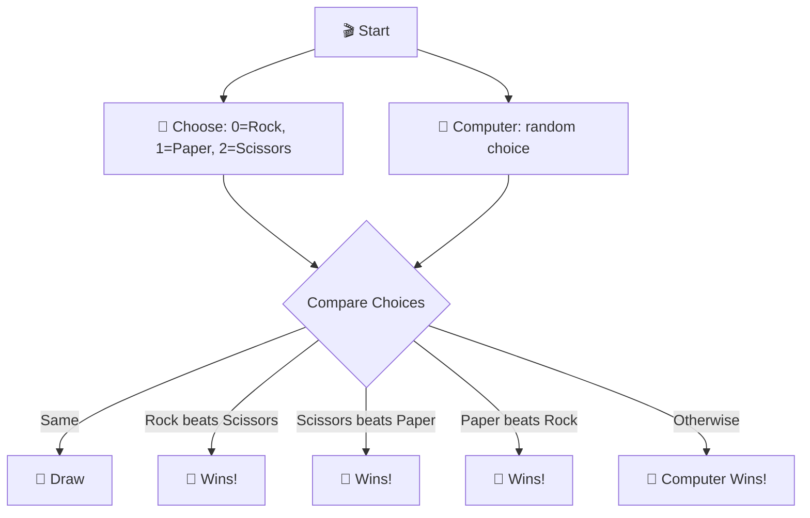
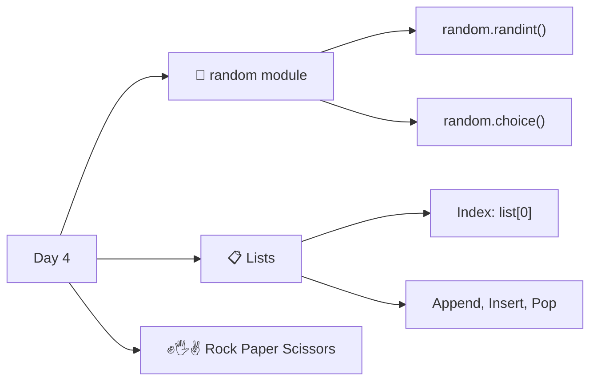

# Day 4 — Randomisation and Python Lists

---

## Overview

Day 4 covers **random number generation** and **lists** — Python's way of storing collections of data.



---

## 1. Randomisation — `random` Module

Python has a built-in `random` module that generates random numbers.

### Importing

```python
import random
```

### Common Functions

| Function | Description | Example |
|----------|-------------|---------|
| `random.randint(a, b)` | Random integer between a and b (inclusive) | `random.randint(1, 6)` |
| `random.random()` | Random float between 0.0 and 1.0 | `random.random()` → `0.734` |
| `random.uniform(a, b)` | Random float between a and b | `random.uniform(1, 10)` |
| `random.choice(list)` | Random item from a list | `random.choice(["H", "T"])` |

### Examples

```python
import random

# Dice roll
dice = random.randint(1, 6)    # 1, 2, 3, 4, 5, or 6
print(f"🎲 You rolled: {dice}")

# Coin flip
coin = random.randint(0, 1)
if coin == 0:
    print("Heads")
else:
    print("Tails")
    
# Random float
print(random.random())          # 0.0 to 0.999...
print(random.uniform(1, 10))    # 1.0 to 10.0
```



---

## 2. Python Lists

A **list** is a collection of items in a single variable, stored in order.



### Creating a List

```python
fruits = ["Apple", "Banana", "Cherry"]
numbers = [1, 2, 3, 4, 5]
mixed = ["Hello", 42, True, 3.14]
empty = []
```

### Accessing Items — Indexing

```python
fruits = ["Apple", "Banana", "Cherry"]

print(fruits[0])    # Apple
print(fruits[1])    # Banana
print(fruits[2])    # Cherry
print(fruits[-1])   # Cherry (negative = from end)
print(fruits[-2])   # Banana
```



### Modifying Lists

```python
fruits = ["Apple", "Banana", "Cherry"]

# Change value
fruits[1] = "Blueberry"
print(fruits)   # ['Apple', 'Blueberry', 'Cherry']

# Add to end
fruits.append("Mango")
print(fruits)   # ['Apple', 'Blueberry', 'Cherry', 'Mango']

# Add at specific position
fruits.insert(1, "Kiwi")
print(fruits)   # ['Apple', 'Kiwi', 'Blueberry', 'Cherry', 'Mango']

# Remove
fruits.remove("Kiwi")
# or
popped = fruits.pop()    # removes and returns last item
del fruits[0]            # removes at index

# Length
print(len(fruits))       # number of items
```

### List Methods Summary

| Method | Description | Example |
|--------|-------------|---------|
| `list.append(item)` | Add to end | `fruits.append("Mango")` |
| `list.insert(i, item)` | Add at index | `fruits.insert(1, "Kiwi")` |
| `list.remove(item)` | Remove first match | `fruits.remove("Apple")` |
| `list.pop()` | Remove & return last | `last = fruits.pop()` |
| `list.pop(i)` | Remove & return at index | `item = fruits.pop(2)` |
| `list.index(item)` | Find index of item | `fruits.index("Banana")` |
| `len(list)` | Number of items | `len(fruits)` |

### List Slicing

```python
numbers = [0, 1, 2, 3, 4, 5]

print(numbers[0:3])    # [0, 1, 2]  (start:end — end exclusive)
print(numbers[:3])     # [0, 1, 2]  (from start)
print(numbers[3:])     # [3, 4, 5]  (to end)
print(numbers[::2])    # [0, 2, 4]  (step)
```

---

## 3. Nested Lists

Lists can contain other lists.

```python
# Row, column
matrix = [
    [1, 2, 3],   # Row 0
    [4, 5, 6],   # Row 1
    [7, 8, 9]    # Row 2
]

print(matrix[0][1])   # 2 (row 0, col 1)
print(matrix[2][2])   # 9 (row 2, col 2)
```



---

## 4. `random.choice()` with Lists

```python
import random

friends = ["Alice", "Bob", "Charlie", "Diana"]
print(random.choice(friends))   # Random friend

# Manual way
print(friends[random.randint(0, len(friends) - 1)])
```

---

## 5. Best Practices

| Practice | Bad ❌ | Good ✅ |
|----------|-------|--------|
| List naming | `l = [1, 2, 3]` | `numbers = [1, 2, 3]` |
| Indexing | `list[len(list)-1]` | `list[-1]` |
| Random import | `from random import *` | `import random` |
| List copying | `b = a` (reference!) | `b = a.copy()` |

---

## 6. Day 4 Project — Rock Paper Scissors ✊🖐️✌️



### Code

```python
import random

rock = "✊"
paper = "🖐️"
scissors = "✌️"

choices = [rock, paper, scissors]

user = int(input("0 = Rock, 1 = Paper, 2 = Scissors: "))
computer = random.randint(0, 2)

print(f"You chose: {choices[user]}")
print(f"Computer chose: {choices[computer]}")

if user == computer:
    print("Draw 🤝")
elif (user == 0 and computer == 2) or \
     (user == 1 and computer == 0) or \
     (user == 2 and computer == 1):
    print("You Win! 🎉")
else:
    print("You Lose! 💀")
```

### Sample Run

```
0 = Rock, 1 = Paper, 2 = Scissors: 0
You chose: ✊
Computer chose: ✌️
You Win! 🎉
```

---

## Summary



| Concept | Syntax | Example |
|---------|--------|---------|
| **Random int** | `random.randint(a, b)` | `random.randint(1, 6)` |
| **Random choice** | `random.choice(list)` | `random.choice(["H", "T"])` |
| **Create list** | `list = [a, b, c]` | `fruits = ["Apple", "Banana"]` |
| **Access** | `list[index]` | `fruits[0]` |
| **Add** | `list.append(item)` | `fruits.append("Mango")` |
| **Length** | `len(list)` | `len(fruits)` |

---

*Based on Dr. Angela Yu's "100 Days of Code: The Complete Python Pro Bootcamp" — Day 4*
