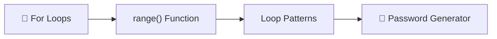
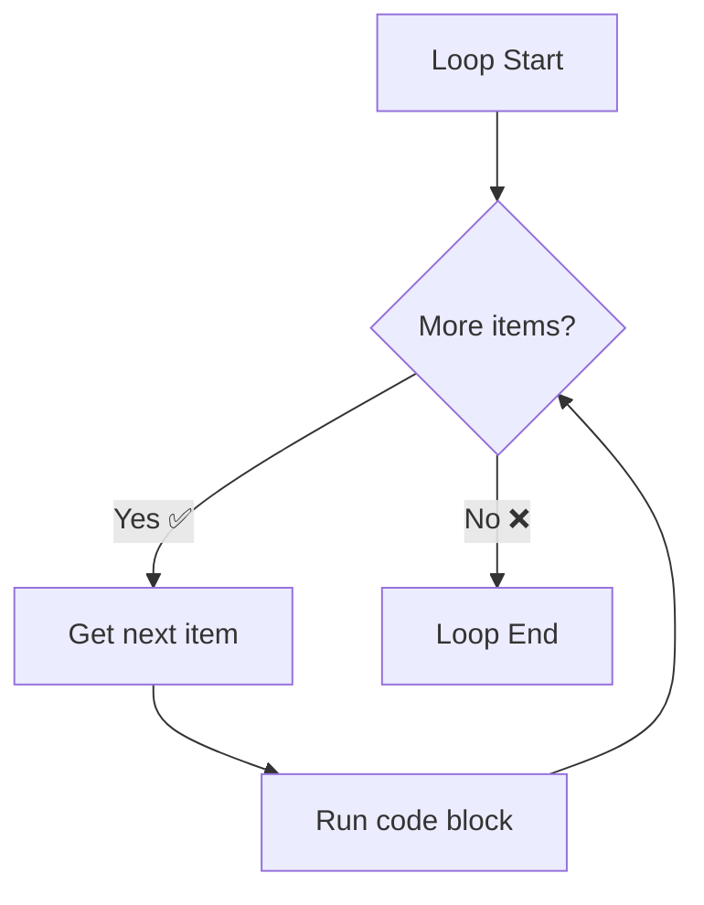
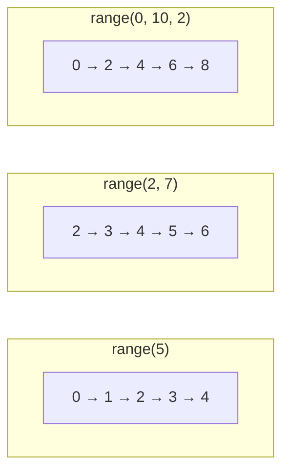
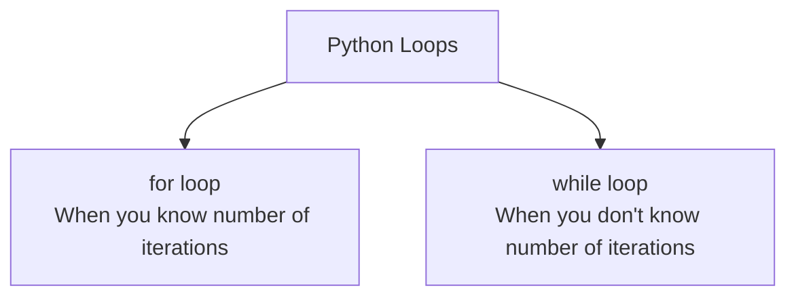
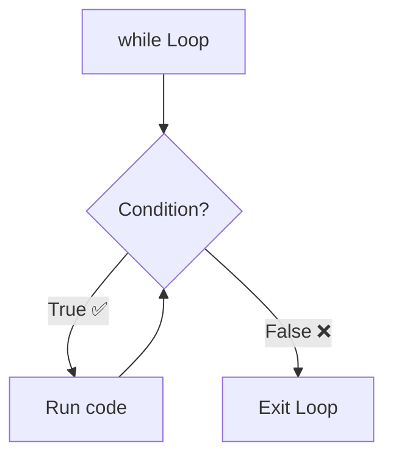
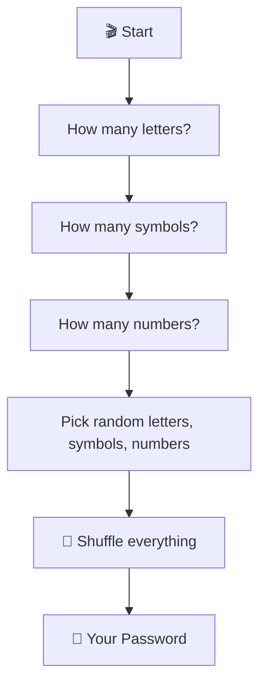
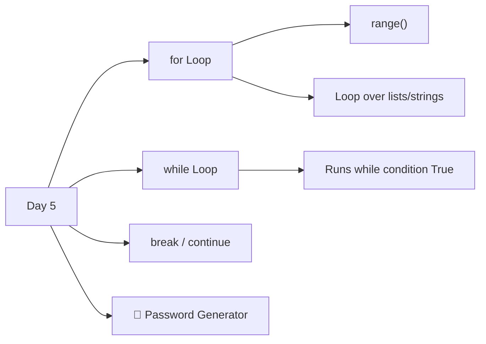

# Day 5 — Python Loops

---

## Overview

Day 5 introduces **loops** — repeating actions in code using `for` loops and `while` loops.



---

## 1. The `for` Loop

A `for` loop **iterates** over a sequence (list, string, range, etc.) and runs code for each item.



### Basic Syntax

```python
for item in sequence:
    # code to run for each item
```

### Looping Through a List

```python
fruits = ["Apple", "Banana", "Cherry"]

for fruit in fruits:
    print(f"I like {fruit}")
```

```
I like Apple
I like Banana
I like Cherry
```

### Looping Through a String

```python
for letter in "Python":
    print(letter)
```

```
P
y
t
h
o
n
```

---

## 2. The `range()` Function

`range(start, stop, step)` generates a sequence of numbers.



| Call | Sequence |
|------|----------|
| `range(5)` | `0, 1, 2, 3, 4` |
| `range(1, 6)` | `1, 2, 3, 4, 5` |
| `range(1, 10, 2)` | `1, 3, 5, 7, 9` |
| `range(5, 0, -1)` | `5, 4, 3, 2, 1` |

### Examples

```python
# Loop 5 times (0 to 4)
for i in range(5):
    print(f"Count: {i}")

# Sum of 1 to 100
total = 0
for num in range(1, 101):
    total += num
print(f"Sum 1-100 = {total}")   # 5050

# Even numbers only
for num in range(0, 11, 2):
    print(num)   # 0, 2, 4, 6, 8, 10
```

---

## 3. Common Loop Patterns

### Summing / Accumulating

```python
total = 0
for score in [78, 92, 85, 63, 97]:
    total += score
print(f"Total: {total}")      # 415
print(f"Average: {total / 5}")  # 83.0
```

### Finding Max / Min

```python
scores = [78, 92, 85, 63, 97]

max_score = 0
for score in scores:
    if score > max_score:
        max_score = score
print(f"Highest: {max_score}")   # 97

# Or use built-in:
print(max(scores))
print(min(scores))
print(sum(scores))
```

### Filtering

```python
numbers = [1, 2, 3, 4, 5, 6, 7, 8, 9, 10]

evens = []
for num in numbers:
    if num % 2 == 0:
        evens.append(num)

print(evens)   # [2, 4, 6, 8, 10]
```

---

## 4. `for` vs `while`



### `for` Loop — Use when you know how many times to loop

```python
for i in range(10):          # I know: exactly 10 times
for fruit in fruits:          # I know: once per item
```

### `while` Loop — Use when you loop until a condition changes

```python
while condition_is_true:
    # keep running
```

```python
# Keep asking until valid input
user_input = ""
while user_input != "quit":
    user_input = input("Type something (or 'quit'): ")
    print(f"You said: {user_input}")
```



> ⚠️ **Infinite loop danger!** Always make sure your `while` condition eventually becomes `False`.

```python
# Infinite loop — DON'T DO THIS
while True:
    print("Forever...")

# Safe loop
count = 0
while count < 5:
    print(count)
    count += 1   # ← This makes it stop
```

---

## 5. Loop Control — `break` and `continue`

| Keyword | Effect |
|---------|--------|
| `break` | Exit the loop immediately |
| `continue` | Skip the rest of current iteration, go to next |

```python
# break — stop at 5
for num in range(10):
    if num == 5:
        break
    print(num)    # 0, 1, 2, 3, 4

# continue — skip even numbers
for num in range(10):
    if num % 2 == 0:
        continue
    print(num)    # 1, 3, 5, 7, 9
```

---

## 6. Nested Loops

A loop inside another loop.

```python
for i in range(3):
    for j in range(3):
        print(f"({i}, {j})", end=" ")
    print()   # new line
```

```
(0, 0) (0, 1) (0, 2)
(1, 0) (1, 1) (1, 2)
(2, 0) (2, 1) (2, 2)
```

---

## 7. Best Practices

| Practice | Bad ❌ | Good ✅ |
|----------|-------|--------|
| Loop variable | `for x in range(10):` | `for item in items:` |
| `while` usage | `while True:` (no exit) | Clear exit condition |
| List building | Hardcoded lists | Build with loops |
| `range` clarity | `range(1, 11)` (magic numbers) | Comment or variable |

---

## 8. Day 5 Project — Password Generator 🔑



### Code

```python
import random

letters = ['a','b','c','d','e','f','g','h','i','j','k','l','m',
           'n','o','p','q','r','s','t','u','v','w','x','y','z',
           'A','B','C','D','E','F','G','H','I','J','K','L','M',
           'N','O','P','Q','R','S','T','U','V','W','X','Y','Z']
numbers = ['0','1','2','3','4','5','6','7','8','9']
symbols = ['!','@','#','$','%','^','&','*','(',')','+']

print("Welcome to the Password Generator!")

nr_letters = int(input("How many letters? "))
nr_symbols = int(input("How many symbols? "))
nr_numbers = int(input("How many numbers? "))

password_list = []

for _ in range(nr_letters):
    password_list.append(random.choice(letters))

for _ in range(nr_symbols):
    password_list.append(random.choice(symbols))

for _ in range(nr_numbers):
    password_list.append(random.choice(numbers))

# Shuffle the order
random.shuffle(password_list)

# Convert list to string
password = "".join(password_list)

print(f"Your password is: {password}")

# Easy version (no shuffle)
# easy_password = ""
# easy_password = easy_password + random.choice(letters) + ...
```

### Sample Run

```
Welcome to the Password Generator!
How many letters? 4
How many symbols? 2
How many numbers? 3
Your password is: a$K9m#2Q8
```

---

## Summary



| Concept | Syntax | Example |
|---------|--------|---------|
| **for loop** | `for x in seq:` | `for fruit in fruits:` |
| **range()** | `range(start, stop, step)` | `range(1, 10, 2)` |
| **while loop** | `while condition:` | `while count < 5:` |
| **break** | `break` | Exit loop |
| **continue** | `continue` | Skip iteration |
| **shuffle** | `random.shuffle(list)` | Randomize list order |
| **join** | `" ".join(list)` | List → string |

---

*Based on Dr. Angela Yu's "100 Days of Code: The Complete Python Pro Bootcamp" — Day 5*
