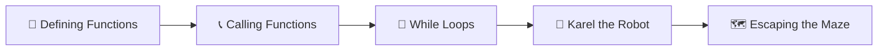
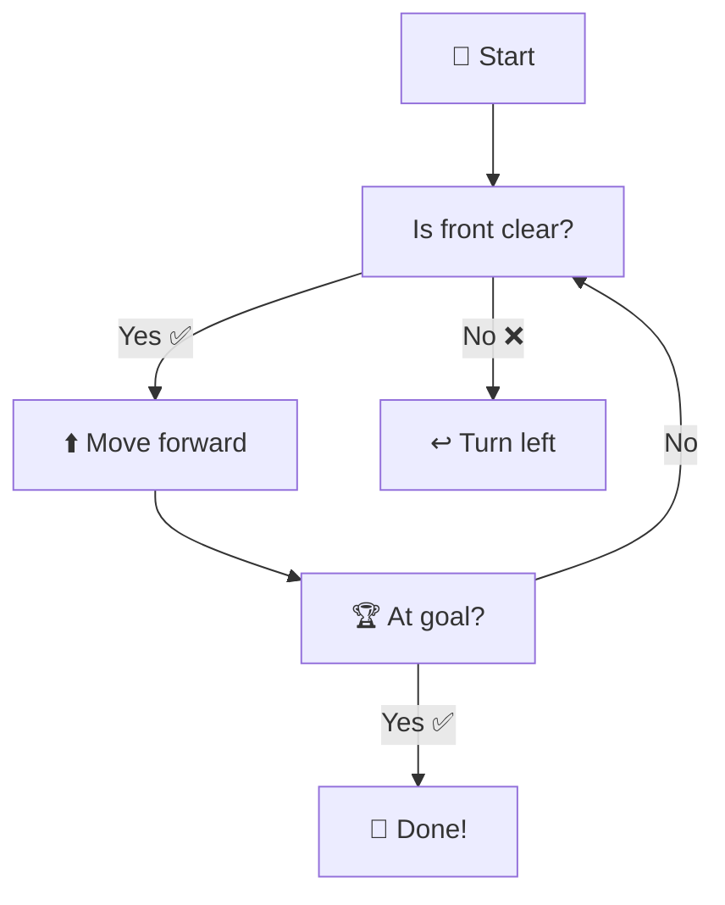
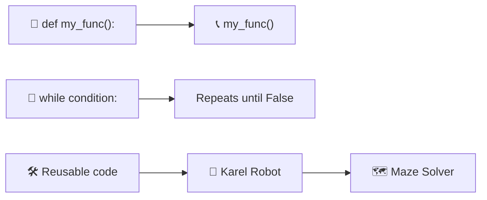

# Day 6 — Python Functions & Karel

---

## Overview

Functions are **reusable blocks of code** that perform a specific task. Today we learn how to define our own functions, work with the Karel robot environment, and use `while` loops for repeated actions.



---

## 1. Defining Functions — `def`

A function is defined using the `def` keyword, followed by a name, parentheses `()`, and a colon `:`.

```python
def my_function():
    print("Hello from a function!")
    print("This is inside the function")
```

### Calling a Function

```python
# Define
def greet():
    print("Hello!")
    print("Welcome to Python!")

# Call
greet()   # Output: Hello!
           #         Welcome to Python!
```

### Function Naming Rules

| Rule | Bad ❌ | Good ✅ |
|------|--------|---------|
| Use lowercase | `def MyFunc():` | `def my_func():` |
| Use underscores | `def myfunction():` | `def my_function():` |
| Descriptive name | `def a():` | `def calculate_total():` |
| No reserved words | `def print():` | `def print_message():` |

### Indentation

Everything inside the function must be **indented** (4 spaces).

```python
def say_hello():
    print("Hello!")   # ✅ Inside function
print("Outside!")      # ❌ Not inside function — will run immediately
```

> ⚠️ **Indentation is critical in Python.** Wrong indentation = `IndentationError`.

---

## 2. While Loops — Repeat Until Condition is False

A `while` loop runs **as long as a condition is `True`**.

```python
# Basic while loop
count = 0
while count < 5:
    print(f"Count is: {count}")
    count += 1
```

```
Count is: 0
Count is: 1
Count is: 2
Count is: 3
Count is: 4
```

### While Loop vs For Loop

| Aspect | `for` Loop | `while` Loop |
|--------|-----------|-------------|
| **When to use** | Known number of iterations | Unknown number of iterations |
| **Example** | Loop through a list | Keep going until condition met |
| **Risk** | None | Infinite loop (if condition never becomes `False`) |

### Infinite Loops — 🚨 Danger!

```python
# ⚠️ This runs forever!
while True:
    print("Help! I'm stuck!")
```

> **Rule:** Always make sure the condition can eventually become `False`.

```python
# Safe version — counter ensures exit
tries = 0
while tries < 3:
    print("Attempt", tries + 1)
    tries += 1
```

---

## 3. Karel the Robot 🤖

Karel is a robot that moves around a grid. You control it by writing functions.

### Karel's Commands

| Command | Action |
|---------|--------|
| `move()` | Move forward one step |
| `turn_left()` | Turn left 90 degrees |
| `pick_beeper()` | Pick up a beeper |
| `put_beeper()` | Put down a beeper |

### Karel's Sensors (Boolean)

| Function | Returns `True` if... |
|----------|---------------------|
| `front_is_clear()` | No wall in front |
| `right_is_clear()` | No wall to the right |
| `beepers_present()` | There's a beeper here |
| `facing_north()` | Facing north |

### Building Karel Commands

```python
# Reusable command: turn right (3 left turns)
def turn_right():
    turn_left()
    turn_left()
    turn_left()

# Jump over a hurdle
def jump():
    turn_left()
    move()
    turn_right()
    move()
    turn_right()
    move()
    turn_left()

# Main program
while front_is_clear():
    move()
```

---

## 4. Using While Loops with Conditions

### Reeborg's World — Hurdle Challenge

```python
def turn_right():
    turn_left()
    turn_left()
    turn_left()

def jump():
    """Jump over a single hurdle."""
    turn_left()
    move()
    turn_right()
    move()
    turn_right()
    move()
    turn_left()

# Jump until we reach the goal
while not at_goal():
    if front_is_clear():
        move()
    else:
        jump()
```

### Maze Solving Algorithm (Right-Hand Rule)

```python
def turn_right():
    turn_left()
    turn_left()
    turn_left()

while not at_goal():
    if right_is_clear():
        turn_right()
        move()
    elif front_is_clear():
        move()
    else:
        turn_left()
```

---

## 5. Best Practices

| Practice | Bad ❌ | Good ✅ |
|----------|-------|---------|
| **Function names** | `def do():` | `def jump_hurdle():` |
| **Single responsibility** | One function does everything | One function = one task |
| **While loop safety** | `while True:` with no break | `while condition:` with clear exit |
| **Code reuse** | Copy-paste same code | Write a function and call it |
| **Comment intent** | `# move` (obvious) | `# jump over the hurdle` |

---

## 6. Day 6 Project — Escaping the Maze 🗺️



### Code

```python
def turn_right():
    turn_left()
    turn_left()
    turn_left()

while not at_goal():
    if right_is_clear():
        turn_right()
        move()
    elif front_is_clear():
        move()
    else:
        turn_left()
```

### Sample Run

```
Starting position: (1, 1), facing east
→ front_is_clear() → move() → position (1, 2)
→ right_is_clear() → turn_right() → move() → position (2, 2)
→ ... continues until at_goal() is True
→ 🎉 Escaped the maze!
```

---

## Summary



| Concept | Syntax | Example/Purpose |
|---------|--------|-----------------|
| Define function | `def name():` | `def greet(): print("Hi")` |
| Call function | `name()` | `greet()` |
| While loop | `while condition:` | `while count < 5:` |
| While with `not` | `while not condition:` | `while not at_goal():` |
| Infinite loop | `while True:` | ⚠️ Use with `break` only |
| Indentation | 4 spaces | Inside function/loop body |

---

*Based on Dr. Angela Yu's "100 Days of Code: The Complete Python Pro Bootcamp" — Day 6*
