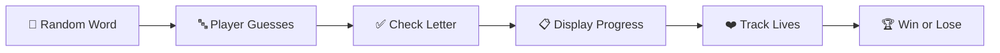
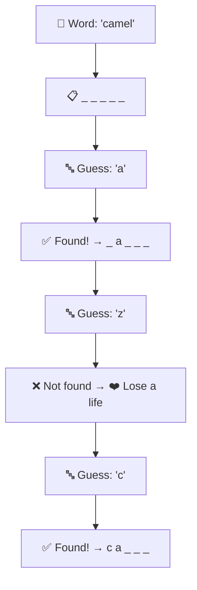
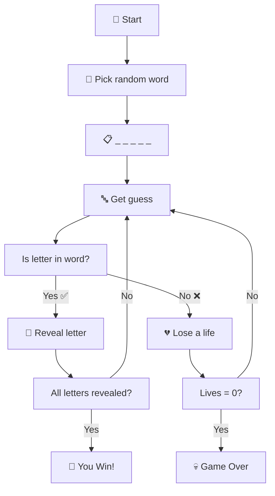
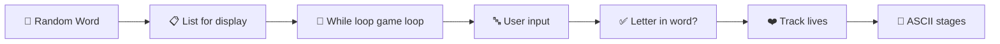

# Day 7 — Hangman 🎮

---

## Overview

Today we build the classic **Hangman** game — combining everything we've learned: loops, lists, strings, conditionals, and randomisation. This is our first proper **project** that ties multiple concepts together.



---

## 1. Step 1 — Pick a Random Word

```python
import random

word_list = ["ardvark", "baboon", "camel"]
chosen_word = random.choice(word_list)
print(f"Pssst... the word is: {chosen_word}")  # For testing
```

---

## 2. Step 2 — Get User Guess

```python
guess = input("Guess a letter: ").lower()
```

> ⚠️ Always convert to lowercase so "A" matches "a".

---

## 3. Step 3 — Check if Letter is in the Word

```python
for letter in chosen_word:
    if letter == guess:
        print("✅ Right!")
    else:
        print("❌ Wrong!")
```

---

## 4. Step 4 — Track Progress with a List

Instead of just printing right/wrong, we build a **display list** showing blanks `_` and revealing correct guesses.

```python
# Create blanks
display = []
for _ in chosen_word:
    display.append("_")

print(display)  # e.g., ['_', '_', '_', '_', '_', '_']

# Check guess and update display
guess = input("Guess a letter: ").lower()

for position in range(len(chosen_word)):
    letter = chosen_word[position]
    if letter == guess:
        display[position] = letter

print(display)  # e.g., ['a', '_', '_', '_', '_', '_']
```

### Visual Lifecycle



---

## 5. Step 5 — Track Lives (The Hangman)

```python
lives = 6

# Wrong guess → lose a life
if guess not in chosen_word:
    lives -= 1
    print(f"❌ Wrong! You have {lives} lives left.")
    if lives == 0:
        print("💀 You lose!")
```

---

## 6. Step 6 — Complete Game Loop

```python
import random

word_list = ["ardvark", "baboon", "camel"]
chosen_word = random.choice(word_list)
lives = 6

# Create display
display = ["_" for _ in chosen_word]

print("🎮 Welcome to Hangman!")
print(" ".join(display))

# Game loop
while "_" in display and lives > 0:
    guess = input("\nGuess a letter: ").lower()
    
    # Check if already guessed
    if guess in display:
        print(f"⚠️ You already guessed '{guess}'")
        continue
    
    # Check guess
    if guess in chosen_word:
        for position in range(len(chosen_word)):
            if chosen_word[position] == guess:
                display[position] = guess
        print("✅ Correct!")
    else:
        lives -= 1
        print(f"❌ Wrong! {lives} lives remaining.")
        if lives == 0:
            print("💀 Game Over! You lost.")
            break
    
    print(" ".join(display))

if "_" not in display:
    print("🎉 Congratulations! You won!")
```

### Sample Run

```
🎮 Welcome to Hangman!
_ _ _ _ _ _

Guess a letter: a
✅ Correct!
_ a _ _ _ _

Guess a letter: z
❌ Wrong! 5 lives remaining.
_ a _ _ _ _

... continues ...
```

---

## 7. ASCII Art Stages

Hangman comes alive with ASCII art for each life stage:

```python
stages = [  # 0 lives remaining (dead)
    """
       _______
      |/      |
      |      (_)
      |      \|/
      |       |
      |      / \\
      |
    __|___
    """,
    # 1 life remaining
    """
       _______
      |/      |
      |      (_)
      |      \|/
      |       |
      |      / 
      |
    __|___
    """,
    # ... up to 6 lives (full man)
]

# Print current stage
print(stages[lives])
```

---

## 8. Best Practices

| Practice | Bad ❌ | Good ✅ |
|----------|-------|---------|
| **Case handling** | `input("Guess: ")` | `input("Guess: ").lower()` |
| **Duplicate guess** | Let user guess same letter repeatedly | Check and warn `if guess in guessed_letters` |
| **Clear feedback** | Just print the display | Print "✅ Correct!" or "❌ Wrong!" |
| **Game state** | Mix win/lose logic | Clear `while "_" in display and lives > 0` |
| **Readability** | One giant block of code | Use functions and clear variable names |

---

## 9. Day 7 Project — Hangman 🎮



### Code

```python
import random

word_list = ["ardvark", "baboon", "camel"]
chosen_word = random.choice(word_list)
lives = 6

display = ["_" for _ in chosen_word]
guessed_letters = []

stages = [  # 0 to 6 lives
    """
       _______
      |/      |
      |      (_)
      |      \|/
      |       |
      |      / \\
      |
    __|___
    """,
    """
       _______
      |/      |
      |      (_)
      |      \|/
      |       |
      |      / 
      |
    __|___
    """,
    """
       _______
      |/      |
      |      (_)
      |      \|/
      |       |
      |
      |
    __|___
    """,
    """
       _______
      |/      |
      |      (_)
      |      \|/
      |
      |
      |
    __|___
    """,
    """
       _______
      |/      |
      |      (_)
      |
      |
      |
      |
    __|___
    """,
    """
       _______
      |/      |
      |
      |
      |
      |
      |
    __|___
    """,
    """
       _______
      |/      |
      |
      |
      |
      |
      |
      |
    __|___
    """
]

print("🎮 Welcome to Hangman!")

while "_" in display and lives > 0:
    print(stages[lives])
    print(" ".join(display))
    
    guess = input("\nGuess a letter: ").lower()
    
    if guess in guessed_letters:
        print(f"⚠️ You already guessed '{guess}'")
        continue
    
    guessed_letters.append(guess)
    
    if guess in chosen_word:
        for position in range(len(chosen_word)):
            if chosen_word[position] == guess:
                display[position] = guess
    else:
        lives -= 1
        print(f"❌ '{guess}' is not in the word.")
        
    print("\n" + "=" * 20)

# Game result
if lives == 0:
    print(stages[0])
    print(f"💀 You lost! The word was: {chosen_word}")
else:
    print(" ".join(display))
    print("🎉 You win! You saved the hangman!")
```

### Sample Run

```
🎮 Welcome to Hangman!
       _______
      |/      |
      |
      |
      |
      |
      |
    __|___

_ _ _ _ _ _

Guess a letter: a
✅ Correct!

       _______
      |/      |
      |
      |
      |
      |
      |
    __|___

_ a _ _ _ _

... continues until win or lose ...
```

---

## Summary



| Concept | Syntax | Example/Purpose |
|---------|--------|-----------------|
| Random choice | `random.choice(list)` | Pick a random word |
| List comprehension | `["_" for _ in word]` | Create blank display |
| Loop with index | `for i in range(len(list)):` | Access positions in list |
| Multiple conditions | `while a and b:` | Game continues while both true |
| `in` keyword | `if letter in word:` | Check membership |
| List append | `list.append(item)` | Track guessed letters |

---

*Based on Dr. Angela Yu's "100 Days of Code: The Complete Python Pro Bootcamp" — Day 7*
