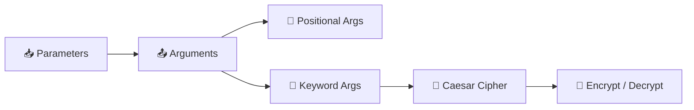
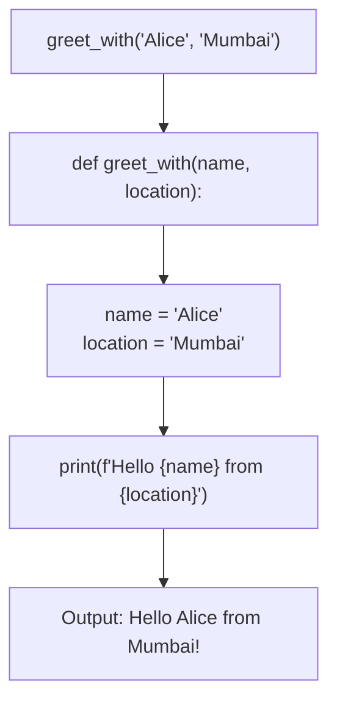
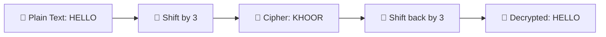
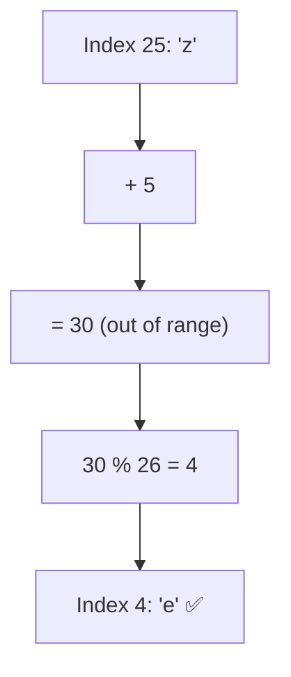
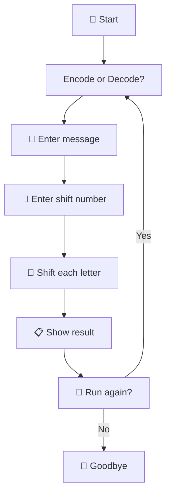
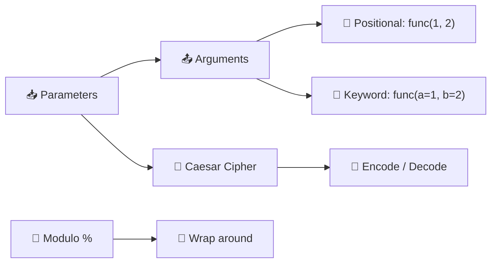

# Day 8 — Function Parameters & Caesar Cipher

---

## Overview

Functions become **powerful** when they accept parameters — inputs that change their behaviour. Today we learn parameters, arguments, positional vs keyword arguments, and build the Caesar Cipher encryption tool.



---

## 1. Function Parameters

A **parameter** is a variable listed in the function definition. An **argument** is the value you pass when calling.

```python
# Parameter: name
def greet(name):
    print(f"Hello {name}!")

# Argument: "Alice"
greet("Alice")   # Hello Alice!
greet("Bob")     # Hello Bob!
```

### Multiple Parameters

```python
def greet_with(name, location):
    print(f"Hello {name} from {location}!")

greet_with("Alice", "Mumbai")
# Hello Alice from Mumbai!
```

### How Parameters Work



---

## 2. Positional vs Keyword Arguments

### Positional Arguments

Order **matters**. The first argument goes to the first parameter.

```python
def describe_pet(animal, name):
    print(f"I have a {animal} named {name}.")

describe_pet("dog", "Buddy")
# I have a dog named Buddy.

describe_pet("Buddy", "dog")
# ⚠️ I have a Buddy named dog. — WRONG!
```

### Keyword Arguments

Use `parameter=value` syntax. Order **doesn't matter**.

```python
describe_pet(animal="dog", name="Buddy")
# I have a dog named Buddy.

describe_pet(name="Buddy", animal="dog")
# I have a dog named Buddy. ✅ Still correct!
```

| Type | Syntax | Order Matters? | Readability |
|------|--------|---------------|-------------|
| **Positional** | `func(a, b)` | ✅ Yes | Less clear |
| **Keyword** | `func(x=a, y=b)` | ❌ No | More clear |
| **Mixed** | `func(a, y=b)` | ✅ Positional first | Common pattern |

> **Rule:** When mixing, positional arguments must come before keyword arguments.

```python
# ✅ Correct
greet_with("Alice", location="Mumbai")

# ❌ SyntaxError
greet_with(name="Alice", "Mumbai")
```

---

## 3. Default Parameters

You can give parameters **default values**. If no argument is passed, the default is used.

```python
def greet(name="Guest"):
    print(f"Hello {name}!")

greet("Alice")   # Hello Alice!
greet()          # Hello Guest!
```

---

## 4. The Caesar Cipher 🔐

The Caesar Cipher shifts each letter by a fixed number of positions in the alphabet.



### How It Works

```
Alphabet:  A B C D E F G H I J K L M N O P Q R S T U V W X Y Z
Index:     0 1 2 3 4 5 6 7 8 9 ... 
Shift +3:  D E F G H I J K L M N O ...

H → K  (index 7 → 10)
E → H  (index 4 → 7)
L → O  (index 11 → 14)
L → O
O → R  (index 14 → 17)
```

### Encryption Logic

```python
alphabet = ['a', 'b', 'c', 'd', 'e', 'f', 'g', 'h', 'i', 'j', 'k', 'l',
            'm', 'n', 'o', 'p', 'q', 'r', 's', 't', 'u', 'v', 'w', 'x', 'y', 'z']

def encrypt(text, shift):
    cipher_text = ""
    for letter in text:
        if letter in alphabet:
            position = alphabet.index(letter)
            new_position = (position + shift) % 26  # Wrap around
            cipher_text += alphabet[new_position]
        else:
            cipher_text += letter  # Keep spaces/punctuation
    print(f"The encoded text is: {cipher_text}")

encrypt("hello", 3)   # khoor
encrypt("xyz", 3)     # abc (wraps around)
```

### Decryption Logic

```python
def decrypt(text, shift):
    plain_text = ""
    for letter in text:
        if letter in alphabet:
            position = alphabet.index(letter)
            new_position = (position - shift) % 26  # Go backwards
            plain_text += alphabet[new_position]
        else:
            plain_text += letter
    print(f"The decoded text is: {plain_text}")

decrypt("khoor", 3)   # hello
```

---

## 5. Combining Encrypt & Decrypt

```python
def caesar(text, shift, direction):
    result = ""
    if direction == "decode":
        shift *= -1  # Reverse shift for decoding
    
    for char in text:
        if char in alphabet:
            position = alphabet.index(char)
            new_position = (position + shift) % 26
            result += alphabet[new_position]
        else:
            result += char
    
    print(f"The {direction}d text is: {result}")

caesar("hello", 3, "encode")   # khoor
caesar("khoor", 3, "decode")   # hello
```

---

## 6. Wrap Around Logic

The `% 26` (modulo) operator handles wrapping around the alphabet.

```python
# Without modulo
position = 25  # 'z'
new_pos = 25 + 5  # 30 — out of range!

# With modulo
new_pos = (25 + 5) % 26  # 4 → 'e' ✅
```



---

## 7. Best Practices

| Practice | Bad ❌ | Good ✅ |
|----------|-------|---------|
| **Parameter names** | `def f(a, b):` | `def encrypt(text, shift):` |
| **Keyword arguments** | `caesar(text, 3, "encode")` | `caesar(text="hello", shift=3, ...)` |
| **Code reuse** | Separate encrypt/decrypt functions | Single `caesar()` with direction param |
| **Magic numbers** | `(pos + 3) % 26` | `(pos + shift) % 26` (use the parameter) |
| **Edge cases** | Ignore non-letters | `if char in alphabet: ... else: keep as is` |

---

## 8. Day 8 Project — Caesar Cipher 🔐



### Code

```python
alphabet = ['a', 'b', 'c', 'd', 'e', 'f', 'g', 'h', 'i', 'j', 'k', 'l',
            'm', 'n', 'o', 'p', 'q', 'r', 's', 't', 'u', 'v', 'w', 'x', 'y',
            'z', 'a', 'b', 'c', 'd', 'e', 'f', 'g', 'h', 'i', 'j', 'k', 'l',
            'm', 'n', 'o', 'p', 'q', 'r', 's', 't', 'u', 'v', 'w', 'x', 'y', 'z']

def caesar(start_text, shift_amount, cipher_direction):
    end_text = ""
    if cipher_direction == "decode":
        shift_amount *= -1
    for char in start_text:
        if char in alphabet:
            position = alphabet.index(char)
            new_position = position + shift_amount
            end_text += alphabet[new_position]
        else:
            end_text += char
    print(f"Here's the {cipher_direction}d result: {end_text}")

should_continue = True
while should_continue:
    direction = input("Type 'encode' to encrypt, type 'decode' to decrypt:\n").lower()
    text = input("Type your message:\n").lower()
    shift = int(input("Type the shift number:\n"))
    
    shift = shift % 26  # Handle shifts > 26
    
    caesar(start_text=text, shift_amount=shift, cipher_direction=direction)
    
    restart = input("Type 'yes' if you want to go again. Otherwise type 'no'.\n").lower()
    if restart == "no":
        should_continue = False
        print("👋 Goodbye!")
```

### Sample Run

```
Type 'encode' to encrypt, type 'decode' to decrypt:
encode
Type your message:
hello world
Type the shift number:
5
Here's the encoded result: mjqqt btwqi
Type 'yes' if you want to go again. Otherwise type 'no'.
yes
Type 'encode' to encrypt, type 'decode' to decrypt:
decode
Type your message:
mjqqt btwqi
Type the shift number:
5
Here's the decoded result: hello world
Type 'yes' if you want to go again. Otherwise type 'no'.
no
👋 Goodbye!
```

---

## Summary



| Concept | Syntax | Example/Purpose |
|---------|--------|-----------------|
| Parameter | `def func(param):` | Input variable in function definition |
| Argument | `func("value")` | Value passed when calling |
| Positional arg | `func(1, 2, 3)` | Order matches parameters |
| Keyword arg | `func(a=1, b=2)` | Named parameters, any order |
| Default param | `def func(x=5):` | Default value if no arg given |
| Modulo | `%` | `(25 + 5) % 26 = 4` — wrap around |

---

*Based on Dr. Angela Yu's "100 Days of Code: The Complete Python Pro Bootcamp" — Day 8*
