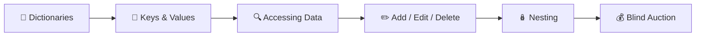
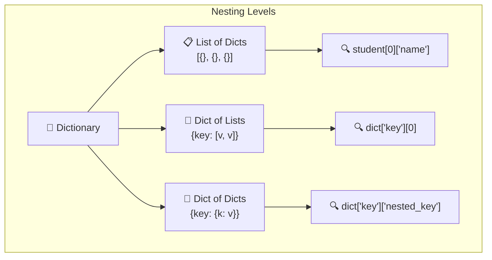
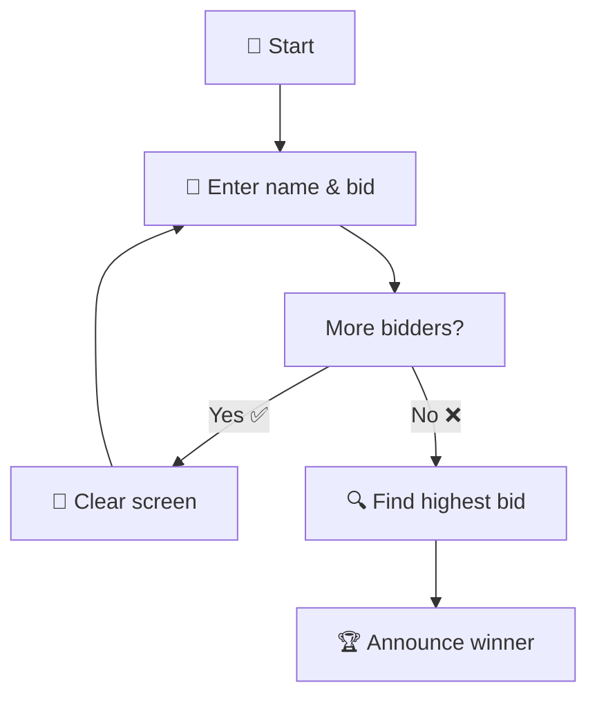
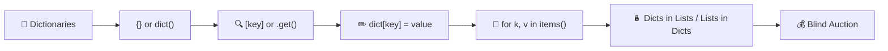

# Day 9 — Dictionaries & Nesting

---

## Overview

**Dictionaries** store data in **key-value pairs**. Unlike lists (which use numeric indices), dictionaries use **keys** — making data retrieval fast and meaningful. Today we also learn **nesting** — putting dictionaries inside lists and vice versa.



---

## 1. What is a Dictionary?

A dictionary maps **keys** to **values**.

```python
# List (indexed by position)
student_list = ["Alice", "Bob", "Charlie"]

# Dictionary (indexed by key)
student_dict = {
    "name": "Alice",
    "age": 25,
    "city": "Mumbai"
}
```

### Key Rules

| Rule | Bad ❌ | Good ✅ |
|------|--------|---------|
| **Keys must be unique** | `{"a": 1, "a": 2}` | `{"a": 1, "b": 2}` |
| **Keys must be immutable** | `{["key"]: "value"}` | `{"key": "value"}` |
| **Values can be any type** | — | `int`, `str`, `list`, `dict`, etc. |
| **String keys need quotes** | `{key: "value"}` | `{"key": "value"}` |

---

## 2. Creating Dictionaries

```python
# Empty dictionary
empty_dict = {}
empty_dict = dict()

# With data
student = {
    "name": "Alice",
    "age": 25,
    "grade": "A",
    "subjects": ["Math", "Science"]
}

print(student)
# {'name': 'Alice', 'age': 25, 'grade': 'A', 'subjects': ['Math', 'Science']}

# Using dict() constructor
person = dict(name="Bob", age=30, city="Delhi")
print(person)
# {'name': 'Bob', 'age': 30, 'city': 'Delhi'}
```

---

## 3. Accessing Dictionary Items

```python
student = {"name": "Alice", "age": 25, "grade": "A"}

# Using square brackets (KeyError if missing)
print(student["name"])   # Alice
# print(student["city"])  # ❌ KeyError!

# Using .get() (returns None if missing — safe!)
print(student.get("name"))  # Alice
print(student.get("city"))  # None
print(student.get("city", "Not found"))  # "Not found"

# Check if key exists
if "name" in student:
    print(f"Name is {student['name']}")

# Get all keys, values, items
print(student.keys())    # dict_keys(['name', 'age', 'grade'])
print(student.values())  # dict_values(['Alice', 25, 'A'])
print(student.items())   # dict_items([('name', 'Alice'), ('age', 25), ('grade', 'A')])
```

| Method | Description | Returns |
|--------|-------------|---------|
| `dict[key]` | Access by key | Value or `KeyError` |
| `dict.get(key)` | Safe access | Value or `None` |
| `dict.keys()` | All keys | `dict_keys` view |
| `dict.values()` | All values | `dict_values` view |
| `dict.items()` | Key-value pairs | `dict_items` view |

---

## 4. Adding & Modifying Items

```python
student = {"name": "Alice", "age": 25}

# Add new key-value pair
student["city"] = "Mumbai"
print(student)  # {'name': 'Alice', 'age': 25, 'city': 'Mumbai'}

# Modify existing key
student["age"] = 26
print(student)  # {'name': 'Alice', 'age': 26, 'city': 'Mumbai'}

# Update multiple items
student.update({"grade": "A", "subject": "Math"})
print(student)
```

---

## 5. Removing Items

```python
student = {"name": "Alice", "age": 25, "city": "Mumbai", "grade": "A"}

# Remove specific key
del student["grade"]
print(student)  # {'name': 'Alice', 'age': 25, 'city': 'Mumbai'}

# Remove and return value
city = student.pop("city")
print(city)     # Mumbai
print(student)  # {'name': 'Alice', 'age': 25}

# Remove last inserted (Python 3.7+)
last = student.popitem()
print(student)  # {'name': 'Alice'}

# Clear all items
student.clear()
print(student)  # {}
```

---

## 6. Looping Through Dictionaries

```python
student = {"name": "Alice", "age": 25, "grade": "A"}

# Loop through keys (default)
for key in student:
    print(key)        # name, age, grade

# Loop through keys explicitly
for key in student.keys():
    print(key)

# Loop through values
for value in student.values():
    print(value)      # Alice, 25, A

# Loop through key-value pairs
for key, value in student.items():
    print(f"{key}: {value}")
# name: Alice
# age: 25
# grade: A
```

---

## 7. Nesting 🪆

Nesting means putting dictionaries inside other dictionaries or lists.

### List of Dictionaries

```python
# List of students (each student is a dict)
students = [
    {"name": "Alice", "age": 25, "grade": "A"},
    {"name": "Bob", "age": 22, "grade": "B"},
    {"name": "Charlie", "age": 24, "grade": "A"}
]

# Access first student's name
print(students[0]["name"])   # Alice

# Loop through all students
for student in students:
    print(f"{student['name']}: Grade {student['grade']}")
```

### Dictionary of Lists

```python
# Track scores per subject
scores = {
    "Math": [85, 90, 78],
    "Science": [92, 88, 95],
    "English": [80, 85, 82]
}

# Access Math scores
print(scores["Math"])  # [85, 90, 78]

# Get average for Science
avg = sum(scores["Science"]) / len(scores["Science"])
print(f"Science avg: {avg:.1f}")  # 91.7
```

### Dictionary of Dictionaries

```python
# Travel log — cities with visited countries
travel_log = {
    "France": {
        "cities_visited": ["Paris", "Lille", "Dijon"],
        "total_visits": 12
    },
    "India": {
        "cities_visited": ["Mumbai", "Delhi", "Bangalore"],
        "total_visits": 5
    }
}

# Access nested data
print(travel_log["France"]["cities_visited"])
# ['Paris', 'Lille', 'Dijon']

print(travel_log["India"]["total_visits"])
# 5
```

### Nesting Depth



---

## 8. Grading Program Example

```python
# Convert scores to grades
scores = {
    "Alice": 85,
    "Bob": 72,
    "Charlie": 91,
    "Diana": 65,
    "Eve": 78
}

grades = {}
for student, score in scores.items():
    if score >= 90:
        grades[student] = "A"
    elif score >= 80:
        grades[student] = "B"
    elif score >= 70:
        grades[student] = "C"
    else:
        grades[student] = "D"

print(grades)
# {'Alice': 'B', 'Bob': 'C', 'Charlie': 'A', 'Diana': 'D', 'Eve': 'C'}
```

---

## 9. Best Practices

| Practice | Bad ❌ | Good ✅ |
|----------|-------|---------|
| **Key naming** | `{1: "value"}` | `{"name": "value"}` (descriptive) |
| **Safe access** | `dict["key"]` (risks KeyError) | `dict.get("key")` or `if "key" in dict` |
| **Looping** | `for k in dict: print(dict[k])` | `for k, v in dict.items():` |
| **Nesting clarity** | Deeply nested on one line | Break into variables |
| **Mutable keys** | `{[1,2]: "value"}` (TypeError) | Use tuples `{(1,2): "value"}` |

---

## 10. Day 9 Project — Blind Auction 🏷️



### Code

```python
from os import system

def clear_screen():
    """Clear the terminal screen."""
    system('clear')

bids = {}
bidding_finished = False

def find_highest_bidder(bidding_record):
    highest_bid = 0
    winner = ""
    for bidder in bidding_record:
        bid_amount = bidding_record[bidder]
        if bid_amount > highest_bid:
            highest_bid = bid_amount
            winner = bidder
    print(f"🏆 The winner is {winner} with a bid of ${highest_bid}!")

print("💰 Welcome to the Secret Auction!")

while not bidding_finished:
    name = input("What is your name?: ")
    price = int(input("What is your bid?: $"))
    bids[name] = price
    
    should_continue = input("Are there any other bidders? Type 'yes' or 'no'.\n").lower()
    if should_continue == "no":
        bidding_finished = True
        find_highest_bidder(bids)
    elif should_continue == "yes":
        clear_screen()
```

### Sample Run

```
💰 Welcome to the Secret Auction!
What is your name?: Alice
What is your bid?: $150
Are there any other bidders? Type 'yes' or 'no'.
yes

[Screen clears]

What is your name?: Bob
What is your bid?: $200
Are there any other bidders? Type 'yes' or 'no'.
no
🏆 The winner is Bob with a bid of $200!
```

---

## Summary



| Concept | Syntax | Example/Purpose |
|---------|--------|-----------------|
| Create dict | `{key: value}` | `{"name": "Alice"}` |
| Access value | `dict[key]` | `student["name"]` |
| Safe access | `dict.get(key)` | `student.get("age", 0)` |
| Add/Update | `dict[key] = val` | `student["age"] = 26` |
| Remove | `del dict[key]` | `del student["grade"]` |
| Loop items | `for k, v in dict.items():` | Get both key and value |
| Nesting | `{key: {nested_key: val}}` | Dictionary inside dictionary |

---

*Based on Dr. Angela Yu's "100 Days of Code: The Complete Python Pro Bootcamp" — Day 9*
