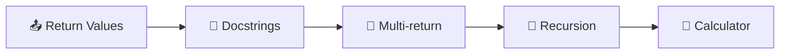
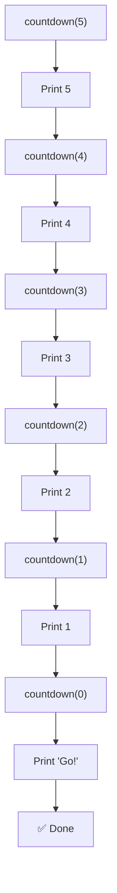
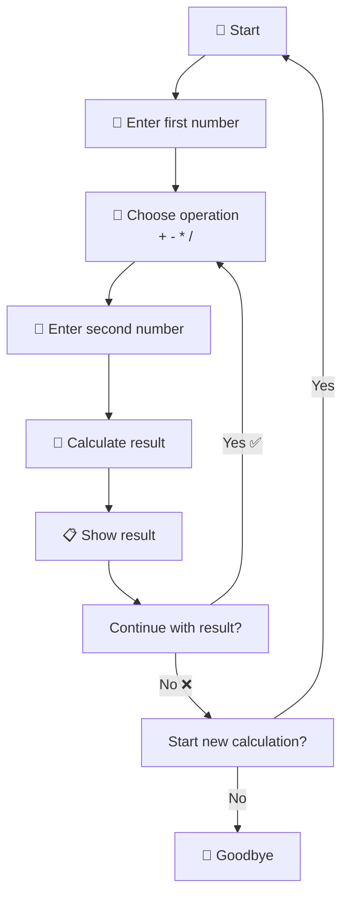
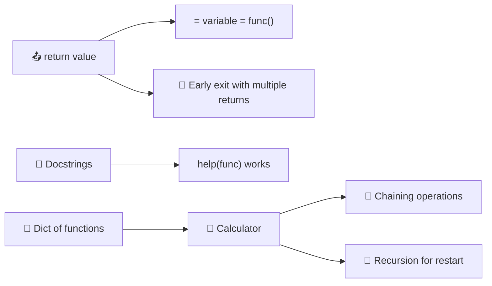

# Day 10 — Functions with Outputs & Calculator

---

## Overview

Functions can **return values** back to the caller using the `return` keyword. This makes them pure, reusable building blocks. Today we also learn **docstrings**, recursion, and build a fully functional calculator.



---

## 1. The `return` Statement

`return` sends a value back to where the function was called.

```python
def add(a, b):
    result = a + b
    return result

sum_result = add(5, 3)
print(sum_result)  # 8
```

### Without Return

```python
def add(a, b):
    print(a + b)

result = add(5, 3)  # 8 (printed)
print(result)       # None ← no return value!
```

### With Return

```python
def add(a, b):
    return a + b

result = add(5, 3)  # Nothing printed
print(result)       # 8 ← we get the value back
```

| Aspect | `print()` | `return` |
|--------|-----------|----------|
| **Purpose** | Display to console | Give value back to caller |
| **Stops function?** | ❌ No | ✅ Yes |
| **Assignable?** | ❌ `x = print()` is `None` | ✅ `x = func()` has value |
| **Used in expressions?** | ❌ No | ✅ Yes, e.g., `add(a, b) * 2` |

> **Key Insight:** `return` ends the function immediately. Code after `return` never runs.

---

## 2. Multiple Returns (Early Exit)

```python
def check_grade(score):
    if score >= 90:
        return "A"
    if score >= 80:
        return "B"
    if score >= 70:
        return "C"
    return "F"

print(check_grade(85))  # B
print(check_grade(95))  # A
print(check_grade(50))  # F
```

Each `return` exits the function — no need for `elif` chains.

---

## 3. Returning Multiple Values

```python
def calculate(a, b):
    add = a + b
    subtract = a - b
    multiply = a * b
    divide = a / b
    return add, subtract, multiply, divide

result = calculate(10, 2)
print(result)  # (12, 8, 20, 5.0) ← tuple

# Unpack into variables
add, sub, mul, div = calculate(10, 2)
print(add)  # 12
print(sub)  # 8
```

---

## 4. Docstrings — Documenting Functions

A **docstring** is a multi-line comment that explains what a function does.

```python
def add(a, b):
    """
    Add two numbers together.
    
    Parameters:
    a (int/float): First number
    b (int/float): Second number
    
    Returns:
    int/float: The sum of a and b
    """
    return a + b

# View docstring
print(add.__doc__)
help(add)
```

### Docstring Format

```python
def function(param1, param2):
    """Short description of what function does.
    
    Parameters:
    param1 (type): Description of param1
    param2 (type): Description of param2
    
    Returns:
    type: Description of return value
    """
    # function body
```

---

## 5. Recursion — Function Calling Itself

**Recursion** is when a function calls itself inside its own definition.

```python
def countdown(n):
    if n <= 0:
        print("Go!")
    else:
        print(n)
        countdown(n - 1)  # Calls itself

countdown(5)
```

```
5
4
3
2
1
Go!
```



> **Rule:** Every recursive function needs a **base case** (condition to stop) and a **recursive case** (call itself).

---

## 6. Calculator — Full Example

### Operations as Functions

```python
def add(a, b):
    return a + b

def subtract(a, b):
    return a - b

def multiply(a, b):
    return a * b

def divide(a, b):
    return a / b

# Dictionary mapping operator symbols to functions
operations = {
    "+": add,
    "-": subtract,
    "*": multiply,
    "/": divide
}

# Using the dictionary
result = operations["+"](5, 3)
print(result)  # 8
```

### Calculator Flow



---

## 7. Day 10 Project — Calculator 🧮

### Code

```python
def add(a, b):
    return a + b

def subtract(a, b):
    return a - b

def multiply(a, b):
    return a * b

def divide(a, b):
    return a / b

operations = {
    "+": add,
    "-": subtract,
    "*": multiply,
    "/": divide
}

def calculator():
    """Interactive calculator with chaining."""
    print("🧮 Welcome to the Calculator!")
    
    num1 = float(input("What's the first number?: "))
    
    for symbol in operations:
        print(symbol)
    
    should_continue = True
    
    while should_continue:
        operation_symbol = input("Pick an operation: ")
        num2 = float(input("What's the next number?: "))
        
        calculation_function = operations[operation_symbol]
        answer = calculation_function(num1, num2)
        
        print(f"{num1} {operation_symbol} {num2} = {answer}")
        
        choice = input(f"Type 'y' to continue with {answer}, "
                       f"type 'n' to start a new calculation, "
                       f"or type 'exit' to quit: ").lower()
        
        if choice == 'y':
            num1 = answer  # Chain: use result as first number
        elif choice == 'n':
            should_continue = False
            calculator()  # Recursion — start fresh
        else:
            should_continue = False
            print("👋 Goodbye!")

calculator()
```

### Sample Run

```
🧮 Welcome to the Calculator!
What's the first number?: 10
+
-
*
/
Pick an operation: +
What's the next number?: 5
10.0 + 5.0 = 15.0
Type 'y' to continue with 15.0, type 'n' to start a new calculation, or type 'exit' to quit: y
Pick an operation: *
What's the next number?: 3
15.0 * 3.0 = 45.0
Type 'y' to continue with 45.0, type 'n' to start a new calculation, or type 'exit' to quit: n

🧮 Welcome to the Calculator!
What's the first number?: 100
...
```

---

## 8. Best Practices

| Practice | Bad ❌ | Good ✅ |
|----------|-------|---------|
| **Return instead of print** | `def add(a,b): print(a+b)` | `def add(a,b): return a+b` |
| **Docstrings** | No documentation | `"""Explain parameters & return"""` |
| **Function naming** | `def calc():` | `def calculate_total():` |
| **Recursion depth** | No base case (infinite) | Has clear `if` condition to stop |
| **Dictionary of functions** | Long if/elif chains | `ops = {"+": add, "-": sub}` |

---

## Summary



| Concept | Syntax | Example/Purpose |
|---------|--------|-----------------|
| Return | `return value` | `return a + b` |
| Early return | `if cond: return` | Exit function early |
| Docstring | `"""description"""` | Document function purpose |
| Recursion | `def f(): ... f()` | Function calls itself |
| Dict as switch | `{key: func}` | `operations["+"](a, b)` |
| Function in var | `f = add` | `result = f(5, 3)` |

---

*Based on Dr. Angela Yu's "100 Days of Code: The Complete Python Pro Bootcamp" — Day 10*
